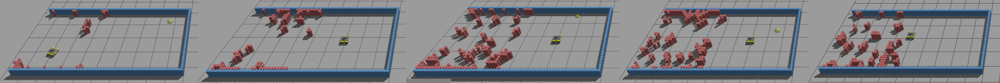
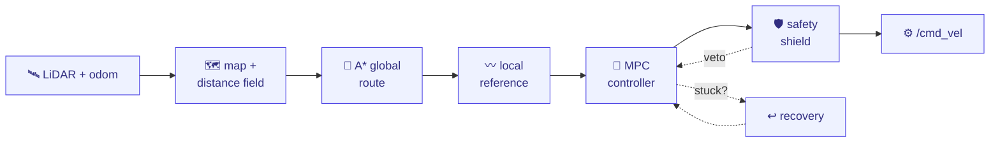

<div align="center">

# barn-2027-prep

**Preparation programme for the ICRA BARN Challenge 2027**
*benchmarked against the completed BARN 2026 ROS 2 evaluation pipeline*

### [**▶  Explore the Interactive Visualization**](https://rudra-roy.github.io/BARN/)

[](https://rudra-roy.github.io/BARN/)

[](https://docs.ros.org/en/jazzy/)
[](LICENSE)
[](docs/tutorials/README.md)

*A working autonomous-navigation stack — **and** a course that teaches how it works.*
*7 live demos: LiDAR · mapping · A\* · elastic band · MPC · safety shield · recovery.*

</div>

---

## 📸 Media & Highlights

<div align="center">



*Five hidden BARN worlds, sparse → dense (**5 · 32 · 62 · 155 · 299**). The yellow Jackal must reach the goal (yellow ball), collision-free, in an environment it has never seen.*

</div>

### Trial runs (RViz2)

The footprint-aware Classical MPC stack navigating a full evaluator trial —
online LiDAR map, drift-corrected `map` frame, global A* path, and MPC local
trajectory visualized live.

| Simple world | Complex world |
|:---:|:---:|
| <!-- video: simple world trial --> *(video placeholder — see [docs/media/README.md](docs/media/README.md))* | <!-- video: complex world trial --> *(video placeholder — see [docs/media/README.md](docs/media/README.md))* |

---

## 📚 Learn how it works — the tutorial

> **New to robotics or path planning?** This repository doubles as a **hands-on
> course**. The [**BARN Navigation Tutorial**](docs/tutorials/README.md) teaches the
> entire classical stack from first principles — from *"what is a LiDAR?"* to a
> sequentially-linearized MPC solving a quadratic program thirty times a second.

Every idea is taught in three layers, so it works for a mixed classroom:

> 🟢 **Intuition** — plain language + a picture · 📐 **The math** — the formal
> version (skippable) · 🔍 **In the code** — the exact file and lines.

**Start here → [The BARN Navigation Tutorial](docs/tutorials/README.md)** · **▶ [Interactive visual companion](https://rudra-roy.github.io/BARN/)** (live MPC, safety-shield & recovery demos) · jump to a topic:

[00 · The problem](docs/tutorials/00-the-barn-problem.md) ·
[01 · Robot & senses](docs/tutorials/01-the-robot-and-its-senses.md) ·
[02 · Mapping](docs/tutorials/02-mapping-occupancy-and-distance-fields.md) ·
[03 · A\* planning](docs/tutorials/03-global-planning-with-a-star.md) ·
[04 · **MPC** ⭐](docs/tutorials/04-local-planning-and-mpc.md) ·
[05 · Safety shield](docs/tutorials/05-the-safety-shield.md) ·
[06 · Recovery](docs/tutorials/06-recovery-and-backtracking.md) ·
[07 · System](docs/tutorials/07-the-system-as-a-whole.md) ·
[08 · The metric](docs/tutorials/08-measuring-success.md)

---

## What is this?

[BARN](https://people.cs.gmu.edu/~xiao/Research/BARN_Challenge/BARN_Challenge26.html) (Benchmark Autonomous Robot Navigation) tests **fast, collision-free autonomous navigation of a Clearpath Jackal through dense, highly constrained static obstacle fields** using only a 2-D LiDAR, at up to 2 m/s, on **hidden** environments the robot has never seen.

This repository is a **clean-room preparation programme** for the 2027 edition. We replace the default navigation stack with **three independently developed approaches**:

| Track | Package(s) | Language | Status |
|-------|-----------|----------|--------|
| **A — Classical** | `barn_classical`, `barn_mapping` | C++ | footprint-aware lattice + MPC stack ✅ |
| **B — End-to-end RL** | `barn_rl_runtime`, `learning/` | Python | runtime + training stubs |
| **C — Hybrid** | `barn_hybrid`, `barn_dynamic_tracking` | Python + C++ | arbiter + tracker stubs |

The **tutorial above teaches Track A**, the classical stack, which clears the world set with comfortable timings.

> **Note:** The core rule of this repo is that the algorithm must be deployable to the physical Jackal without modification. Reading Gazebo ground truth or pre-loading map structures is strictly forbidden.

---

## 🗺️ The classical stack at a glance

Sensors in, wheel commands out. Each stage links to its tutorial chapter.



- **Map & distance field** — a log-odds occupancy grid + a Euclidean distance transform giving clearance *and gradients*. → [Ch 02](docs/tutorials/02-mapping-occupancy-and-distance-fields.md)
- **Global A\*** — a two-phase search (Dijkstra cost-to-go field → lattice A\* over `(x, y, yaw)`) with clearance-shaped costs. → [Ch 03](docs/tutorials/03-global-planning-with-a-star.md)
- **Local planner + MPC** — an elastic-band reference feeding a sequentially-linearized MPC (OSQP) with distance-field obstacle constraints. → [Ch 04](docs/tutorials/04-local-planning-and-mpc.md)
- **Safety shield** — an independent swept-footprint veto that scales any command to the largest collision-free version. → [Ch 05](docs/tutorials/05-the-safety-shield.md)
- **Recovery** — backtracking: reverse along a known-clear breadcrumb to open space, then re-plan. → [Ch 06](docs/tutorials/06-recovery-and-backtracking.md)

---

## Quick start (inside your ROS 2 Jazzy distrobox)

> Full walkthrough: [`docs/setup/barn_2026_jazzy_distrobox.md`](docs/setup/barn_2026_jazzy_distrobox.md).

```bash
# 0. Clone this repo into the container and enter it
git clone <your-fork-url> barn-2027-prep && cd barn-2027-prep

# 1. Clone the evaluator and add the minimal algo_type dispatcher
bash tools/setup_barn_eval.sh

# 2. Resolve dependencies and build the whole workspace
bash tools/setup_workspace.sh          # rosdep install + colcon build --symlink-install

# 3. Source the overlay
source ros2_ws/install/setup.bash

# 4. Run the footprint-aware Classical MPC stack
ros2 launch jackal_helper BARN_runner.launch.py \
  algo_type:=classical_mpc world_idx:=0 gui:=true planner_rviz:=true
```

---

## Documentation

### 📚 Learn it — the tutorial series
Start with the **[BARN Navigation Tutorial](docs/tutorials/README.md)** (chapters 00–08 + [references](docs/tutorials/references.md)). It's the recommended path for understanding the classical stack, whether you're a student or new to the codebase.

### 🔧 Build & tune it
- **[Distrobox + Jazzy setup walkthrough](docs/setup/barn_2026_jazzy_distrobox.md)**
- **[Classical MPC Configuration Guide](docs/features/configuration_guide.md)** — the tunable parameters and how to trade speed against tight-space robustness.
- **[Classical MPC & Recovery feature notes](docs/features/classical_mpc_updates.md)** — what changed and why.

### 📐 Reference
- **[System Architecture & Data Flow](docs/architecture/overview.md)** · **[Robot Interface Contract](docs/robot_interface.md)** · **[Roadmap (M0–M21)](docs/roadmap.md)** · **[Architecture Decisions (ADRs)](docs/decisions/)**

### 🏁 Benchmark & scoring
- **[Competition-Faithful Input Policy](docs/benchmark/barn_2026_contract.md)** · **[Metric Definitions & Scoring](docs/benchmark/metric_notes.md)** · **[Failure Taxonomy](docs/benchmark/failure_taxonomy.md)**

---

## References

- ICRA 2026 BARN Challenge — <https://people.cs.gmu.edu/~xiao/Research/BARN_Challenge/BARN_Challenge26.html>
- BARN ROS 2 evaluation pipeline — <https://github.com/Saadmaghani/The-Barn-Challenge-Ros2>
- Foundational works behind every algorithm in the stack — [tutorial references](docs/tutorials/references.md)

## License

[MIT](LICENSE). *(Switch to BSD-3-Clause if you prefer to match the Clearpath/Jackal ecosystem.)*
