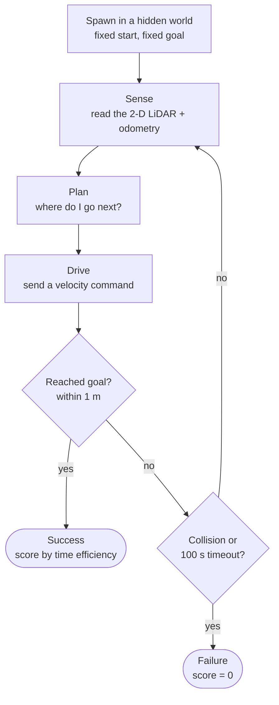
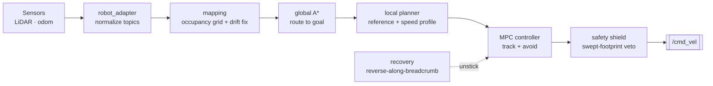

# 00 · The BARN problem — why navigation is hard

> **Part of the [BARN navigation tutorial](./README.md).**
> **Before this:** _(none — this is the start)_ · **After this:** [01 · The robot and its senses](./01-the-robot-and-its-senses.md)

**What you'll learn**
- What the BARN Challenge actually asks a robot to do, and why that turns out to be hard.
- The rules of the game — success, the timeout, the clock, and how a run is scored — at an
  intuition level.
- The one discipline this repository refuses to break: the algorithm must work on a real
  robot, unmodified. Why that rule shapes everything that follows.
- The three-track program, and a mental model of the **classical stack** this tutorial teaches.

**Prerequisites:** none. If you have ever tried to walk across a crowded room without bumping
anyone, you already have the right intuition. We build from there.

---

## 1. What is BARN?

Picture a warehouse floor after an earthquake. Crates have toppled into rough rows, leaving a
maze of narrow lanes. Some lanes pinch down to barely shoulder-width; a few are dead ends that
look open until you are already inside them. Now imagine you are asked to walk briskly from one
end to the other, in the dark, feeling your way with a single outstretched cane — and you have
never seen this particular floor before.

That is the **BARN Challenge**. BARN stands for *Benchmark for Autonomous Robot Navigation*
[Perille 2020]. It measures one narrow, honest skill: **can a wheeled robot drive quickly and
without collision through a dense, cluttered field of static obstacles, using only what it can
sense right now?**

The robot is a **Clearpath Jackal** — a small four-wheeled *differential-drive* ground robot.
"Differential drive" means it steers like a tank: the left wheels and the right wheels are
driven independently, so it turns by spinning one side faster than the other. It cannot slide
sideways. We will meet the Jackal properly in [Chapter 01](./01-the-robot-and-its-senses.md).

The robot's only eye on the world is a **2-D LiDAR**: a laser scanner that sweeps a flat,
knee-high disc of range measurements around the front of the robot, roughly ten times a second.
It sees a thin horizontal slice of the world as a fan of distances — nothing above or below that
plane, no colour, no labels. And it may drive at up to **2 m/s** — a brisk jog.

> **💡 Key idea:** BARN isolates *local, reactive navigation*. There is no long-range map to
> memorize and no clever route to look up. The whole difficulty lives in the next few metres in
> front of the robot.

Here is the part that makes it a genuine test of intelligence rather than memorization: the
worlds are **hidden**. A scored campaign runs across **50 worlds the robot has never seen**, and
it must attempt each one **10 times** — **500 trials** in total. You do not get to tune your
robot for world #37 in particular. Whatever it does, it must do on maps that did not exist when
you wrote the code.

### The challenge loop

Every trial follows the same rhythm. The robot is dropped into a fresh hidden world at a fixed
start, handed a goal, and then it is on its own: sense, decide, move, repeat — until it either
reaches the goal or runs out of time.



Read that loop clockwise. The **sense → plan → drive** cycle in the middle repeats many times a
second; the whole trial is that little loop spinning until one of the exits on the right fires.
Most of this tutorial is about what happens inside the **Plan** box — but never forget it is a
loop running against a ticking clock.

---

## 2. Why is it genuinely hard?

It is tempting to think "drive toward the goal, turn away from obstacles" and be done. That naive
rule works in an open field and fails immediately here. Let us look at *why*, because each reason
below is a problem some later chapter exists to solve.

### 2.1 The gaps are barely wider than the robot

In the hardest BARN worlds the obstacles are packed so tightly that the only way through is a gap
only slightly wider than the Jackal itself. There is no comfortable margin. A route that treats
the robot as a dot will cheerfully steer it into a wall, because the robot is *not* a dot — it
has width, and half of it lives on either side of the line you plan.

```
   dense obstacle field, top-down view  (each  #  is an obstacle, R is the robot)

     #   #  #      ##    #   #     #   #
       #    #   #      #     #  ##    #
   #    ##      #   #      #    #    #   #
     #     #  ┌───┐   #  #    #    ##
    #   #     │ R │→ · · · · · · · · ·         ← the goal is somewhere over here
     #    ##  └───┘   #     #   #    #
   #    #   #      #  ##   #     #  #   #
      ##     #   #     #      #    #    #
        the robot must thread the one gap ── │ ── wide enough to fit,
        not the wider-looking gaps that dead-end two metres later.
```

Threading that gap means reasoning about the robot's **footprint** — its physical outline —
against the obstacles, not just its centre point. That single fact forces most of the design
decisions in the classical stack.

> **⚠️ Gotcha:** The widest-looking opening is often a trap. A gap you can *see* into is not the
> same as a gap you can *drive through and out of*. Local greed leads straight into dead ends.

### 2.2 Dead ends and the trap of local greed

Because the robot only senses locally, "head toward the goal" repeatedly walks it into pockets
that looked open from the outside. Escaping means recognizing you are stuck, backing out along
the way you came, and trying a different lane — a behaviour the naive rule simply does not have.
The classical stack answers this with a global route planner ([Chapter 03](./03-global-planning-with-a-star.md))
and a dedicated **recovery** behaviour ([Chapter 06](./06-recovery-and-backtracking.md)) that reverses
the robot back out of pinches.

### 2.3 The speed–safety tension

You are scored on speed, but a collision scores **zero**. Those two pressures pull in opposite
directions. Drive fast and you may not be able to stop or turn before you clip an obstacle;
drive cautiously and the clock eats your score. Good BARN navigation is not about being fast *or*
safe — it is about being **as fast as is still safe**, moment to moment, and that boundary moves
as the corridor tightens. Balancing this is the whole job of the controller
([Chapter 04](./04-local-planning-and-mpc.md)) and its independent safety shield
([Chapter 06](./06-recovery-and-backtracking.md)).

### 2.4 No map, only a keyhole of sensing

The robot begins each world with **no prior map**. It cannot look up the layout; it has to build
its own picture of the world as it goes, from the thin disc of LiDAR returns, while also keeping
track of where *it* is. That online picture — an *occupancy grid* — is what
[Chapter 02](./02-mapping-occupancy-and-distance-fields.md) are about.

### 2.5 Generalization to worlds you have never seen

Finally, and most importantly: because the scored worlds are **hidden**, you cannot memorize your
way to a good score. A solution that is secretly tuned for the specific test maps is worthless —
it would collapse the moment the maps change. Everything in this repository is built to
*generalize*: to behave sensibly on a layout no one has ever driven before. That single
requirement is what elevates BARN from a puzzle into a real robotics problem [Xiao 2022].

---

## 3. The rules of the game

Now the referee's rulebook — at intuition level. The exact scoring formula is a chapter of its
own ([Chapter 08](./08-measuring-success.md)); here you only need the shape of it.

**Success** means the robot gets its body **within 1.0 m of the goal**, without ever touching an
obstacle, before the clock runs out. The goal is a fixed pose 10 m ahead of the start.

**The timeout is 100 seconds.** Take longer and the trial fails, no matter how close you got.

**Collision ends everything.** Any contact with an obstacle terminates the trial as a failure,
instantly. There is no partial credit for a brave attempt.

There is one subtle, delightful rule about *when the clock starts*:

> **💡 Key idea:** The evaluation clock does not start when the robot is spawned. It starts only
> after the robot has first moved **more than 0.1 m**. Sitting still and thinking costs you
> nothing — but the instant you commit to moving, the 100 s budget begins.

That rule quietly shapes the controller's design. Time spent *deliberating before the first
motion* is free, so a stack could in principle think hard at the start line. In practice the
classical stack chooses to move promptly and keep thinking while it drives — a decision we
unpack in [Chapter 04](./04-local-planning-and-mpc.md).

One more crucial point about how success is judged:

> **⚠️ Gotcha:** Success is decided by the robot's **physical position**, not by what your
> software *claims*. Your navigation code can announce "I have arrived!" all it likes; if the
> robot's body is parked 1.2 m short of the goal, that is a failure. The referee watches the
> world, not your status messages.

### How a run is scored (intuition only)

You do not earn points for speed alone, and you cannot buy your way out of a crash by having been
fast. Scoring works in two stages, and the order matters:

1. **First, did you finish cleanly?** A collision or a timeout scores exactly **0**. Full stop.
2. **Only then, how efficient were you?** Among successful runs, finishing closer to the
   *theoretically optimal* time earns more.

The "optimal time" is roughly how long an ideal robot would need to trace the best possible path
at top speed. A real run that takes about that long scores near the top; a run that dawdles
scores less. There are guard rails at both ends so that neither an implausibly fast fluke nor a
painfully slow crawl can distort the average.

> ### 📐 The math
>
> The per-trial score has the shape
>
> $$s_i \;=\; \underbrace{\text{success}_i}_{\in\{0,\,1\}} \;\times\; \frac{OT_i}{\text{clip}\!\big(AT_i,\; L\cdot OT_i,\; 8\cdot OT_i\big)}$$
>
> | Symbol | Meaning |
> |---|---|
> | $s_i$ | Score of trial $i$ (this world, this attempt). |
> | $\text{success}_i$ | $1$ if the goal is reached within 1 m, collision-free, before 100 s; otherwise $0$. |
> | $AT_i$ | **Actual** traversal time the robot took. |
> | $OT_i$ | **Optimal** traversal time — a reference path length divided by the 2 m/s top speed. |
> | $\text{clip}(\cdot)$ | Bounds $AT_i$ into $[\,L\cdot OT_i,\; 8\cdot OT_i\,]$ so extremes cannot dominate. |
> | $L$ | The lower-bound multiplier — and the subject of a subtle discrepancy handled in Chapter 08. |
>
> Read only the shape: **success is a switch** (multiply by $0$ and the whole trial is worth
> nothing), and among successes the score **rises as $AT_i$ approaches $OT_i$** — that is,
> reward grows with efficiency. The overall benchmark number is the mean of $s_i$ over all
> **500 trials**.
>
> The exact value of $L$, why the clip exists, and a genuine discrepancy between the published
> rule and the upstream evaluator source are the whole subject of
> [Chapter 08 · Measuring success](./08-measuring-success.md). Do not memorize the formula
> here; just keep the intuition: **finish clean first, then be efficient.**

---

## 4. The competition-faithful rule (the heart of this repo)

Here is the single discipline that defines this repository, and it is worth reading twice.

> **💡 Key idea:** The navigation algorithm must be deployable to a **physical Jackal without
> modification**. The only thing allowed to change between simulation and the real robot is a
> thin hardware-adapter layer. Everything else — perception, planning, control — must be
> identical.

BARN runs inside a Gazebo simulator, and the simulator *knows everything*: exactly where every
obstacle is, exactly where the robot is, exactly where the goal is. It would be trivial — and
completely useless — to peek at that ground truth. So this repository forbids it, absolutely:

- **No reading Gazebo ground truth.** No asking the simulator where the obstacles or the robot
  "really" are.
- **No preloaded maps.** The robot must build its own picture from its own sensors, every time.
- **No parsing the world file.** The `.world` file *is* the answer sheet for the map you are
  being tested on. Reading it is cheating.

The repository states this bluntly: *reading Gazebo ground truth or pre-loading map structures is
strictly forbidden.* The benchmark contract frames the same idea as a test you can apply to any
line of code you write:

> **⚠️ The "physical Jackal" test:** *Could I move this algorithm onto a real Jackal, change only
> the hardware adapter, and have it still work?* If the answer is no — because it reads world
> files, ground-truth positions, the world index, or a stored map — then it fails the rule and
> its numbers do not count.

**Why be so strict, pedagogically?** Because every shortcut you allow teaches the wrong lesson. A
robot that navigates by reading the simulator's map has learned nothing about navigation — it has
learned to cheat on a test, and it would be helpless the instant you unplugged it from the
simulator. By binding ourselves to *only the sensors a real robot has* — the 2-D LiDAR, wheel
odometry, and coordinate transforms — every technique in this tutorial is a technique that would
actually drive a real robot down a real corridor. That honesty is the entire point. The allowed
inputs and the reasoning behind them are the subject of
[Chapter 01 · The robot and its senses](./01-the-robot-and-its-senses.md).

```
   ALLOWED (what a real robot has)            FORBIDDEN (simulator-only truth)
   ────────────────────────────────           ───────────────────────────────
     2-D LiDAR   (/front/scan)          ✗   Gazebo obstacle geometry
     wheel odometry                     ✗   ground-truth robot / obstacle poses
     coordinate transforms (TF)         ✗   the .world file for this test map
     the goal pose you are given        ✗   a preloaded map of this world
     your own past sensors & commands   ✗   the current world index
   ────────────────────────────────           ───────────────────────────────
        │  build everything from the left column only  │
        └──────────────► a stack that survives on real hardware
```

---

## 5. Three tracks — and the one this tutorial teaches

There is more than one honest way to solve BARN, and this repository pursues **three of them in
parallel**, each developed independently so they can be compared head-to-head on the same
benchmark.

| Track | Idea in one line | Language |
|---|---|---|
| **A — Classical** | Hand-built perception → planning → control, each stage explicit and inspectable. | C++ |
| **B — End-to-end RL** | A neural network learns to map sensor readings straight to motion commands. | Python |
| **C — Hybrid** | An arbiter blends the classical plan with a learned component. | Python + C++ |

> **💡 Key idea:** **This tutorial teaches Track A — the classical stack.** It is the best track
> to learn on because every decision is *visible*: you can point to the exact piece of code that
> decided to turn left, and understand *why*. Nothing is hidden inside a learned black box.

### The stack you are about to document

Here is your one-paragraph mental model of the classical stack. Keep it nearby; the whole rest of
the tutorial is a guided tour of this pipeline, one stage per chapter.

The robot's **sensors** feed a **robot adapter** that normalizes them onto tidy internal topics
([Chapter 01](./01-the-robot-and-its-senses.md)). Those feed a **mapping** stage, which fuses LiDAR sweeps
into a log-odds *occupancy grid* and corrects for drift by matching scans against the map it is
building ([Chapter 02](./02-mapping-occupancy-and-distance-fields.md)). A **global A\*** planner searches
that grid for a route to the goal ([Chapter 03](./03-global-planning-with-a-star.md)). A **local
planner** turns that route into a smooth reference path with a sensible speed profile, and an
**MPC controller** — a model-predictive controller solving a small optimization problem every
tick — tracks that reference while dodging obstacles ([Chapter 04](./04-local-planning-and-mpc.md)).
Downstream of everything sits an independent **safety shield** that vetoes any command whose
swept footprint would hit an obstacle, and a **recovery** state machine that reverses the robot
back along its own breadcrumbs to escape a pinch ([Chapter 06](./06-recovery-and-backtracking.md)).
The final, safety-checked command leaves as a velocity on `/cmd_vel`.



Each box is a chapter. By the end you will understand not just *what* each stage does, but *why*
BARN's peculiar difficulties — narrow gaps, dead ends, the speed–safety tension, hidden worlds —
made that stage necessary.

---

## Recap

- **BARN** asks a differential-drive Jackal to drive fast and collision-free through **dense,
  static obstacle fields** it has **never seen**, using only a 2-D LiDAR, at up to 2 m/s —
  across **50 hidden worlds × 10 trials = 500 trials**.
- It is hard because the **gaps are barely robot-width**, greedy local moves fall into **dead
  ends**, **speed fights safety**, there is **no prior map**, and everything must **generalize**
  to unseen worlds.
- **Success** = reach within **1 m** of the goal, collision-free, before the **100 s** timeout —
  judged by the robot's physical position. The clock starts only after the first **0.1 m** of
  motion. Scoring is **finish clean first, then be efficient**; the exact formula is
  [Chapter 08](./08-measuring-success.md).
- The repository's core discipline: the algorithm must run **unmodified on a real Jackal** — no
  Gazebo ground truth, no preloaded maps, no world-file parsing. This keeps every technique
  honest.
- Three tracks exist (Classical / RL / Hybrid); **this tutorial teaches Track A, the classical
  stack**: sensors → adapter → mapping → global A\* → local planner → MPC → safety shield →
  `/cmd_vel`, with a recovery state machine on the side.

## Try it yourself

- **A thought experiment (no computer needed):** Stand in a cluttered room, close your eyes, and
  extend one arm as your "LiDAR". Try to reach the far wall by feeling only what your fingertips
  touch *right now*. Notice how often the open-feeling direction leads you into a corner. That
  frustration is exactly the problem the global planner and recovery behaviour exist to solve.
- **Peek at the real thing:** the top-level [README](../../README.md) has a launch command that
  runs the classical stack on world 0 with RViz visualization. You will not understand the output
  yet — that is what the next chapters are for — but it is worth seeing the loop from
  [§1](#1-what-is-barn) actually spin.

## References

- [Perille 2020](./references.md) — the original BARN benchmark, "Benchmarking Metric Ground
  Navigation".
- [Xiao 2022](./references.md) — the BARN Challenge report and survey of methods, on why
  generalization to unseen worlds is the real test.

---
◀ _start_ · [tutorial index](./README.md) · [next: 01 · The robot and its senses](./01-the-robot-and-its-senses.md) ▶
