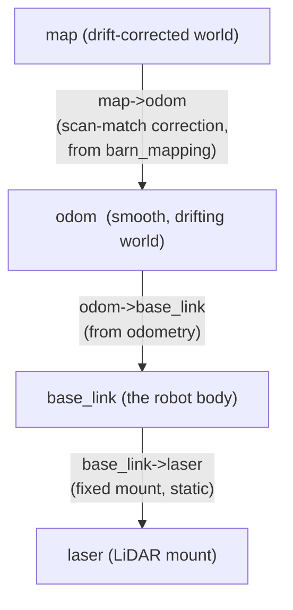
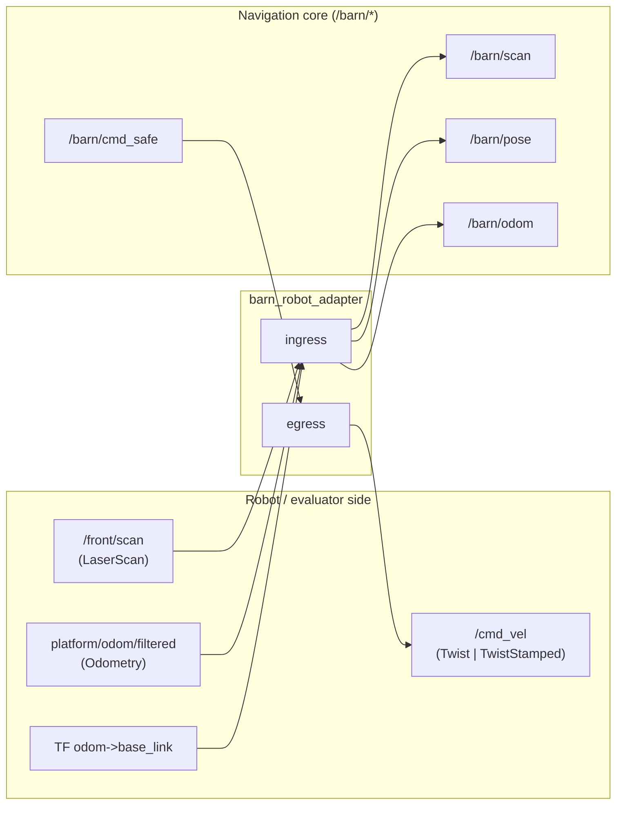

# 01 · The robot, its senses, and its frames

> **Part of the [BARN navigation tutorial](./README.md).**
> **Before this:** [00 · The BARN problem](./00-the-barn-problem.md) · **After this:** [02 · Mapping: occupancy and distance fields](./02-mapping-occupancy-and-distance-fields.md)

**What you'll learn**
- What kind of robot the Jackal is, and why it can drive and spin but never slide sideways.
- The two ways it perceives the world: one LiDAR looking outward, and odometry sensing its own motion.
- What a `LaserScan` message actually contains, field by field.
- What coordinate *frames* are (`base_link`, `odom`, `map`), and how a transform moves a point between them.
- Why the stack puts a thin **adapter** node between the real robot and the navigation core — and the exact internal-topic "contract" that adapter guarantees.

**Prerequisites:** [Chapter 00](./00-the-barn-problem.md) (what the BARN benchmark asks of us). Comfort with basic vectors and angles helps for the math boxes, but every section stands on its intuition and picture first.

---

## The robot: a Jackal, and what "differential drive" means

Picture a supermarket trolley with a twist: instead of casters you can only push,
each of its two sides has its own motor. You control the **left wheels** and the
**right wheels** independently. That is the whole story of a *differential-drive*
robot, and it is exactly how the Clearpath **Jackal** we navigate in BARN moves.

From two knobs — left speed and right speed — you get three behaviours:

- **Drive both sides equally forward** → the robot rolls straight ahead.
- **Drive one side faster than the other** → it arcs, curving toward the slower side.
- **Drive the sides in opposite directions** → it *spins in place*, pirouetting
  around its own centre without going anywhere.

What you cannot do is slide the robot straight to its left or right, the way you
would shove a shopping cart sideways into a parking spot. There is no motor for
that, and the wheels grip too well to skid on purpose. A robot with this "can go
forward and turn, but not sideways" restriction is called **nonholonomic** — a
long word for a simple handcuff: your *instantaneous* choices are fewer than your
*eventual* reachable positions. You can still get anywhere (park anywhere in the
lot), but only by combining forward motion with turning, never by a pure
side-step.

> **💡 Key idea:** The Jackal is steered by a single body twist — a forward speed
> $v$ and a turn rate $\omega$. Everything the navigation stack decides
> ultimately becomes those two numbers. That is why the command message carries
> exactly `linear.x` (forward) and `angular.z` (yaw rate), and nothing else
> useful — see `barn_robot_adapter/src/conversions.cpp:32`.

### The body and its footprint

Before we can avoid obstacles we need to know how much space the robot *takes up*.
The Jackal's body is modelled as a rectangle centred on the robot, described by
two half-extents measured from the centre:

| Quantity     | Symbol | Meaning                                    | Value (m) |
|--------------|--------|--------------------------------------------|-----------|
| Half-length  | $\ell$ | centre → front (or centre → back) bumper   | `0.254`   |
| Half-width   | $w$    | centre → left (or centre → right) side     | `0.2159`  |
| Safety margin| $m$    | extra shell added around the body          | `0.04`    |

So the physical robot is about $0.508\,\text{m}$ long and $0.432\,\text{m}$ wide —
knee-high and a bit longer than it is wide. BARN corridors can be barely wider
than this, which is what makes the benchmark hard.

> ### 🔍 In the code
> The footprint is a plain struct with these exact defaults, reused by every
> collision check in the classical stack:
>
> ```cpp
> // barn_classical/include/barn_classical/collision_checker.hpp:12
> struct Footprint
> {
>   double half_length{0.254};
>   double half_width{0.2159};
>   double margin{0.04};
> };
> ```

Here is the robot seen from directly above. The nose points along its **+x** body
axis; **+y** points to its left. This body frame is called `base_link`, and we
will meet it properly in a moment.

```
                 +x  (forward, "nose")
                  ^
                  |
        +---------|---------+   ---
        |         |         |    ^
        |         |         |    |
  +y <--+---------O---------+    | 2·half_width = 0.432 m
  (left)|         |         |    |
        |         |         |    v
        +---------|---------+   ---
        |<----------------->|
          2·half_length = 0.508 m

   O = base_link origin (robot centre)
   The robot may drive along +x or spin about O,
   but can never translate along +y.
```

> ### 📐 The math — differential-drive kinematics & the nonholonomic constraint
>
> Let the robot's pose in a fixed plane be $(x, y, \theta)$: position
> $(x,y)$ and heading $\theta$ (the angle of the +x body axis, measured
> counter-clockwise from the world +x axis). The two control inputs are the body
> **twist**: linear speed $v$ (along the nose) and yaw rate $\omega$ (positive =
> turning left). The motion of the robot is
>
> $$\dot{x} = v\cos\theta, \qquad \dot{y} = v\sin\theta, \qquad \dot{\theta} = \omega .$$
>
> Read it as: the robot always moves *in the direction it is pointing*, at speed
> $v$, while its heading turns at rate $\omega$. Because velocity is locked to the
> heading, the sideways component of motion is always zero. Eliminate $v$ from the
> first two equations and you get the **nonholonomic constraint**:
>
> $$\dot{x}\,\sin\theta - \dot{y}\,\cos\theta = 0 .$$
>
> This says the velocity vector $(\dot x, \dot y)$ has no component along the body
> +y axis — the robot cannot move sideways, at any instant, ever. It is not a
> boundary you can approach and touch; it is a wall built into the equations.
> See [Siegwart 2011] for the full derivation and the wheeled-robot zoo.

---

## Its one eye: the 2-D LiDAR

The Jackal perceives obstacles with a single **exteroceptive** sensor — a sensor
that looks *outward* at the world (as opposed to *proprioceptive* sensors that
feel the robot's own body). That sensor is a **2-D LiDAR**: a laser rangefinder
that spins, firing a beam at many evenly spaced angles and timing each echo to
measure the distance to whatever it hits.

Think of a lighthouse sweeping its beam around a slice of the world at ankle
height. For each angle it reports one number: *how far away is the nearest thing
in that direction?* Stack those numbers up and you get a fan of distances — a 2-D
outline of the walls and pillars around the robot, in that one horizontal plane.

The driver publishes this fan as a `sensor_msgs/LaserScan` message on the topic
`/front/scan`. The message is compact: instead of storing an angle *and* a range
for every beam, it stores the ranges in order and tells you how to reconstruct the
angles.

```
                 obstacle
                  #####
   ray i-1  ·····/     \
   ray i    ····/       range_max (dashed): no return -> +inf
   ray i+1  ·· /         .........................>
              /
        angle_increment
         between rays
              \
               O  LiDAR origin (on the robot)
              /|\
        angle_min   angle_max = angle_min + (N-1)*angle_increment

   Each ray -> one entry in ranges[]. A ray that hits nothing
   inside range_max is reported as +inf, not as a wall.
```

The important fields, and what they mean for us:

| Field             | Meaning                                                              |
|-------------------|---------------------------------------------------------------------|
| `angle_min`       | angle of the first beam (radians), in the sensor frame              |
| `angle_increment` | angular step between consecutive beams                              |
| `ranges[i]`       | measured distance for beam `i`; angle of beam `i` is `angle_min + i·angle_increment` |
| `range_min`       | closest trustworthy reading; nearer echoes are noise                |
| `range_max`       | farthest trustworthy reading                                        |

> **⚠️ Gotcha:** A beam that finds no obstacle within `range_max` does **not**
> return `range_max`. It returns **`+inf`** (infinity). "I see a wall exactly at
> my max range" and "I see nothing out here" are different facts, and the message
> keeps them different. Any code that reads `ranges[]` must treat `inf` (and
> sometimes `NaN`) as "no return", never as a distance. Chapter 02 leans on this
> when it decides which cells the laser has *cleared*.

The adapter never edits these numbers — it hands the raw scan straight through
(more on why below). The place the fields get unpacked into the navigation core's
own lightweight view is `to_view`:

> ### 🔍 In the code
> ```cpp
> // barn_robot_adapter/src/conversions.cpp:10
> barn_core::ScanView to_view(const sensor_msgs::msg::LaserScan & scan)
> {
>   view.ranges = scan.ranges.data();     // borrowed, not copied
>   view.count = scan.ranges.size();
>   view.angle_min = scan.angle_min;
>   view.angle_increment = scan.angle_increment;
>   view.range_min = scan.range_min;
>   view.range_max = scan.range_max;
>   ...
> ```
> The view *borrows* the message's range buffer rather than copying it — fast, but
> it must not outlive the message.

### The other sense: odometry

The LiDAR tells the robot about the world; **odometry** tells the robot about
*itself*. It is the robot's proprioception — the same sense that lets you touch
your nose with your eyes closed. By counting wheel rotations and fusing an IMU,
the platform estimates how far and how fast it has moved, and publishes that as a
`nav_msgs/Odometry` message on `platform/odom/filtered`. An `Odometry` message
carries a **pose** (where the robot thinks it is) and a **twist** (how fast it is
moving and turning) — exactly the $v$ and $\omega$ we control.

Odometry is smooth and always available, but it **drifts**: small errors in each
wheel count accumulate, so after a lot of turning the robot's believed position
slowly slides away from the truth. That drift is the reason a *map* frame exists
and the reason Chapter 02's scan-matcher has a job at all. Hold that thought.

---

## Coordinate frames and TF

Every number we have quoted — a range, a position, a footprint corner — is only
meaningful *relative to something*. "Three metres ahead" begs the question: ahead
of *what*? A **coordinate frame** is that "what": an origin and a set of axes that
give points a place to live. Robotics almost never uses just one frame, and the
machinery that relates them is called **TF** (short for *transform*).

An analogy. Imagine giving directions. To a passenger in your car you say "the
café is 200 m ahead on your right" — directions in the *car's* frame, which moves
with you. To someone on the phone you say "the café is on the corner of 5th and
Main" — directions in the *city's* frame, which never moves. Both describe the
same café; they differ only in the frame. A robot faces the same choice
constantly, so it keeps several frames and a rule for translating between them.

BARN uses three, following the ROS standard **REP-105**:

- **`base_link`** — bolted to the robot, origin at the robot's centre, +x out the
  nose, +y to the left (the footprint picture above). This is the robot's own
  point of view. The LiDAR sits at a fixed offset from it.
- **`odom`** — a fixed world frame the robot wakes up in. `base_link` glides
  through `odom` as the robot drives. It is smooth and continuous but drifts over
  time, exactly inheriting the odometry drift we just met.
- **`map`** — a fixed world frame that is *drift-corrected*. It is produced by the
  mapping node (Chapter 02) by matching live scans against the map it is building,
  so it stays pinned to the real world even when `odom` wanders.



Read the tree top-down: to know where the robot is *in the map*, you chain the
transforms. `map → odom` tells you how far the smooth frame has drifted;
`odom → base_link` tells you where the robot sits in the smooth frame;
`base_link → laser` tells you where the sensor sits on the body. Chain them and a
laser return becomes a point on the map.

> **💡 Key idea:** A frame has *no* meaning without the transforms that connect it
> to the others. TF is a live, timestamped tree of those transforms; ask it "where
> is `base_link` expressed in `odom` right now?" and it walks the tree and answers.

### How a transform actually moves a point

A 2-D rigid transform is a rotation plus a translation. To express a point known
in frame *B* (say the robot body) in frame *A* (say `odom`), you rotate it by the
angle between the frames and then shift it by the offset between their origins.

> ### 📐 The math — a planar transform, and yaw from a quaternion
>
> Let frame *B*'s origin sit at $(t_x, t_y)$ in frame *A*, rotated by angle
> $\theta$. A point $p_B = (x_B, y_B)$ expressed in *A* is
>
> $$
> \begin{bmatrix} x_A \\ y_A \end{bmatrix}
> =
> \begin{bmatrix} \cos\theta & -\sin\theta \\ \sin\theta & \cos\theta \end{bmatrix}
> \begin{bmatrix} x_B \\ y_B \end{bmatrix}
> +
> \begin{bmatrix} t_x \\ t_y \end{bmatrix}.
> $$
>
> That "rotate then translate" pattern is exactly what the adapter applies when it
> folds the drift correction into the pose (`robot_adapter_node.cpp:113`) — same
> $\cos\theta / \sin\theta$ mixing, same additive offset.
>
> **Where does $\theta$ come from?** ROS stores 3-D orientation as a **quaternion**
> $(x, y, z, w)$ — four numbers that avoid the singularities of Euler angles. For a
> robot on flat ground only the *yaw* (rotation about vertical) matters, and it is
> recovered by
>
> $$\theta = \text{atan2}\!\big(2(wz + xy),\; 1 - 2(y^2 + z^2)\big).$$
>
> Symbols: $(x,y,z,w)$ are the quaternion components; $\theta$ is the planar
> heading; `atan2` is the two-argument arctangent that returns the correct quadrant.

> ### 🔍 In the code
> That yaw formula is precisely what `to_pose2d` uses to turn an `Odometry`
> orientation into a planar heading:
>
> ```cpp
> // barn_robot_adapter/src/conversions.cpp:22
> const auto & q = odom.pose.pose.orientation;
> pose.yaw = barn_core::yaw_from_quat(q.x, q.y, q.z, q.w);
> ```
>
> (When the robot really is planar — flat ground, so $x \approx y \approx 0$ — the
> general formula collapses to the shortcut $\theta = 2\,\text{atan2}(z, w)$,
> which is exactly what the drift-correction callback uses at
> `robot_adapter_node.cpp:78`.)

---

## Why an adapter? The internal-topic contract

Here is a design decision worth understanding, because the whole stack is built on
it. The evaluator hands us robot-specific topics: scans on `/front/scan`,
odometry on `platform/odom/filtered`, and it wants commands on `/cmd_vel`. Those
names, types, and quirks belong to *this particular robot wiring*. If the
navigation core subscribed to them directly, then swapping to a different robot —
or a different simulator, or the physical Jackal — would mean editing planners,
controllers, and safety code all over the tree.

So the stack inserts one thin translator: **`barn_robot_adapter`**. It is the
single door between "the robot's world" and "our world". Everything inside speaks
a fixed private vocabulary of `/barn/*` topics; the adapter is the only node that
knows the robot's real topic names and the real `/cmd_vel` type. Swap robots and
you rewrite *one* node.

> **💡 Key idea:** The adapter *decouples* the navigation core from the exact
> robot wiring. It is also the one place the true `/cmd_vel` wire type is confirmed
> against the live graph — because a mismatch there means the base silently ignores
> every command. Decoupling like this is a recurring theme; you will see the same
> "one node owns the boundary" pattern for goals and for safety.



### Ingress: bringing the robot's senses inward

On the way *in*, the adapter does three small jobs (`robot_adapter_node.cpp`):

1. **Scan relay.** `/front/scan` is republished *verbatim* as `/barn/scan`. No
   filtering, no reprojection — the core builds its own view from raw ranges, so
   the adapter must not pre-chew them (`scan_callback`, line 67).
2. **Pose.** From TF `odom → base_link` (falling back to the odometry message if
   TF is not ready yet), it publishes the robot's pose as
   `geometry_msgs/PoseStamped` on `/barn/pose`, applying the mapping node's drift
   correction so the pose, the goal, and the map all live in one frame
   (`odom_callback`, line 85).
3. **Odom.** It republishes the odometry — keeping the *measured* twist but making
   the *pose* agree with `/barn/pose` — as `/barn/odom`, so predictive control
   never has to reach back across the robot boundary.

### Egress: sending our decision back out

On the way *out*, the adapter takes the safety-approved command `/barn/cmd_safe`
(a `TwistStamped`) and writes it to `/cmd_vel`. The wire type of `/cmd_vel` is a
**parameter**, `cmd_vel_type`, because the 2026 baseline routes commands through a
downstream *velocity smoother* whose expected type differs by setup:

- `twist_stamped` (default) → publish `geometry_msgs/TwistStamped`;
- `twist` → publish a bare `geometry_msgs/Twist`.

Exactly one publisher is created at startup, per the parameter:

> ### 🔍 In the code
> ```cpp
> // barn_robot_adapter/src/robot_adapter_node.cpp:52
> if (cmd_vel_type_ == "twist") {
>   cmd_unstamped_pub_ = create_publisher<geometry_msgs::msg::Twist>(cmd_vel_topic_, 10);
> } else {
>   cmd_stamped_pub_ = create_publisher<geometry_msgs::msg::TwistStamped>(cmd_vel_topic_, 10);
> }
> ```

> **⚠️ Gotcha:** If the base subscribes to `/cmd_vel` as a `Twist` but the adapter
> publishes `TwistStamped` (or vice-versa), the base receives *nothing* — no
> error, no motion, just silence. Always confirm the live type on first bring-up
> with `ros2 topic info /cmd_vel --verbose` and flip `cmd_vel_type` to match. This
> is the single reason the type is a parameter at all.

### The internal-topic table

These are the `/barn/*` topics the adapter guarantees. The whole rest of the
tutorial talks in these names; the parameter defaults are from
`barn_bringup/config/classical_mpc.yaml` (`robot_adapter_node` section) and the
node's `declare_parameter` calls.

| Internal topic         | Direction | Type                              | Source (external)                | Frame                 |
|------------------------|-----------|-----------------------------------|----------------------------------|-----------------------|
| `/barn/scan`           | out       | `sensor_msgs/LaserScan`           | relay of `/front/scan`           | LiDAR frame           |
| `/barn/pose`           | out       | `geometry_msgs/PoseStamped`       | `odom` + TF, drift-corrected     | `map` (`corrected_frame`) |
| `/barn/odom`           | out       | `nav_msgs/Odometry`               | `platform/odom/filtered` (+ pose fix) | `map` / `base_link` child |
| `/barn/cmd_safe`       | in        | `geometry_msgs/TwistStamped`      | safety node                      | `base_link`           |
| `/cmd_vel`             | out       | `Twist` **or** `TwistStamped`     | egress of `/barn/cmd_safe`       | `base_link`           |

The relevant adapter parameters and their defaults:

| Parameter          | Meaning                                   | Default                  |
|--------------------|-------------------------------------------|--------------------------|
| `scan_topic`       | external scan in                          | `/front/scan`            |
| `odom_topic`       | external odometry in                      | `platform/odom/filtered` |
| `odom_frame`       | smooth world frame                        | `odom`                   |
| `base_frame`       | robot body frame                          | `base_link`              |
| `internal_scan_topic` | relayed scan out                       | `/barn/scan`             |
| `internal_pose_topic` | pose out                               | `/barn/pose`             |
| `internal_odom_topic` | odom out                               | `/barn/odom`             |
| `safe_cmd_topic`   | safety-approved command in                | `/barn/cmd_safe`         |
| `cmd_vel_topic`    | command out to base                       | `/cmd_vel`               |
| `cmd_vel_type`     | wire type of `/cmd_vel`                    | `twist_stamped`          |
| `cmd_vel_frame`    | frame stamped on outgoing command         | `base_link`              |
| `corrected_frame`  | label for drift-corrected pose/odom       | `map`                    |

> **📎 Forward link:** The `map` frame that `/barn/pose` is labelled with, and the
> drift correction the adapter applies, are *produced* by the mapping node. That is
> [Chapter 02](./02-mapping-occupancy-and-distance-fields.md) — where the scan you
> just learned to read becomes an occupancy grid and a distance field, and where
> the scan-matcher earns the word "corrected".

---

## Recap

- The Jackal is a **differential-drive**, **nonholonomic** robot: steered by one
  body twist $(v, \omega)$, it drives and spins but never slides sideways
  ($\dot x\sin\theta - \dot y\cos\theta = 0$). Its footprint is a rectangle with
  half-length `0.254 m` and half-width `0.2159 m`.
- It senses the world with one **2-D LiDAR** (`sensor_msgs/LaserScan` on
  `/front/scan`: angles from `angle_min`/`angle_increment`, distances in `ranges`,
  `+inf` for no return) and senses **itself** with drifting **odometry**.
- Three **frames** (`base_link`, `odom`, `map`, per REP-105) and the **TF** tree
  that links them let a laser return become a point on the map; a planar transform
  rotates then translates a point, and yaw comes from a quaternion via `atan2`.
- A thin **adapter** owns the robot boundary, translating robot topics into a fixed
  `/barn/*` contract so the navigation core never depends on the exact wiring — and
  it is the one place the real `/cmd_vel` type is confirmed.

## Try it yourself

In the distrobox, with the stack running, look at the robot with its own eyes:

```bash
# What is really flowing on the scan, and at what angles?
ros2 topic echo /barn/scan --once | head -n 20

# Confirm the live /cmd_vel type — the gotcha above in one command.
ros2 topic info /cmd_vel --verbose

# Watch the frames relate in real time (prints odom->base_link).
ros2 run tf2_ros tf2_echo odom base_link
```

Thought exercise: the robot is stationary, pointing north, and you command
$v = 0,\ \omega = 0.5\ \text{rad/s}$. Using the kinematics box, what happens to
$x$, $y$, and $\theta$? Now command $v = 0.5,\ \omega = 0$ — which of the three
changes, and why can it never make $y$ change *sideways* relative to the body?

## References

- [Siegwart 2011] — *Introduction to Autonomous Mobile Robots*: differential-drive
  kinematics, the nonholonomic constraint, and the wheeled-robot families. See
  [references.md](./references.md).

---
◀ [00 · The BARN problem](./00-the-barn-problem.md) · [tutorial index](./README.md) · [02 · Mapping: occupancy and distance fields](./02-mapping-occupancy-and-distance-fields.md) ▶
