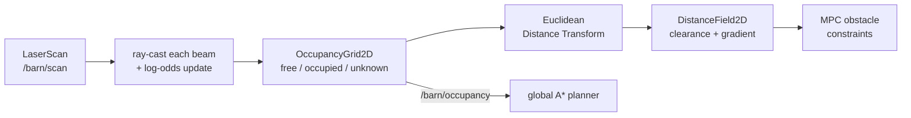
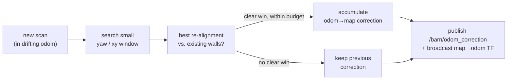

# 02 · Seeing the world — occupancy grids and distance fields

> **Part of the [BARN navigation tutorial](./README.md).**
> **Before this:** [01 · The robot and its senses](./01-the-robot-and-its-senses.md) · **After this:** [03 · Global planning with A\*](./03-global-planning-with-a-star.md)

**What you'll learn**
- How a stream of raw LiDAR hits becomes a tidy grid of *free / occupied / unknown* cells.
- Why the map stores **log-odds** instead of probabilities, and what each tuning knob really does.
- The drift-correction twist that keeps the map, the robot's pose, and the goal all in one frame.
- How a **distance field** turns "where are the walls" into "how far is the nearest wall from *here*",
  and why the planner and the controller both live off that number.

**Prerequisites:** [Chapter 01](./01-the-robot-and-its-senses.md) — you should know that the robot
publishes a `LaserScan` on `/barn/scan` and a `PoseStamped` on `/barn/pose`. A little trigonometry
helps for the math boxes, but every idea is explained in words first.

---

## Why a map at all?

The LiDAR gives you a fan of range readings — hundreds of little "the nearest thing in *this*
direction is 2.3 m away" measurements, refreshed many times a second. That is enough to *react*
(swerve away from the closest return), but it is a terrible thing to *plan* over. Each scan is a
fresh snapshot from wherever the robot happens to be standing; nothing accumulates; the wall behind
the robot simply vanishes the instant the beam sweeps past it.

A planner wants the opposite: a stable, top-down chart of the world it can search across —
"is *this* square metre over there walkable?" — even for places the sensor isn't looking at right
now. That chart is the **occupancy grid**, and turning it into a **clearance map** (the distance
field) is what the rest of this chapter builds.



Both boxes on the top row live in one node — `barn_mapping` — and both ideas follow the tutorial's
**intuition → picture → math** rule. Let's take them in order.

---

## Part A — The occupancy grid

### Intuition: shading in graph paper

Imagine you are exploring a dark warehouse with a tape measure and a sheet of graph paper. Every
time the tape hits a wall, you shade the square where the wall is. Every square the tape *passed
through* on the way there, you know is empty, so you lightly cross it out. Squares you have never
measured stay blank. Walk around long enough and the blank sheet fills into a floor plan.

That is exactly what an occupancy grid does, automatically, at 15 times a second. The world is
chopped into small square **cells**; each cell is one of three states:

- **free** — a beam has passed through it (crossed-out square),
- **occupied** — a beam ended in it (shaded square),
- **unknown** — no beam has touched it yet (blank square).

```
top-down occupancy grid  ( . = free   # = occupied   ? = unknown )

    ? ? ? ? ? ? ? ? ? ?
    ? # # # # # # # ? ?        # walls the LiDAR has seen
    ? # . . . . . # ? ?        . free space rays passed through
    ? # . . R . . # ? ?        R the robot, mapping outward
    ? # . . . . . # ? ?
    ? # # # # ? ? ? ? ?        ? cells no beam has reached yet
    ? ? ? ? ? ? ? ? ? ?
```

In BARN the cells are **0.05 m** on a side (`resolution`), the whole sheet is **50 m × 30 m**, and
the grid's origin — the world coordinate of the corner of cell (0, 0) — is pinned under the robot's
*first* pose so the robot starts near the middle:

> ### 🔍 In the code
> `ros2_ws/src/barn_mapping/src/mapping_node.cpp:91`
> ```cpp
> grid_ = barn_core::OccupancyGrid2D(
>   width, height, resolution_, msg->pose.position.x - width_m_ / 2.0,
>   msg->pose.position.y - height_m_ / 2.0);
> ```
> The grid is allocated once, on the first `/barn/pose` message, and anchored so the robot sits at
> the centre. Config: `ros2_ws/src/barn_bringup/config/classical_mpc.yaml:46` (`resolution: 0.05`,
> `width_m: 50.0`, `height_m: 30.0`).

The cell states aren't stored directly, though. Storing a hard "free/occupied" label would throw
away a spurious reading forever, or trust a lucky one too soon. Instead each cell holds a *running
tally of evidence*. That tally is a **log-odds** value — and it is worth understanding why.

### Picture: adding evidence, beam by beam

Every beam does two things to the map. Along its length it deposits a little *free* evidence in
each cell it crosses; at its endpoint (if it actually struck something) it deposits *occupied*
evidence. Walk a beam from the robot to a wall:

```
robot                                        wall
  R ---- . ---- . ---- . ---- . ---- . ---- [#]
        miss   miss   miss   miss   miss    hit
        -0.85  -0.85  -0.85  -0.85  -0.85   +0.45     (log-odds added)

each cell keeps a sum; the more a cell is crossed, the more negative
(confidently free); the more a cell is hit, the more positive (occupied).
```

Every scan is another round of these little additions on top of what is already there. A cell that
is genuinely a wall gets hit again and again and climbs positive; a cell in open space gets crossed
again and again and sinks negative. One noisy reading barely moves the tally — the map is a voter,
not a single witness.

Tracing which cells a beam crosses is a straight-line rasterisation — the classic **Bresenham**
line walk — from the sensor cell to the endpoint cell:

> ### 🔍 In the code
> `ros2_ws/src/barn_mapping/src/mapping_node.cpp:369`
> ```cpp
> for (const auto & beam : beams) {
>   const double ex = corr_cos_ * beam.ex - corr_sin_ * beam.ey + corr_x_;
>   const double ey = corr_sin_ * beam.ex + corr_cos_ * beam.ey + corr_y_;
>   const auto end = grid_.world_to_cell(ex, ey);
>   integrate_ray(grid_, start, end, beam.hit && grid_.in_bounds(end), sensor_model_);
> }
> ```
> `integrate_ray` (`ros2_ws/src/barn_mapping/include/barn_mapping/ray_integrator.hpp`) walks the
> beam with Bresenham, adding `miss` to every crossed cell and `hit` to the endpoint only when
> `endpoint_is_hit` is true (a real return, not a max-range fade-out).

### The math: why log-odds

Here is the elegant part. If you tried to combine evidence as raw probabilities you'd be multiplying
fractions and re-normalising every update — fiddly and numerically touchy near 0 and 1. Take the
*logarithm of the odds* instead and Bayesian fusion collapses into plain **addition**. Adding a
scan's evidence becomes `+=`. That's it.

**📐 The math**

Store each cell as its **log-odds** $l = \log\dfrac{p}{1-p}$, where $p$ is the probability the
cell is occupied. Integrating one measurement $z$ under an inverse sensor model is a single add:

```math
l_{t} \;=\; l_{t-1} \;+\; \text{logodds}\!\big(p(m \mid z)\big)
```

In BARN the increment takes one of two constant values — the **inverse sensor model** —
depending on whether the cell is the beam's endpoint or merely on its path, and the result is
**clamped** so no cell can become infinitely certain:

```math
l_t \;=\; \text{clamp}\!\Big(\, l_{t-1} + \underbrace{\ell_{\text{hit}}}_{+0.45\ \text{if endpoint}}
\ \text{or}\ \underbrace{\ell_{\text{miss}}}_{-0.85\ \text{if crossed}},\ \; l_{\min},\ l_{\max}\Big)
```

To read a probability back out, invert the transform:

```math
p \;=\; \frac{1}{1 + e^{-l}}
```

| symbol | meaning | value (config) |
|---|---|---|
| $l$ | cell log-odds (the stored number) | starts at $0$ (unknown) |
| $\ell_{\text{hit}}$ | evidence added at an occupied endpoint | $0.45$ |
| $\ell_{\text{miss}}$ | evidence added along a free ray | $-0.85$ |
| $l_{\min}, l_{\max}$ | clamp bounds | $-4.0,\ 2.5$ |

A cell starts at $l = 0$, i.e. $p = 0.5$ — pure "unknown", no evidence either way. The classifier
then reads the tally against two thresholds:

> ### 🔍 In the code
> `ros2_ws/src/barn_core/src/occupancy.cpp:73` (and the header default thresholds at
> `ros2_ws/src/barn_core/include/barn_core/occupancy.hpp:63`)
> ```cpp
> CellState OccupancyGrid2D::classify(const GridIndex & idx,
>     double free_threshold, double occupied_threshold) const {
>   const double l = log_odds(idx);
>   if (l >= occupied_threshold) return CellState::kOccupied;   // default 0.85
>   if (l <= free_threshold)     return CellState::kFree;       // default -0.4
>   return CellState::kUnknown;
> }
> ```
> The published `nav_msgs/OccupancyGrid` maps these to the ROS convention `100 / 0 / -1`
> (`mapping_node.cpp:438`). Note one $\ell_{\text{hit}} = 0.45$ doesn't cross the $0.85$ occupied
> threshold — it takes **two** consistent hits (0.90) to declare a wall, which is the latency the
> config comment is talking about.

The clamp helper and the probability round-trip live in one small header:

> ### 🔍 In the code
> `ros2_ws/src/barn_core/include/barn_core/logodds.hpp:36`
> ```cpp
> double update(double cell, bool occupied) const {
>   const double next = cell + (occupied ? hit : miss);
>   return std::min(std::max(next, clamp_min), clamp_max);
> }
> ```

### What the knobs actually do

These four numbers are the whole personality of the mapper. The BARN values are deliberately *not*
the textbook defaults, and the config comments explain why. Here is the intuition:

| param | symbol | value | raise it → | lower it → |
|---|---|---|---|---|
| `log_odds_hit` | $\ell_{\text{hit}}$ | `0.45` | walls confirmed in fewer scans (lower obstacle **latency**) — but slowly drifting scans **drag** the map with them before the matcher notices | slower to trust a wall, but the frame has time to anchor |
| `log_odds_miss` | $\ell_{\text{miss}}$ | `-0.85` | clears free space aggressively (good for a moving robot) | free space lingers, ghosts persist |
| `log_odds_min` | $l_{\min}$ | `-4.0` | — | deeper "definitely free" memory (harder to re-occupy) |
| `log_odds_max` | $l_{\max}$ | `2.5` | walls become "unforgettable" (slow to erase if wrong) | walls erase faster when re-observed as free |

> **💡 Key idea:** There is a genuine tension here. A **high** `log_odds_hit` gives you a snappy,
> low-latency map — but because a wall is repainted in just a scan or two, if the robot's estimate
> of *where it is* is drifting, the wall gets repainted at the drifted position and the whole map
> smears along with the error ("map dragging"). BARN picks a **moderate** `0.45` on purpose: quick
> enough to react, slow enough that the scan-matcher (next section) can spot and cancel the drift
> before it bakes in. See the comment at `classical_mpc.yaml:51`.

### The drift-correction twist

There is one subtlety here that trips up every "just build an occupancy grid" tutorial, and BARN
has to solve it head-on.

> **⚠️ Gotcha — the floor is moving under the map.** The robot's pose comes from the platform's
> EKF, which fuses *absolute wheel-odometry yaw*. Wheels **slip** during an in-place rotation, so
> that yaw estimate quietly wanders — which means the `odom` frame the map is drawn in is itself
> **drifting**. Paint scans blindly into a drifting frame and the walls rotate away from where they
> really are; the planner then chases phantom gaps and the robot misses the goal circle at the
> finish line.

The fix is **scan-to-map registration**. Before integrating a new scan, the mapper asks: *is there
a small rotation (and tiny translation) of this scan that lines its hits up better with the walls
already in the map?* It searches a narrow window — about ±0.06 rad of yaw in 0.005 rad steps, ±0.04 m
of xy — scores each candidate by how well the scan's hits land on existing occupied evidence, and if
one clearly wins, it folds that correction into a running `odom → map` transform.



That correction is then published two ways so *everything* stays in one frame: broadcast as the
`map → odom` TF (so RViz and the planner agree), and sent on `/barn/odom_correction` for the robot
adapter to fold back into `/barn/pose` and `/barn/odom`. Map, pose, and the latched goal all move
together.

> ### 🔍 In the code
> `ros2_ws/src/barn_mapping/src/mapping_node.cpp:222` (the registration search) and
> `mapping_node.cpp:349` (publishing the correction). The header explains the *why* at
> `ros2_ws/src/barn_mapping/include/barn_mapping/mapping_node.hpp:59`.
> A **divergence guard** budgets how much yaw correction can be accepted per second
> (`scan_match_max_yaw_rate: 0.25`, burst `scan_match_yaw_burst: 0.50`) so the matcher can't run
> away chasing feature-poor geometry — real wheel slip is slow.

We keep this at the intuition level on purpose; the full geometry is a rabbit hole. The takeaway a
beginner needs: **the map isn't just accumulated, it's continuously re-aligned against itself**, and
that is what makes the downstream planning trustworthy. (See also the memory note *"BARN odom yaw
drift + scan-match fix"* — this is a real bug this code exists to fix.)

---

## Part B — The distance field

### Intuition: heat radiating from the walls

The occupancy grid answers *"is this exact cell a wall?"* But a planner rarely asks that. It asks
*"how much room do I have here?"* and *"which way is 'away from the nearest wall'?"* Answering those
from the raw grid would mean, at every query, scanning outward for the closest occupied cell — far
too slow to do thousands of times per planning cycle.

So we precompute the answer everywhere, once per map update, into a **distance field**: a second
grid where each cell stores *the distance to the nearest obstacle*. Picture heat radiating out from
every wall — right against a wall it's 0, and it grows steadily as you move into open space.

```
distance field  (metres to nearest # ; walls are 0.00, clearance grows outward)

    # # # # # # #
    0.00 0.00 0.00 0.00 0.00 0.00 0.00
    0.05 0.05 0.05 0.05 0.05 0.05 0.05
    0.10 0.10 0.11 0.11 0.11 0.10 0.10
    0.15 0.16 0.18 0.20 0.18 0.16 0.15      ← more clearance mid-corridor
    0.20 0.22 0.25 0.28 0.25 0.22 0.20
    0.25 0.28 0.32 0.36 0.32 0.28 0.25      ← safest line runs down the middle
```

Two things fall out of this map for free:

1. **Clearance** — the value at the robot's cell *is* its distance to the nearest obstacle. The
   global planner uses it to prefer routes down the middle of corridors, and the safety layer uses
   it to know when a pinch is too tight.
2. **A gradient** — the *direction* the values increase points straight away from the nearest wall.
   That vector is exactly the "push" the MPC needs to keep a smooth safety margin.

### The math: the Euclidean Distance Transform

Formally the distance field is the **Euclidean Distance Transform (EDT)** of the set of occupied
cells. In words: for every point, take the distance to the *closest* occupied point.

**📐 The math**

Let $\mathrm{Occ}$ be the set of occupied cells. The distance field is

```math
D(p) \;=\; \min_{q \,\in\, \mathrm{Occ}} \lVert p - q \rVert .
```

Computed naively this is $O(n \cdot |\mathrm{Occ}|)$ — hopeless at map scale. The trick is that
the squared transform is **separable**: you can run an exact 1-D distance transform down every
**column**, then run the same 1-D transform across every **row** of that intermediate result, and
the two passes compose into the exact 2-D answer. Each 1-D pass is the
**Felzenszwalb–Huttenlocher** lower-envelope-of-parabolas algorithm, which is **linear**, so the
whole field is

```math
O(n) \quad\text{for } n = \text{cells},
```

independent of how many obstacles there are. Distances come out in *cells*; BARN multiplies by
`resolution` (0.05 m) to get metres. [Felzenszwalb 2012]

> ### 🔍 In the code
> `ros2_ws/src/barn_core/src/distance_field.cpp:94` — the two separable passes. The 1-D primitive
> `edt_1d` (`distance_field.cpp:18`) is the lower-envelope algorithm; the vertical pass fills a
> scratch buffer, the horizontal pass reads it back and takes the square root:
> ```cpp
> distances_[row * width_ + col] = squared_cells >= kInfinity / 2.0 ?
>   std::numeric_limits<double>::infinity() : std::sqrt(squared_cells) * resolution_;
> ```
> The field is rebuilt every publish tick from the current grid (`mapping_node.cpp:409`,
> `distance_field_.rebuild(grid_)`). The comment at `distance_field.cpp:85` notes the work buffers
> are reused across all rows and columns — thousands of tiny allocations per 5–15 Hz update would
> starve the simulator.

### Reading the field: clearance and gradient

The two accessors the rest of the stack calls are `distance_world()` and `gradient_world()`. The
first hands back the metric clearance at a world point; the second returns its gradient by central
differences — the "away from the wall" direction, in metres per metre.

> ### 🔍 In the code
> `ros2_ws/src/barn_core/src/distance_field.cpp:176`
> ```cpp
> gx = (right - left) / (2.0 * resolution_);
> gy = (up - down) / (2.0 * resolution_);
> return true;
> ```
> `gradient_world` returns `false` (and zero) at the map edge or beside an unknown/infinite cell, so
> callers can tell a real push from "no information". This is the number the MPC's obstacle
> constraints lean on — **we forward-link that to [Chapter 04](./04-local-planning-and-mpc.md)**,
> where the clearance and its gradient become soft constraints in the optimiser.

> **💡 Key idea — unknown space is *not* an obstacle.** `rebuild()` takes
> `unknown_is_obstacle = false` by default (`distance_field.hpp:24`), so only cells that classify as
> **occupied** seed the transform. Open *and* unknown space both read as large clearance. That's
> deliberate: BARN's worlds are cluttered, and treating never-yet-seen cells as walls would wall the
> robot into the tiny patch it has already scanned. The planner is allowed to *consider* unknown
> space — it just pays an extra cost for the risk (`unknown_cost_multiplier`, Chapter 03), rather
> than being forbidden outright.

---

## Recap

- The **occupancy grid** turns a stream of LiDAR scans into a stable top-down chart of
  *free / occupied / unknown* cells, at 0.05 m resolution, anchored under the robot's first pose.
- Each cell stores **log-odds**, so fusing a new scan is just addition; hits add $\ell_{\text{hit}}
  = 0.45$, misses add $\ell_{\text{miss}} = -0.85$, and the tally is clamped to $[-4.0, 2.5]$.
- `log_odds_hit` trades **obstacle latency against map-dragging**; BARN keeps it moderate so the
  **scan-to-map matcher** can cancel the EKF's slipping-yaw drift before it bakes into the map.
- The **distance field** (EDT) converts "where are the walls" into "how far is the nearest wall,
  and which way is away from it", computed in **linear time** by the separable
  Felzenszwalb–Huttenlocher algorithm.
- `distance_world()` and `gradient_world()` feed clearance and its gradient to the planner and the
  MPC; **unknown space reads as clear**, not blocked.

## Try it yourself

1. **Watch the map fill in.** In the distrobox, launch the classical stack and open RViz with the
   `barn.rviz` config. Add the `/barn/occupancy` display and drive the robot forward — watch free
   space (light) sweep ahead of the beams and walls (dark) firm up over a couple of scans.
2. **Feel the latency knob.** Edit `classical_mpc.yaml` and set `log_odds_hit: 0.9`. Rebuild and
   spin the robot in place near a wall — do the walls smear or "ghost" more as the odom yaw drifts?
   Now set it to `0.2`: walls take longer to appear but the frame stays cleaner. Put it back to
   `0.45`.
3. **Thought exercise.** A single beam grazes the edge of a distant pillar for one scan, then never
   again. With $\ell_{\text{hit}} = 0.45$ and an occupied threshold of $0.85$, does that cell ever
   get labelled "occupied"? What if the same cell is crossed by a free ray on the next scan? (This
   is the log-odds voter shrugging off noise.)

## References

- [Elfes 1989] — occupancy grids for mobile-robot mapping (the original formulation).
- [Thrun 2005] — *Probabilistic Robotics*: the log-odds inverse-sensor-model derivation.
- [Felzenszwalb 2012] — *Distance Transforms of Sampled Functions*: the linear-time separable EDT.

Full entries in [`./references.md`](./references.md).

---
◀ [01 · The robot and its senses](./01-the-robot-and-its-senses.md) · [tutorial index](./README.md) · [03 · Global planning with A\*](./03-global-planning-with-a-star.md) ▶
