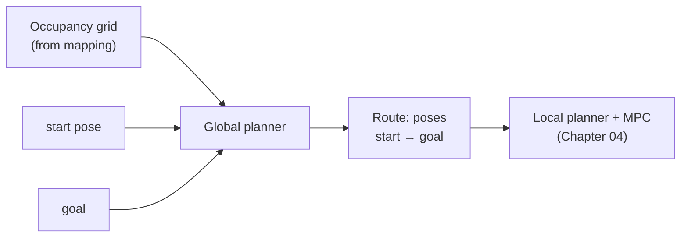
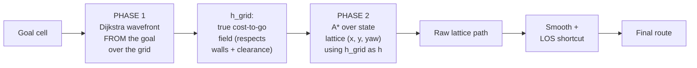

# 03 · Global planning — A\* search over a lattice

> **Part of the [BARN navigation tutorial](./README.md).**
> **Before this:** [02 · Mapping: occupancy & distance fields](./02-mapping-occupancy-and-distance-fields.md) · **After this:** [04 · Local planning & MPC](./04-local-planning-and-mpc.md)

**What you'll learn**
- Why a robot plans a *whole route* before it moves, and how search "explores" a grid
- Dijkstra → A\* → heuristic-weighted A\*: the idea of `f = g + h` and what the
  weight buys you
- BARN's clever two-phase planner: a Dijkstra **cost-to-go field** feeding an A\*
  search over a **state lattice** in `(x, y, yaw)`
- The costs that *shape* the path — length, clearance, unknown space, turning —
  and the swept-footprint feasibility check that keeps the body off the walls
- The post-processing that turns a jagged lattice path into something drivable

**Prerequisites:** [Chapter 02](./02-mapping-occupancy-and-distance-fields.md) —
you should know what the occupancy grid is (free / occupied / unknown cells) and
what the **distance field** gives you (metres of clearance to the nearest obstacle
at any cell).

---

## 1. The problem: from a map to a route

You have a map. The mapping node ([Chapter 02](./02-mapping-occupancy-and-distance-fields.md))
hands you an occupancy grid: a big rectangle of cells, each labelled *free*,
*occupied*, or *unknown*. You also have a **start** (where the robot is) and a
**goal** (where the evaluator wants it). What you do *not* have is a route.

The job of the **global planner** is to produce that route — a sequence of poses
from start to goal that a small robot can actually drive, staying off the walls
of a cluttered BARN corridor.

> **💡 Key idea:** The global planner is the strategist. It looks at the *whole*
> map and commits to a route *before the robot moves*. The local planner and MPC
> ([Chapter 04](./04-local-planning-and-mpc.md)) are the tacticians — they follow
> that route while reacting to what the sensors see right now. Splitting "where to
> go overall" from "how to move next" is what keeps the robot both *purposeful*
> and *reactive*.

### Search as exploring a maze

Imagine you're standing at the entrance of a hedge maze and you want the exit.

Two ways to solve it:

- **Flood-fill.** Pour water in at your feet. It spreads down every open path at
  once, an even wavefront, until some drop reaches the exit. You've now explored
  the *entire* maze — thorough, but you looked everywhere, including dead ends
  pointing away from the exit. This is **Dijkstra's algorithm**.
- **Hiker with a compass.** You know roughly which *direction* the exit is. At
  each junction you prefer the branch that heads that way. You still backtrack out
  of dead ends, but you waste far less effort on paths pointing the wrong way.
  This is **A\***.

Both are *frontier* searches: you keep a growing boundary of "cells I've reached
but not yet explored past", and you repeatedly pick one, look at its neighbours,
and grow the frontier outward. The only difference is *which* frontier cell you
pick next. That single choice is the whole story of this chapter.



---

## 2. Dijkstra: the even wavefront

Start with the flood-fill. Give every cell a running number `g` = *cost of the
cheapest route found so far from the start to this cell*. Initialise the start at
`g = 0` and everything else at `g = ∞`. Keep a queue of frontier cells ordered by
`g`. Repeatedly:

1. Pop the frontier cell with the **smallest `g`**.
2. For each neighbour, the route through the current cell costs
   `g(current) + step_cost`. If that's cheaper than the neighbour's current `g`,
   update it and put it on the frontier.

Because you always expand the cheapest cell first, the first time you pop the goal
you've found its cheapest route. Dijkstra is **optimal** — it never returns a route
more expensive than necessary [Dijkstra 1959].

The catch is the "flood in all directions" part. Dijkstra has no idea where the
goal is, so it expands a roughly circular wavefront outward from the start,
spending effort on cells that lead *away* from the goal. In a big map with a
100-millisecond deadline, that's wasted time.

```
Dijkstra wavefront from S (numbers = g, cost-so-far):

      3 2 3
    3 2 1 2 3        the frontier is a ring;
    2 1 S 1 2        it grows evenly outward,
    3 2 1 2 3        toward the goal AND away from it
      3 2 3
```

---

## 3. A\*: point the search at the goal

A\* keeps Dijkstra's `g` but adds a second number: `h`, a *guess* of the cost
still to go from a cell to the goal. Instead of expanding the cell with the
smallest `g`, you expand the one with the smallest

$$ f = g + h. $$

`g` is what a route has cost *so far* (known, exact). `h` is what it's *estimated*
to cost from here to the goal (a guess, the "compass"). Their sum `f` estimates
the total cost of the best route *through* this cell. Expanding the smallest `f`
first means you pursue cells that look like they're on a good complete route — the
hiker heading toward the exit [Hart 1968].

```
Same map, A* with h = straight-line distance to goal G (right side).
Each cell shows  g|h|f :

    2|3|5   1|2|3   2|1|3
    1|2|3   S       1|0|1  G       A* prefers the low-f cells
    2|3|5   1|2|3   2|1|3          on the S→G line and barely
                                   touches the cells behind S
```

Notice the cells directly behind `S` (away from `G`) get a large `h`, so a large
`f`, so A\* expands them last or never. That's the win: same answer as Dijkstra,
far fewer cells touched.

### When is the answer still optimal?

`h` is a guess, so it could lie. There's one rule that keeps A\* optimal: `h` must
be **admissible** — it must *never overestimate* the true remaining cost. An
admissible `h` is optimistic; it might promise a cell is closer than it is, but it
never scares you off a cell that was actually good. Straight-line ("as the crow
flies") distance is the classic admissible heuristic: no real route is ever shorter
than the straight line.

> **### 📐 The math** — A\*, admissibility, and the ε-bound
>
> For a search node $n$, define
> $$ f(n) = g(n) + \varepsilon\, h(n), $$
> where $g(n)$ is the exact cost of the best path found from the start to $n$,
> $h(n)$ is an estimate of the cost from $n$ to the goal, and $\varepsilon \ge 1$
> is the **heuristic weight**.
>
> | symbol | meaning |
> |---|---|
> | $g(n)$ | cost-so-far, start → $n$ (exact) |
> | $h(n)$ | estimated cost-to-go, $n$ → goal |
> | $\varepsilon$ | heuristic weight (`heuristic_weight`) |
> | $f(n)$ | priority key; smallest is expanded first |
>
> - **$\varepsilon = 1$, $h$ admissible** ($h(n) \le h^*(n)$ for the true
>   cost-to-go $h^*$): A\* returns the **optimal** path and expands the fewest
>   nodes any optimal search can [Hart 1968].
> - **$\varepsilon > 1$** (*weighted A\**): you inflate the compass, biasing the
>   search harder toward the goal. It expands far fewer nodes and finishes sooner,
>   at a price — the returned path cost $C$ obeys the bound
>   $$ C \le \varepsilon \, C^{*}, $$
>   where $C^{*}$ is the optimal cost. So $\varepsilon = 2$ guarantees a path no
>   worse than **twice** optimal, usually *much* better in practice.

> **💡 Why BARN weights the heuristic.** BARN scores you on reaching the goal
> inside a deadline, not on shaving centimetres off an already-safe route. A path
> that is 20 % longer but found in time beats an optimal path found too late. So
> the planner deliberately runs weighted A\* with $\varepsilon > 1$. The header
> comment says it outright: *"The lattice is deliberately weighted: BARN needs a
> safe feasible path inside the 100 ms deadline, not an optimal one."*
> (`ros2_ws/src/barn_classical/include/barn_classical/global_planner_astar.hpp:22`)

---

## 4. The clever bit: a *grid* heuristic, not a straight line

Straight-line distance is admissible, but in a cluttered maze it's a *terrible*
guess. Picture the goal one metre away on the far side of a long wall. As the crow
flies it's 1 m; the real route snakes 6 m around the wall's end. Straight-line `h`
tells the search "you're basically there!" for every cell hugging the near side of
the wall — so A\* wastes effort exploring all of them before discovering the detour.
The more walls, the worse the lie. BARN is *all* walls.

BARN's planner fixes this with a **two-phase design**. It builds a much smarter
heuristic *first*, then searches with it.



### Phase 1 — flood *from the goal* to get a real cost-to-go field

Run Dijkstra, but backwards: start the wavefront **at the goal** and flood
outward over the grid. When a cell is reached, its `g` is the true cheapest
grid-distance *from that cell to the goal*, going *around* every wall. Store that
number in an array `h_grid`, one entry per cell. That array **is** the heuristic:
for any pose, look up its cell and read off a cost-to-go that already knows about
every obstacle between it and the goal.

This is a genuinely informed heuristic. Around a wall it returns the ~6 m
*around*, not the 1 m *through* — so A\* is never fooled into exploring the dead
side of a wall.

> **### 🔍 In the code** — the goal-rooted Dijkstra that fills `h_grid`
>
> `ros2_ws/src/barn_classical/src/global_planner_astar.cpp:84`
> ```cpp
> std::vector<double> h_grid(grid.width() * grid.height(), ... infinity());
> h_grid[goal_cell.row * grid.width() + goal_cell.col] = 0.0;
> pq.push({0.0, goal_cell});                       // seed AT the goal
> const int dx[] = {1, -1, 0, 0, 1, -1, 1, -1};    // 8-connected
> const int dy[] = {0, 0, 1, -1, 1, 1, -1, -1};
> const double dc[] = {1.0, 1.0, 1.0, 1.0, 1.414, 1.414, 1.414, 1.414};
> ```
> It's 8-connected (`1.414` is the diagonal step, $\sqrt 2$), and it skips
> occupied cells — so the field flows around walls, exactly like water.

Two efficiency touches worth noticing. The flood **stops early**: once it has
passed the start cell by a margin of 5 m of accumulated cost it breaks, rather
than filling the whole 50 m × 30 m map (`global_planner_astar.cpp:112`). And if the
start cell is never reached — `h_grid` there stays `∞` — the goal is walled off and
the planner returns an empty path immediately, no A\* needed
(`global_planner_astar.cpp:147`).

> **⚠️ Gotcha — is this heuristic still admissible?** Phase 1 uses the *same* cost
> terms as the real search (distance, clearance, unknown), but on a *free* grid
> that can move in any direction and pays no turning cost. The real robot moves on
> a **lattice** with turning penalties and a kinematic step. Relaxing those
> constraints can only make the grid route *cheaper* than the true lattice route,
> so `h_grid` tends to *under*-estimate — the admissible direction. Then Phase 2
> multiplies it by $\varepsilon = \texttt{heuristic\_weight} > 1$, which
> knowingly gives up the guarantee for speed. Be honest with yourself: this
> planner is a fast *satisficer*, not a certified-optimal one. On BARN that is the
> correct trade.

---

## 5. Phase 2 — A\* over a state lattice in `(x, y, yaw)`

Phase 1 searched *cells*. But a differential-drive robot isn't a point that
teleports between cells — it has a **heading** (`yaw`), and it can only move by
driving forward along that heading or by rotating in place. So Phase 2 searches a
richer space: a **state lattice** where each node is a pose `(x, y, yaw)`, with
`yaw` chopped into `yaw_bins` discrete headings. This is the Hybrid-A\* /
state-lattice style of vehicle planning [Dolgov 2010][LaValle 2006].

> **💡 Key idea:** A *grid* node answers "which cell am I in?". A *lattice* node
> answers "which cell am I in **and which way am I facing?**". Facing matters,
> because turning costs time and a long thin robot can pass a gap facing one way
> but not another.

With `yaw_bins = 16` (the default, `global_planner_astar.hpp:19`), headings snap to
multiples of $360°/16 = 22.5°$.

### The five motion primitives

From any pose, the search doesn't consider "all neighbouring cells". It considers
the handful of *moves the robot can actually make* — the **motion primitives**:

- **3 forward moves** — step forward by `step_size` (0.20 m) while turning one yaw
  bin **left**, going **straight**, or turning one bin **right**. The step is
  taken along the *average* heading of the move, so the arc lands cleanly on the
  next lattice pose.
- **2 in-place rotations** — pivot one yaw bin **left** or **right** without
  translating (a diff-drive robot can spin on the spot).

```
The 5 primitives fanning out from a pose  ">"  (facing right):

              ↗  turn-left-forward   (step + turn one bin CCW)
    ⟲  →  →   →  straight-forward     (step, keep heading)
              ↘  turn-right-forward  (step + turn one bin CW)
    ⟳                                 ⟲ / ⟳ = rotate in place ±1 bin
```

> **### 🔍 In the code** — the five neighbours generated per state
>
> `ros2_ws/src/barn_classical/src/global_planner_astar.cpp:200`
> ```cpp
> for (int turn : {-1, 0, 1}) {                         // 3 forward moves
>   const double yaw_delta = turn * (2.0 * M_PI / params_.yaw_bins);
>   const double mid_yaw   = current.pose.yaw + yaw_delta * 0.5;   // arc midpoint
>   barn_core::Pose2D next{
>     current.pose.x + params_.step_size * std::cos(mid_yaw),
>     current.pose.y + params_.step_size * std::sin(mid_yaw),
>     wrap_angle(current.pose.yaw + yaw_delta)};
>   neighbors.emplace_back(next, params_.step_size + params_.turn_weight*std::abs(turn));
> }
> for (int turn : {-1, 1}) {                            // 2 in-place rotations
>   barn_core::Pose2D next = current.pose;
>   next.yaw = wrap_angle(next.yaw + turn * (2.0 * M_PI / params_.yaw_bins));
>   neighbors.emplace_back(next, params_.rotate_weight * (2.0 * M_PI / params_.yaw_bins));
> }
> ```
> The second value in each `emplace_back` is that move's raw magnitude — its
> "distance-like" cost before the weights in §6 are applied.

---

## 6. The costs that shape the path

A route that is merely *short* can still be a bad route: it might scrape along a
wall, or spin needlessly, or barrel through unmapped space. So each transition's
cost is a weighted sum of several terms. Tuning those weights is how you tell the
planner what "good" means.

| term | param · default (hpp) | deployed (yaml) | what it discourages |
|---|---|---|---|
| path length | `distance_weight` · 1.0 | **0.3** | long routes |
| clearance | `clearance_weight` · 0.08 | **1.2** | hugging walls |
| clearance reach | `clearance_penalty_radius` · 1.0 m | **1.4 m** | (how far walls "push") |
| unknown space | `unknown_cost_multiplier` · 1.8 | **2.0** | driving blind |
| forward turning | `turn_weight` · 0.12 | 0.12 | weaving |
| in-place spinning | `rotate_weight` · 0.20 | 0.20 | pirouettes |

(Defaults live in `global_planner_astar.hpp:17`; the values BARN actually runs
override them in `ros2_ws/src/barn_bringup/config/classical_mpc.yaml:80`.)

### Length and turning

The base cost of a move is `distance_weight × magnitude`. Forward moves that also
turn carry an extra `turn_weight × |turn|`, and in-place rotations cost
`rotate_weight × bin_angle`. Together these say: *prefer going straight; only
turn or spin when the route genuinely needs it.* Without them A\* would happily
zig-zag across the lattice, since many zig-zags have the same length as a straight
run.

### Unknown space is not free

Early in a run the map is mostly *unknown* — nothing has been sensed there yet.
You can plan through unknown cells (better than refusing to move), but you should
*prefer* known-free space when you have the choice, because unknown space might
hide a wall. Multiplying a move's cost by `unknown_cost_multiplier` (2.0) when it
enters an unknown cell prices that risk in.

> **### 🔍 In the code** — assembling one transition cost
>
> `ros2_ws/src/barn_classical/src/global_planner_astar.cpp:236`
> ```cpp
> double transition = params_.distance_weight * candidate.second;      // length
> if (state == barn_core::CellState::kUnknown)
>   transition *= params_.unknown_cost_multiplier;                     // blind-driving tax
> const double clearance = distance_field.distance(cell);
> if (std::isfinite(clearance) && clearance < params_.clearance_penalty_radius) {
>   transition += params_.clearance_weight *
>     (1.0 / std::max(clearance, 0.05) - 1.0 / params_.clearance_penalty_radius) *
>     candidate.second;                                                // clearance soft-cost
> }
> ```

### Clearance: stay off the walls (softly)

This is the term that keeps BARN alive, so it's worth dwelling on. From the
distance field ([Chapter 02](./02-mapping-occupancy-and-distance-fields.md)) you
know `d`, the metres of clearance at a cell. The planner adds a **soft cost** that
grows as you approach an obstacle — but only within a band of `r =
clearance_penalty_radius` around it, and charged **per metre travelled**.

> **### 📐 The math** — the clearance penalty
> (`global_planner_astar.cpp:241`, and the identical Phase-1 form at `:127`)
>
> For a move of length $\Delta s$ ending at a cell with clearance $d$, the added
> cost is
> $$\text{penalty} = \begin{cases} w_c \left( \dfrac{1}{\max(d,\,0.05)} - \dfrac{1}{r} \right) \Delta s, & d < r,\\ 0, & d \ge r. \end{cases}$$
> with $w_c = \texttt{clearance\_weight}$ and $r = \texttt{clearance\_penalty\_radius}$.
>
> | symbol | meaning |
> |---|---|
> | $d$ | clearance (m) at the cell, from the distance field |
> | $r$ | penalty radius; beyond it the term is zero |
> | $w_c$ | clearance weight |
> | $\Delta s$ | length of the move (`candidate.second`) |
> | $0.05$ | floor on $d$ so the $1/d$ term can't blow up |
>
> Two design choices are baked into this shape. The $-\,1/r$ makes the penalty
> **exactly zero at $d = r$** and rise smoothly as $d \to 0$ — no discontinuity at
> the band edge. And multiplying by $\Delta s$ makes it a **per-metre** cost: a
> penalty *rate*, integrated along the path.

Why per-metre and capped-radius? Because the alternative — a flat per-*cell*
`1/d` penalty — misbehaves. The header comment explains it
(`global_planner_astar.hpp:29`): an uncapped per-cell penalty *"dwarfs the distance
term everywhere, which makes long detours through unknown space cheaper than any
tight (real) corridor."* You'd get a planner too frightened to ever thread a gap.
Charging per metre and only inside a band keeps clearance a gentle nudge toward the
middle of free space, not a wall the path can't cross.

> **💡 Why BARN tightens this to `1.2` / `1.4`.** The deployed config raises
> `clearance_weight` from 0.08 to **1.2** and `clearance_penalty_radius` from 1.0
> to **1.4 m**. The bigger radius lets the planner "see" walls from further out;
> the bigger weight biases the route toward *corridor centres* and prefers a wider
> passage when one exists. The point, per the yaml comment
> (`classical_mpc.yaml:104`): keep the robot *"less likely to be led into a pinch
> it cannot rotate or recover in."* It stays **soft** — it never hard-blocks a
> genuinely narrow BARN gap — but the comment also warns the honest trade: *"too
> high and A\* detours around legitimately narrow passages."* This is a tuned
> compromise, not a free lunch.

---

## 7. Feasibility: the swept-footprint check

Every cost in §6 assumes the move is even *legal*. But the robot is not a point —
it's a rectangle 0.51 m × 0.43 m (`collision_checker.hpp:12`). A pose whose
*centre* sits in a free cell can still have a *corner* buried in a wall. And even
if both endpoints of a move are clear, the body might clip an obstacle *in
between*.

So before a transition is accepted, the planner sweeps the robot's rectangle along
the move and checks that the swept area never touches an occupied cell. If it does,
the move is discarded — no matter how cheap it looked.

```
Swept-footprint test for one primitive:

   from                      to
    ┌───┐   ┌───┐   ┌───┐   ┌───┐        the rectangle is interpolated
    │   │ → │   │ → │   │ → │   │         along the move; EVERY intermediate
    └───┘   └───┘   └───┘   └───┘         rectangle must be obstacle-free
    ▓▓▓▓▓▓▓▓▓▓▓▓▓▓▓▓▓▓▓▓▓▓▓▓▓▓▓▓ wall  ← if any corner clips ▓, reject the move
```

> **### 🔍 In the code** — reject a move whose body clips an obstacle
>
> `ros2_ws/src/barn_classical/src/global_planner_astar.cpp:224`
> ```cpp
> if (!swept_segment_is_clear(
>     grid, current.pose, next, params_.footprint, false, grid.resolution()))
> {
>   continue;   // body would hit something along the way — not a legal move
> }
> ```
> `swept_segment_is_clear` interpolates both position *and* shortest-angle yaw
> between the two poses and tests the oriented rectangle at each sample
> (`collision_checker.hpp:25`). The same swept test guards the safety shield later
> in the stack ([Chapter 05](./05-the-safety-shield.md)) — collision checking is used
> twice, independently, by design.

Because feasibility is checked on *every* transition, a lattice path is
**guaranteed drivable by a body of the robot's size** — not just a route for an
idealised dot.

---

## 8. Deadlines and graceful failure

A* could, in a nasty map, expand for a long time. BARN can't wait. The search
loop checks the clock on every iteration and, if it has spent longer than
`timeout_ms`, stops and reports failure rather than blocking the whole stack. In
deployment that budget arrives as `global_planner_budget_ms` (500 ms) from the
node config (`classical_mpc.yaml:96`); the `PlannerStats` struct records
`timed_out`, `expanded`, and `elapsed_ms` so the node can log what happened.

> **### 🔍 In the code** — the anytime timeout
>
> `ros2_ws/src/barn_classical/src/global_planner_astar.cpp:170`
> ```cpp
> const double elapsed = std::chrono::duration<double, std::milli>(now - begin).count();
> if (elapsed > params_.timeout_ms) {
>   stats_.timed_out = true;
>   break;                       // give up cleanly; caller decides what to do
> }
> ```

Failure is not a crash. `plan()` returns an **empty path** on every failure mode —
start footprint in collision, goal walled off, or timeout — and the node reacts
(replan, creep, or trigger recovery) rather than the planner throwing. An empty
`Path2D` is the planner's honest way of saying *"I couldn't find a route in the
time you gave me."*

---

## 9. Post-processing: from staircase to smooth line

Raw lattice paths look like a **staircase**. Because headings snap to 22.5°
bins and steps are a fixed 0.20 m, a gentle real-world curve comes out as a series
of little straight jerks. Two cheap passes clean it up.

**Moving-average smoother.** Each interior pose is replaced by the average of
itself and its two neighbours on each side (a 5-point window); headings are
averaged as unit vectors (`atan2` of summed sines/cosines) so the wrap-around at
±π behaves. This rounds off the sharp lattice corners into something the MPC can
track without fighting.

> **### 🔍 In the code** — the 5-point smoother
>
> `ros2_ws/src/barn_classical/src/global_planner_astar.cpp:288`
> ```cpp
> for (int j = -half_window; j <= half_window; ++j) {   // half_window = 2 → 5 pts
>   int idx = std::clamp((int)i + j, 0, (int)reverse_path.size() - 1);
>   sum_x += reverse_path[idx].x;  sum_y += reverse_path[idx].y;
>   sum_sin += std::sin(reverse_path[idx].yaw);
>   sum_cos += std::cos(reverse_path[idx].yaw);
> }
> smoothed_path[i] = { sum_x/count, sum_y/count, std::atan2(sum_sin, sum_cos) };
> ```

**Line-of-sight shortcut.** Before smoothing, the planner tries to append a single
straight segment from the last lattice pose to the *exact* goal — but only if that
straight run passes the swept-footprint test (`global_planner_astar.cpp:277`). When
the goal is close and visible, a clean straight finish beats a lattice-quantised
approach. The controller node layers a second, larger LOS shortcut on top
(`enable_los_shortcut`, `los_max_range = 4.0 m`, `classical_mpc.yaml:94`) — and
deliberately gates it to *near* the goal, because a long straight sprint in a
slightly drifted frame turns into a lateral miss at the finish line (a lesson
learned on world 0).

---

## Recap

- The global planner turns the occupancy grid + start + goal into a **drivable
  route**, committed *before* the robot moves. It's the strategist; the MPC is the
  tactician.
- **Dijkstra** floods evenly and is optimal but blind; **A\*** adds a cost-to-go
  guess `h` and expands the smallest `f = g + h`, pointing the search at the goal.
  **Weighted A\*** ($\varepsilon > 1$, `heuristic_weight`) trades optimality for
  speed, bounded by $C \le \varepsilon C^\*$.
- BARN's **two-phase** trick: Phase 1 floods Dijkstra *from the goal* to build a
  true cost-to-go field `h_grid` that respects walls; Phase 2 runs A\* over a
  `(x, y, yaw)` **state lattice** using that field — a far better guess than
  straight-line distance in a maze.
- Costs **shape** the path: length, a per-metre capped-radius **clearance**
  penalty (tightened to `1.2` / `1.4 m` to hug corridor centres), an **unknown**
  tax, and turn/rotate penalties. Every transition is validated by a
  **swept-footprint** collision test, so the path fits the real robot.
- A hard **timeout** returns an empty path (never a crash); a moving-average
  smoother and an LOS shortcut polish the raw lattice staircase into a drivable
  line.

## Try it yourself

1. **Watch the weight bite.** In `classical_mpc.yaml`, drop `clearance_weight`
   from `1.2` back toward the code default `0.08`, relaunch, and watch in RViz how
   much closer the global path skims the walls. Then push it to `3.0` and watch A\*
   detour around genuinely narrow gaps — the exact failure the yaml comment warns
   about.
2. **Thought experiment.** Why does flooding Dijkstra *from the goal* (Phase 1)
   give a reusable heuristic for *every* start pose, while flooding from the start
   would not? (Hint: `h` is cost-*to-go*, and only the goal is fixed across all the
   lattice nodes A\* will ever expand.)
3. **Trace the trade.** With `heuristic_weight = 2.0`, what is the worst-case cost
   ratio of the returned path to the optimal one? What would `1.0` cost you in
   `expanded` node count on a cluttered world? Check `PlannerStats.expanded` in the
   node's log.

## References

- [Dijkstra 1959] — uniform-cost shortest paths; our Phase-1 cost-to-go field.
- [Hart 1968] — A\* and admissible heuristics; `f = g + h`.
- [Dolgov 2010] — Hybrid A\* / state lattices over `(x, y, heading)`.
- [LaValle 2006] — search, configuration space, and lattice planning, the
  reference text.

See [references.md](./references.md) for full entries.

---
◀ [02 · Mapping](./02-mapping-occupancy-and-distance-fields.md) · [tutorial index](./README.md) · [04 · Local planning & MPC](./04-local-planning-and-mpc.md) ▶
