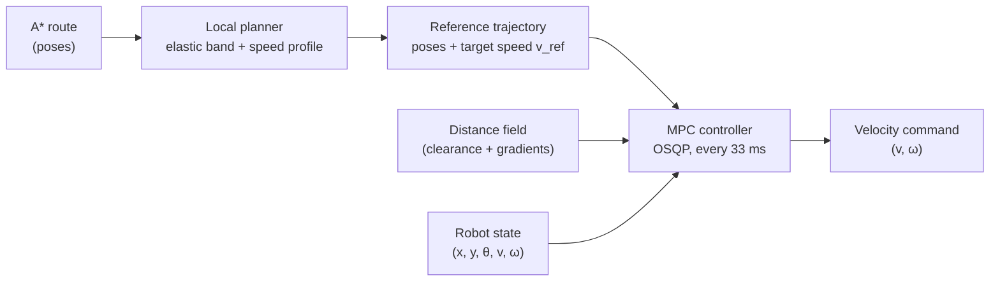
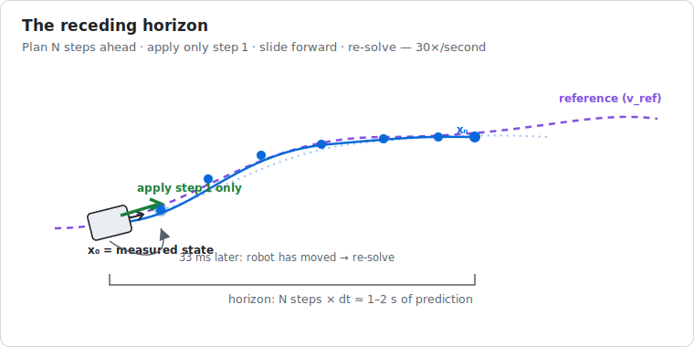
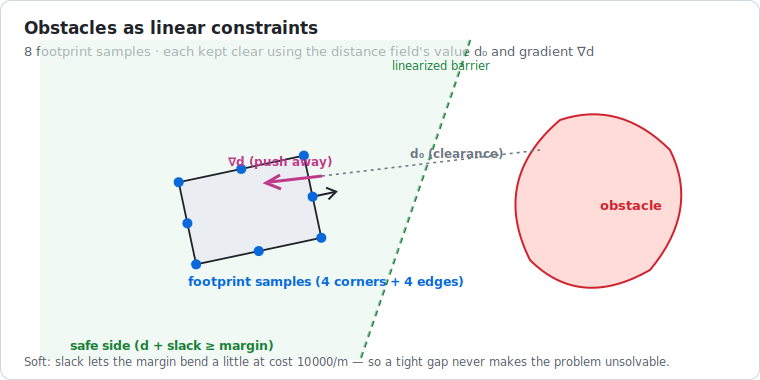
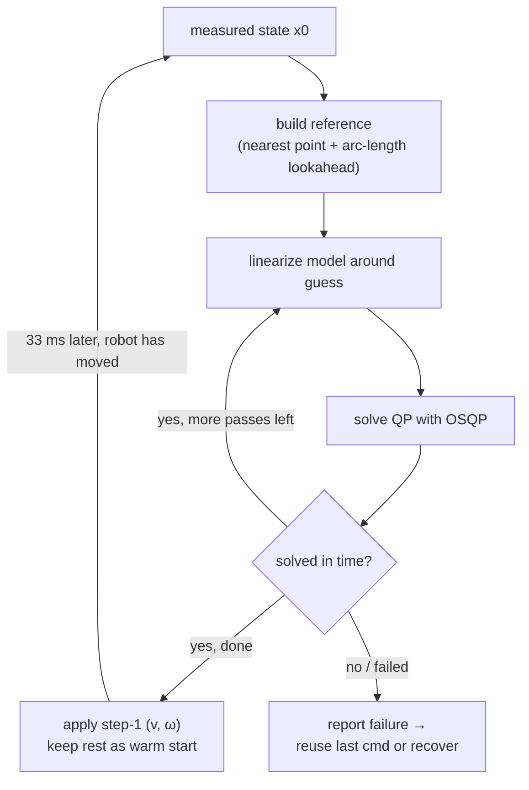

# 04 · Local planning and Model Predictive Control

> **Part of the [BARN navigation tutorial](./README.md).**
> **Before this:** [03 · Global planning with A\*](./03-global-planning-with-a-star.md) · **After this:** [05 · The safety shield](./05-the-safety-shield.md)

**What you'll learn**
- Why a global route is *not* a command you can send to the wheels, and what fills the gap.
- How the **local planner** turns the A\* route into a smooth, speed-profiled *reference*.
- What **Model Predictive Control (MPC)** is, told as "plan a little, act, repeat".
- The robot's **motion model**, and how a nonlinear model becomes a **Quadratic Program (QP)** by *linearizing*.
- How obstacles become **constraints** using the distance field's gradients.
- How the whole thing is solved every 33 ms with **OSQP**, warm-started, under a hard deadline.

**Prerequisites:** [Chapter 02](./02-mapping-occupancy-and-distance-fields.md) (occupancy grids & distance fields) and [Chapter 03](./03-global-planning-with-a-star.md) (the A\* route). A little calculus (derivatives, Taylor's first-order approximation) helps for the math boxes, but every one is optional — the intuition layer stands on its own.

---

## 1. The gap between a route and a wheel command

A\* gave us a *route*: a list of poses from the robot to the goal, threading the obstacle field. That looks like an answer. It isn't — not yet.

Two problems:

1. **A route is a shape, not a motion.** It says *where* to go, but not *how fast*, *how hard to turn*, or *how to accelerate*. The wheels need velocities, tens of times per second.
2. **A route ignores the robot's body and its physics.** The lattice search thought in terms of a point sliding along cells. The real Jackal has mass, a top speed, acceleration limits, and a rectangular body that must not clip a wall. It cannot teleport onto the path; it has to *chase* it.

> **💡 Key idea:** Global planning answers *"which way?"* once. Local control answers *"what exactly do the wheels do in the next fraction of a second?"* — continuously, accounting for the body and its limits.

This chapter is about that second question. We solve it in two stages: a **local planner** shapes a short, smooth *reference* out of the route, and an **MPC controller** works out the velocity commands that follow that reference while respecting the robot's physics and staying clear of obstacles.



---

## 2. The local planner: an elastic band with a speed profile

### Intuition

The A\* route is *feasible but ugly*: it staircases along the lattice, it may hug a wall by a few centimetres, and it carries no notion of speed. Before the MPC chases it, we tidy it into a short **reference trajectory** — the next few metres, smoothed, pushed toward the middle of free space, and annotated with *how fast to go at each point*.

The classic idea is the **elastic band** [Quinlan 1993]: imagine the path as a stretchy rubber band pinned at both ends. Two forces act on it — an **internal tension** that wants to straighten and shorten it (smoothness), and an **external repulsion** from nearby obstacles that pushes it toward open space. Let it settle, and you get a taut, smooth, clearance-aware path.

```
A* route (staircased, hugs wall)        After elastic-band relaxation
   ┌─┐                                        ╭─────╮
###┘ └####          ###                   ###╯      ╲###
     ┌─┘                                            ╰╮
#####┘         ###                        ####       ╰────  ###
   robot ● . . . . . goal                 robot ● ~~~~~~~~ goal
```

Our `LocalPlanner` (`ros2_ws/src/barn_classical/src/local_planner.cpp`) does exactly this: it extracts the portion of the global path within a `horizon_m` window and runs a handful of `elastic_iterations`, each nudging every point by a weighted blend of three pulls — **smoothing** (`smooth_weight`), staying near the original route (**anchor**, `anchor_weight`), and **obstacle repulsion** (`obstacle_weight`, driven by the distance field's gradient toward a `desired_clearance`).

> ### 🔍 In the code
> The tuning knobs live in `LocalPlannerParams` (`ros2_ws/src/barn_classical/include/barn_classical/local_planner.hpp:18`): `smooth_weight{0.35}`, `anchor_weight{0.20}`, `obstacle_weight{0.25}`, `desired_clearance{0.55}`, plus the speed-limit parameters below.

### The speed profile

A smooth *shape* still isn't enough — we need a target speed at each point. Two physical limits shape it:

- **Curvature limit.** On a differential-drive robot, turning tightly at high speed is impossible: your yaw rate is capped at `max_yaw_rate`, so on a path of curvature $\kappa$ the fastest you can go is $v \le \omega_{\max}/\kappa$. Sharp corners force you to slow down.
- **Lateral-acceleration limit.** Even below the yaw-rate cap, whipping around a bend is uncomfortable and imprecise. Capping lateral acceleration $a_\text{lat} = v^2\kappa$ at `max_lateral_accel` gives a second speed ceiling.

The planner also brakes toward zero near the goal and gates speed while the robot is still turning to align with the path entry.

> ### 📐 The math
> For a path of local curvature $\kappa$ (inverse radius of the turn), the reference speed is the smallest of the ceilings:
> $$v_\text{ref} = \min\!\left(v_{\max},\ \underbrace{\frac{\omega_{\max}}{\kappa}}_{\text{yaw-rate limit}},\ \underbrace{\sqrt{\frac{a_\text{lat}^{\max}}{\kappa}}}_{\text{lateral-accel limit}},\ \underbrace{\sqrt{2\,a_\text{brake}\,d_\text{goal}}}_{\text{braking to a stop}}\right)$$
> where $d_\text{goal}$ is the remaining distance and $a_\text{brake}$ is `braking_decel`. The last term is the classic "how fast can I be going and still stop in $d$ metres" relation, $v = \sqrt{2 a d}$.

The output is a `LocalTrajectory` — a list of `TrajectoryPoint`s, each carrying a pose *and* a `v_ref`. **That is the reference the MPC will chase.**

---

## 3. What "predictive" means: the receding horizon

### Intuition

Here is the whole idea of MPC in one analogy. You're driving on a winding road at night. You don't just react to the patch of tarmac under your bumper — you look **as far ahead as your headlights reach**, plan a smooth line through everything you can see, and *start* following it. A moment later you've moved, the headlights reveal a bit more road, and you re-plan from your new position. You **plan far but commit little**, over and over.

That's Model Predictive Control:

1. **Predict** how the robot will move over the next $N$ steps for a *candidate* sequence of commands, using a model of the robot.
2. **Optimize** that whole sequence at once to best follow the reference while obeying limits and avoiding obstacles.
3. **Apply only the first command.**
4. **Repeat** from the new measured state a fraction of a second later.

Step 4 is why it's called a **receding horizon**: the $N$-step window slides forward with the robot, so the plan is always fresh and always re-anchored to where the robot *actually* is (not where it hoped to be).



> **💡 Key idea:** MPC is *optimization used as a controller*. Every tick it solves a small "what's the best plan from here?" problem, executes one step of the answer, and throws the rest away — because next tick it will have better information.

In our stack the controller runs on a 33 ms timer (~30 Hz) in `classical_mpc_node.cpp`, with a horizon of `mpc_horizon` steps of `mpc_dt = 0.1 s` each — so each solve looks ~1–2 seconds into the future, and we redo it thirty times a second.

> ### 🔍 In the code
> `MpcParams` (`ros2_ws/src/barn_classical/include/barn_classical/controller.hpp:16`): `horizon{20}`, `dt{0.1}`, `solve_deadline_ms{35.0}`. The runtime config (`ros2_ws/src/barn_bringup/config/classical_mpc.yaml`) sets `mpc_horizon: 10`, `mpc_dt: 0.1`. The class is aptly documented as a *"Sequentially-linearized differential-drive MPC backed by OSQP."*

---

## 4. The robot's motion model

To *predict*, the MPC needs a model: given the current state and a command, where will the robot be next step? We use the **unicycle model** (the standard model for a differential-drive robot — see [Chapter 01](./01-the-robot-and-its-senses.md) and [Siegwart 2011]).

### Intuition

The robot is a dot with a heading. It can only ever move *along* the way it's pointing (no sideways slip), and it can spin. Two "pedals" control it — one for forward acceleration, one for turning acceleration. So the robot's **state** is its pose *and* how fast it's currently going and turning; the **inputs** are how hard it accelerates and how hard it changes its turn rate.

We deliberately make **acceleration** the input, not velocity. That way the optimizer can be told "you can't change speed infinitely fast" as a simple limit, and the commands it produces are physically smooth — no teleporting from 0 to 2 m/s.

> ### 📐 The math
> **State** (5 numbers) and **input** (2 numbers):
> $$\mathbf{x} = \begin{bmatrix} x \\ y \\ \theta \\ v \\ \omega \end{bmatrix}\ (\text{position, heading, speed, yaw rate}), \qquad \mathbf{u} = \begin{bmatrix} a \\ \alpha \end{bmatrix}\ (\text{linear and angular acceleration}).$$
> **Continuous-time unicycle dynamics:**
> $$\dot x = v\cos\theta,\quad \dot y = v\sin\theta,\quad \dot\theta = \omega,\quad \dot v = a,\quad \dot\omega = \alpha.$$
> **Discretized** with a forward-Euler step of $\Delta t$ (this is what the MPC predicts with):
> $$\begin{aligned} x_{k+1} &= x_k + \Delta t\, v_k\cos\theta_k, & \theta_{k+1} &= \theta_k + \Delta t\,\omega_k, & v_{k+1} &= v_k + \Delta t\, a_k,\\ y_{k+1} &= y_k + \Delta t\, v_k\sin\theta_k, & & & \omega_{k+1} &= \omega_k + \Delta t\,\alpha_k. \end{aligned}$$
> The constants `kStateSize = 5` and `kInputSize = 2` at the top of `controller.cpp` are exactly these dimensions.

Notice the two troublesome terms: $v\cos\theta$ and $v\sin\theta$. They multiply two state variables and pass one through a trig function — they are **nonlinear**. That single fact drives the rest of this chapter.

---

## 5. Turning control into optimization: the cost

### Intuition

MPC picks commands by *scoring* every candidate plan and choosing the best. The score is a **cost** we want to *minimize*, built by adding up penalties for everything we dislike:

- being **off the reference** (wrong position or heading) — the big one;
- going at the **wrong speed**;
- using **large or jerky commands** (wastes energy, looks twitchy, stresses the hardware);
- coming **too close to obstacles** (via a "slack" term, explained in §7).

Weights say how much each thing matters relative to the others. Tuning an MPC is largely choosing these weights.

Every penalty is written as a **squared** error — $(\text{value} - \text{target})^2$ — for two reasons: squaring punishes big errors much more than small ones (so the robot cares a lot about being *way* off and shrugs at millimetres), and a sum of squares makes the whole problem a **Quadratic Program**, which we can solve fast and reliably (§8).

> ### 📐 The math
> Over the horizon $k = 0 \dots N$, minimize
> $$
> J = \sum_{k=0}^{N} \Big[\, \underbrace{q_p\,\lVert \mathbf{p}_k - \mathbf{p}_k^\text{ref}\rVert^2 + q_\theta(\theta_k-\theta_k^\text{ref})^2}_{\text{track the reference}} + \underbrace{q_v(v_k - v_k^\text{ref})^2}_{\text{track speed}} + \underbrace{q_s\, s_k^2}_{\text{obstacle slack}} \,\Big]
> \;+\; \sum_{k=0}^{N-1}\Big[\, \underbrace{r_a a_k^2 + r_\alpha \alpha_k^2}_{\text{small inputs}} + \underbrace{\rho\,\lVert \mathbf{u}_k - \mathbf{u}_{k-1}\rVert^2}_{\text{smooth inputs (slew)}}\,\Big]
> $$
> with the actual weights from `controller.cpp:175–201`:
>
> | Term | Symbol | Weight | Note |
> |------|--------|-------:|------|
> | position $x,y$ | $q_p$ | 14 | ×3 at the terminal step $k=N$ |
> | heading $\theta$ | $q_\theta$ | 14 | equal to position — corners need committed turning |
> | speed $v$ | $q_v$ | 1.5 | low, so the MPC freely slows for turns |
> | yaw rate $\omega$ | — | 0.02 | tiny regularizer toward 0 |
> | obstacle slack $s_k$ | $q_s$ | 10 000 | huge — see §7 |
> | accel $a$, $\alpha$ | $r_a, r_\alpha$ | 0.10, 0.08 | keep commands modest |
> | input slew | $\rho$ | 0.20 / 0.15 | penalize change between consecutive commands |
>
> The **terminal weight** (×3 on the last step's position and heading) is a standard MPC trick [Rawlings 2017]: leaning on the end of the horizon improves stability and stops the robot from being lazy about where it ends up.

> ### 🔍 In the code
> Each squared penalty is added by the `add_square` helper (`controller.cpp:170`), which puts $2w$ on the diagonal of the QP's $P$ matrix and $-2w\cdot\text{target}$ into the linear term $q$ — precisely the expansion of $w(\text{var}-\text{target})^2$. The input-slew penalty (`controller.cpp:191–200`) couples consecutive inputs $u_{k-1}, u_k$, which is what makes commands smooth rather than jumpy.

---

## 6. Constraints: what the robot *cannot* do

The cost says what we *prefer*. **Constraints** say what is *allowed*. An optimizer will happily return a physically impossible plan unless you forbid it, so we pin down:

- **Where we start.** Step 0 is *fixed* to the measured state — the plan must begin from reality. (Notice the code clamps the initial $v \ge 0$ and $\omega$ into range first: the robot's classical stack never commands reverse except in [recovery](./06-recovery-and-backtracking.md).)
- **The physics.** Consecutive states must obey the motion model of §4 — these become **equality constraints** linking $\mathbf{x}_{k+1}$ to $\mathbf{x}_k$ and $\mathbf{u}_k$.
- **The limits.** Box bounds: $v \in [0, v_{\max}]$, $\omega \in [-\omega_{\max}, \omega_{\max}]$, and acceleration inputs within `max_accel` / `max_yaw_accel`.
- **The obstacles.** The body must stay clear — the subtle one, in §7.

```
   state:  x0 ── x1 ── x2 ── ... ── xN      (N+1 states)
            │    │     │            
   input:   u0   u1    u2   ...  u(N-1)      (N inputs)
            ▲
       x0 = measured state (pinned)
   x_{k+1} = f(x_k, u_k)  ← physics, as equality constraints
   0 ≤ v ≤ v_max,  |ω| ≤ ω_max,  |a| ≤ a_max,  |α| ≤ α_max   ← box limits
```

> ### 🔍 In the code
> The initial-state pin is `controller.cpp:221–228` (lower = upper = the measured value). The box bounds are `controller.cpp:215–238`. The dynamics equalities are built by `add_equality` in `controller.cpp:248–264` — five rows per step, one per state variable.

---

## 7. The problem with $v\cos\theta$: sequential linearization

We hit the wall from §4: the motion model has $v\cos\theta$ and $v\sin\theta$ in it. A **Quadratic Program** — the fast, reliable class of problem we want — allows only a quadratic cost and **linear** constraints. Trig-of-a-variable times another variable is not linear. So we can't hand this model to a QP solver as-is.

### Intuition

The fix is the oldest trick in applied maths: **near a point you already believe in, a curve looks like a straight line.** If you have a decent *guess* of the trajectory (call it the *nominal* trajectory $\bar{\mathbf{x}}$), you can replace the curvy dynamics with their straight-line (first-order Taylor) approximation *around that guess*. That approximation **is** linear, so now it's a QP. Solve it, and you get a better trajectory. Use *that* as the new guess and repeat. Each pass the guess improves, so the linear approximation gets more accurate — this is **Sequential Quadratic Programming (SQP)**, a.k.a. sequential linearization.

```
 pass 0: guess ~~~~~   (rough — e.g. the reference, or last tick's solution)
 pass 1: solve QP linearized around guess  → better trajectory
 pass 2: relinearize around that, solve again → better still
 ...     (a few passes; stop early if out of time budget)
```

> ### 📐 The math
> Take the $x$-update, $x_{k+1} = x_k + \Delta t\, v_k\cos\theta_k$. The nonlinear part is $g(v,\theta)=v\cos\theta$. Its **first-order Taylor expansion** about the nominal $(\bar v,\bar\theta)$ is
> $$g(v,\theta)\ \approx\ \underbrace{\bar v\cos\bar\theta}_{g(\bar v,\bar\theta)} + \underbrace{\cos\bar\theta}_{\partial g/\partial v}\,(v-\bar v) + \underbrace{(-\bar v\sin\bar\theta)}_{\partial g/\partial\theta}\,(\theta-\bar\theta).$$
> Collecting terms gives a **linear** relation in the unknowns $x_{k+1}, x_k, v_k, \theta_k$:
> $$x_{k+1} - x_k - \Delta t\cos\bar\theta\; v_k + \Delta t\,\bar v\sin\bar\theta\; \theta_k \;=\; \Delta t\,\bar v\sin\bar\theta\,\bar\theta.$$
> That is *exactly* the first `add_equality(...)` in `controller.cpp:253–256` — read off the coefficients: $\cos\bar\theta \to$ `dt*ct`, $\bar v\sin\bar\theta \to$ `dt*velocity*st`, and the right-hand side `dt*velocity*st*theta`. The $y$-row (`controller.cpp:257–260`) is the same expansion of $v\sin\theta$. The other three state updates ($\theta, v, \omega$) are already linear, so they pass through unchanged.

> ### 🔍 In the code
> The SQP loop is `for (int pass = 0; pass < max_linearization_passes; ++pass)` (`controller.cpp:158`). Each pass rebuilds the QP around the current `linearization`, solves it, and sets `linearization = candidate.x` for the next pass (`controller.cpp:362`). Crucially it also watches the clock: `max_linearization_passes` is only 3–4, and the loop **breaks early** if it has spent more than ~55 % of `solve_deadline_ms` — control must be *timely* even more than it must be *perfect*.

> **⚠️ Gotcha:** Linearization is only trustworthy *near* the nominal. If the real state has jumped far from last tick's plan (a big disturbance), the old guess is a bad place to linearize. The controller guards against this by discarding a **warm start** (§8) whose predicted path diverges more than 0.5 m from the new reference (`controller.cpp:107–117`), and falling back to linearizing around the reference itself.

---

## 8. Obstacles as constraints: distance-field gradients

Now the elegant part. How do you tell a *linear* optimizer "don't put the robot's body into a wall", when walls are an arbitrary shape?

### Intuition

Remember the **distance field** from [Chapter 02](./02-mapping-occupancy-and-distance-fields.md): for any point it returns $d$, the distance to the nearest obstacle, *and* $\nabla d$, the direction that increases that distance fastest (the "push-away" arrow). That's all we need.

We don't check just the robot's centre — a rectangle can clip a corner while its centre is comfortably clear. So at every predicted step we place **8 sample points around the body's edge** (4 corners + 4 edge midpoints) and require each one to keep a safe distance. Since $d$ is a smooth, differentiable field, we can *linearize it too*: near a sample point, "clearance" is approximately its current value plus the push-away gradient dotted with how the point moves. That linear approximation drops straight into the QP as one inequality per sample point per step.



The `slack` variables from the cost (§5) make these constraints **soft**: the robot is allowed to violate the margin *a little* if it must, but each metre of intrusion costs $q_s = 10\,000$ — enormous. So in practice it never cuts a corner unless the alternative is worse than catastrophic, and the QP never becomes *infeasible* (unsolvable) just because the world got tight. Soft constraints are what keep the controller from simply giving up in a narrow gap.

> ### 📐 The math
> A footprint sample sits at world point $\mathbf{p} = \mathbf{c} + R(\theta)\,\mathbf{b}$, where $\mathbf{c}=(x,y)$ is the robot centre, $R(\theta)$ is the rotation, and $\mathbf{b}=(\pm h_x, \pm h_y)$ is the sample's offset in the body frame. We want clearance $d(\mathbf{p}) \ge \text{margin}$, softened by slack $s_k \ge 0$:
> $$d(\mathbf{p}) + s_k \;\ge\; \text{margin}.$$
> Linearize $d$ about the nominal point $\bar{\mathbf{p}}$ using $\nabla d = (g_x, g_y)$ and the chain rule through the pose. With $\dfrac{\partial \mathbf{p}}{\partial\theta} = R'(\theta)\mathbf{b} = (-\sin\theta\,b_x - \cos\theta\,b_y,\ \cos\theta\,b_x - \sin\theta\,b_y)$, define the heading sensitivity $g_\theta = \nabla d \cdot \partial\mathbf{p}/\partial\theta$. The constraint becomes **linear** in $(x, y, \theta, s_k)$:
> $$g_x\,x + g_y\,y + g_\theta\,\theta + s_k \;\ge\; \text{margin} - d_0 + g_x\bar x + g_y\bar y + g_\theta\bar\theta.$$
> This is a first-order **control-barrier-style** safety constraint [Ames 2019]: it keeps the body on the safe side of the obstacle's linearized boundary.

> ### 🔍 In the code
> This is `controller.cpp:266–297`. The 8 `boundary_points` are defined at `controller.cpp:153–156`; `hx`/`hy` are the footprint half-extents plus a margin; `distance_field.distance_world` gives $d_0$ and `distance_field.gradient_world` gives $(g_x, g_y)$; `gt` is the heading sensitivity; and the right-hand side matches the equation above exactly. If the field can't return a value/gradient at a point (unknown space), that sample is simply skipped (`continue`).

---

## 9. Solving it: the QP, OSQP, and the deadline

Assemble everything from §5–§8 and you have a **Quadratic Program**: minimize a quadratic cost subject to linear equalities and inequalities.

> ### 📐 The math
> Stacking all states, inputs and slacks into one big vector $\mathbf{z}$, the per-tick problem is the standard QP form [Boyd 2004]:
> $$\min_{\mathbf{z}} \ \tfrac12 \mathbf{z}^\top P\,\mathbf{z} + q^\top\mathbf{z} \quad \text{s.t.}\quad l \le A\mathbf{z} \le u.$$
> $P$ (positive semidefinite) holds the squared-cost weights; $q$ the linear cost terms; and the single matrix $A$ with bounds $l, u$ encodes **all three** kinds of constraint at once — an equality is just a row with $l = u$, a one-sided inequality sets $u = +\infty$, and a box bound is a single-variable row.

We solve it with **OSQP** [Stellato 2020], a fast, robust operator-splitting QP solver used widely in real-time control. Three details make it work at 30 Hz:

- **Warm starting.** Successive solves are almost identical — the world barely changes in 33 ms. So we seed each solve with last tick's solution, *shifted forward one step* (the plan for "now+0.1 s" becomes the plan for the new "now"). OSQP then converges in a handful of iterations instead of from scratch. This shift-and-reuse is `controller.cpp:119–150`.
- **Loose tolerances, capped iterations.** `eps_abs = eps_rel = 1e-3`, `max_iter = 400`, polishing off (`controller.cpp:320–327`). A control command that's 99.9 % optimal *now* beats a perfect one that's 20 ms late.
- **A hard deadline.** The whole solve is budgeted by `solve_deadline_ms`. If a pass would blow the budget, the SQP loop stops; if the solve fails or times out, the controller reports failure and the node reuses the last good command for one cycle or — if that persists — hands off to [recovery](./06-recovery-and-backtracking.md).

> ### 🔍 In the code
> The QP is built as Eigen sparse triplets, converted to OSQP's CSC format, solved, and cleaned up each pass (`controller.cpp:299–353`). Real-time control code is careful about allocation and cleanup — note every `csc_matrix`/`osqp_setup` is paired with a `c_free`/`osqp_cleanup`.

---

## 10. Reading off the command — and why we throw the rest away

The solver hands back the *entire* optimal trajectory: all $N{+}1$ states and $N$ inputs. We **use almost none of it**.

We read the velocity and yaw rate of **step 1** — the state one tick into the plan — clamp them to the limits for safety, and publish that single $(v, \omega)$ as `/barn/cmd_desired`. Everything else is discarded... except we *keep* the full solution as the warm start for next tick, and we publish the predicted path to RViz (the red trajectory you can watch) so you can *see* what the robot is thinking.

Why discard the rest? Because of the receding horizon (§3): 33 ms from now the robot will have moved, the map may have updated, and we'll solve a fresh, better-informed problem. Committing to more than the next step would mean acting on stale predictions.

> ### 🔍 In the code
> `controller.cpp:376–383`: `result.command.v = clamp(x[sx(1,3)], 0, v_max)` and `result.command.w = clamp(x[sx(1,4)], ...)` — literally the speed and yaw-rate of predicted step 1. The full `prediction` is saved for visualization; `warm_start_ = latest.x` (`controller.cpp:375`) carries the solution to the next tick.



---

## Recap

- A global route is a *shape*; turning it into wheel commands is the job of **local control**.
- The **local planner** relaxes the A\* route into a smooth, clearance-aware **reference** (elastic band) and annotates it with a physically-limited **speed profile**.
- **MPC** = *plan a short horizon, apply one step, slide forward, repeat*. It is optimization used as a controller.
- The robot's **unicycle model** is nonlinear ($v\cos\theta$), so we **linearize** it around a guess and re-solve a few times — **sequential** quadratic programming.
- **Obstacles become linear inequalities** through the distance field's value and gradient, softened by heavily-penalized **slack** so the controller never gets stuck.
- The result is a **QP** solved by **OSQP** every 33 ms, warm-started and deadline-bounded; we use only the first command and rely on the receding horizon for the rest.

## Try it yourself

- In your distrobox, launch the classical stack and open RViz. The **red predicted trajectory** is the MPC's plan (step 0…N). Watch it flick and re-form 30 times a second as the robot moves — that's the receding horizon, live.
- In `classical_mpc.yaml`, lower `max_lateral_accel` and re-run: the reference speed profile (§2) will slow the robot more in corners. Raise `mpc_horizon` and watch the prediction reach further ahead (and the solve take longer — mind the deadline).
- **Thought experiment:** why is the *heading* weight ($q_\theta = 14$) set equal to the *position* weight, rather than much lower? (Hint: at a tight corner, being at the right spot pointing the wrong way is nearly useless.)

## References

- [Rawlings 2017] — the MPC textbook (receding horizon, terminal cost, stability).
- [Mayne 2000] — why constrained MPC is well-posed.
- [Boyd 2004] — quadratic programs and convex optimization.
- [Stellato 2020] — OSQP, the solver we call.
- [Quinlan 1993] — elastic bands (the local planner).
- [Fox 1997] — the Dynamic Window Approach, a classic reactive alternative to MPC.
- [Siegwart 2011] — differential-drive kinematics.

See [`references.md`](./references.md) for full entries.

---
◀ [03 · Global planning with A\*](./03-global-planning-with-a-star.md) · [tutorial index](./README.md) · [05 · The safety shield](./05-the-safety-shield.md) ▶
