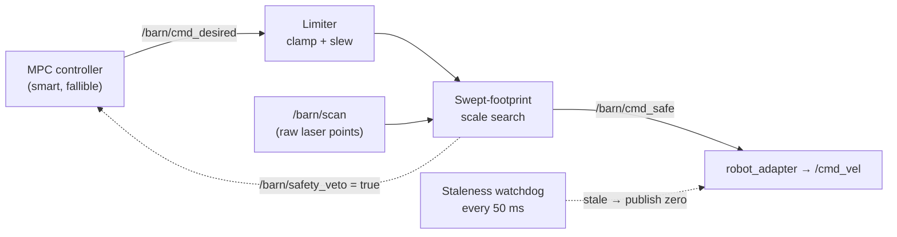

# 05 · The last line of defense — the safety shield

> **Part of the [BARN navigation tutorial](./README.md).**
> **Before this:** [04 · Local planning and MPC](./04-local-planning-and-mpc.md) · **After this:** [06 · Recovery and backtracking](./06-recovery-and-backtracking.md)

**What you'll learn**
- Why a clever planner still needs a dumb, independent guard sitting between it and the wheels
- How the **swept-footprint shield** projects the robot's body forward along its stopping
  distance and vetoes any command whose sweep would touch an obstacle
- The **scale search**: how the shield finds the *biggest* safe fraction of a command instead of
  a plain yes/no
- Why the hard-veto box is the body plus *only* a tiny `emergency_margin` — and the bug that
  taught us to shrink it
- The supporting guards: the velocity/acceleration **limiter** and the **staleness watchdog**,
  and the `/barn/safety_veto` signal the planner listens to

**Prerequisites:** You should know what the MPC controller emits (Chapter
[04](./04-local-planning-and-mpc.md)) and roughly how a laser scan becomes points around the
robot (Chapter [02](./02-mapping-occupancy-and-distance-fields.md)). No control theory required.

---

## Why a last line of defense?

Everything upstream of this chapter is *smart*. The global planner reasons about the whole map;
the MPC solves an optimization problem ten times a second to pick a command that tracks the plan
and dodges obstacles. Smart is good. Smart is also **fragile**.

- The map can be wrong — a wall drifted, or a phantom corridor opened behind the robot.
- The solver can hiccup — miss its 35 ms deadline and hand back last cycle's command.
- The data can be stale — a scan or a command stops arriving and nobody notices for a moment.

When any of those happen, the "smart" command flowing toward the motors might drive the robot
straight into a wall. You want something standing at the very last gate that does **not** trust
any of that reasoning — something simple, independent, and impossible to argue with.

> **💡 Key idea:** The safety shield holds *no planner state*. It never sees the map, the goal,
> or the MPC's plan. It sees exactly two things: the command someone wants to execute, and the
> raw laser points around the body right now. From those alone it decides: pass it, slow it, or
> stop.

Think of a **spotter** guiding a truck backing into a loading dock. The spotter does not know the
delivery schedule or the route. They watch the gap. Their entire vocabulary is two words:
*"slower"* and *"stop"*. They can never say "go faster" or "turn left" — they only ever subtract.
That asymmetry is the whole point. A guard that can only remove motion can never *invent* a
dangerous one.

This is the practical face of an idea from control theory called a **safety filter** or
**control-barrier-function** approach [[Ames 2019]](./references.md): let a performance controller
propose whatever it likes, then pass the proposal through a minimal, provably-conservative filter
that alters it *only* when needed to keep the system inside a safe set. BARN's shield is a
geometric, sampling-based version of exactly that — no barrier functions to hand-derive, just
"sweep the body forward and check."



The shield lives in the `barn_safety` package. The node wiring is in
`ros2_ws/src/barn_safety/src/safety_node.cpp`; the geometric core — the part that actually decides
safe-or-not — is in `ros2_ws/src/barn_safety/src/swept_footprint_shield.cpp`. We'll build up to
that core, because it *is* the chapter.

---

## The mechanism: sweep the body along its stopping distance

Here is the problem the shield solves. Someone hands you a desired command — a forward speed
$v$ and a turn rate $\omega$. Is it safe? A naive check asks "is the robot's body touching an
obstacle *right now*?" That is useless: the robot is not standing still, it is about to *move*,
and even if you cut power this instant it keeps gliding for a bit before it stops.

So the shield asks a better question: **if the robot executes this command, will its body stay
clear the whole time it takes to stop?**

To answer it, imagine dragging the robot's rectangular footprint forward along the arc the command
would produce, for just long enough to cover its **stopping distance** — the braking distance plus
a slice of reaction latency. That dragged shape is the **swept footprint**, or *stopping
envelope*. If any laser point falls inside that swept box at any moment along the arc, the command
is unsafe.

```
Command: v > 0, gentle left turn.  Sweep the footprint forward over the stopping horizon.

          obstacle ×  (outside every box → SAFE)
   ┌───┐ ┌───┐ ┌───┐ ┌───┐
   │ R │ │   │ │   │ │   │        each box = the body at one time-step
   └───┘ └───┘ └───┘ └───┘        along the braked arc
   t=0    t=1   t=2   t=3   →

- - - - - - - - - - - - - - - - - - - - - - - - - - - - - - - - -

          ┌───┐ ┌───┐
   ┌───┐ ┌│ × │┐│   │            obstacle × falls INSIDE the t=1 box → UNSAFE
   │ R │ │└───┘│└───┘            this command gets vetoed (or scaled down)
   └───┘ └───┘ └───┘
   t=0    t=1   t=2   →
```

The robot's body is a rectangle roughly 0.51 m long and 0.43 m wide (a Jackal). Its half-extents
are `half_length = 0.254 m` and `half_width = 0.2159 m` — you'll see those numbers again.

> **💡 Key idea:** The sweep is what makes the check *anticipatory*. You don't need a big static
> safety bubble around the robot to "see obstacles early" — you get earliness for free by sweeping
> the body along the exact path it would take while stopping. Faster command → longer stopping
> distance → longer sweep → obstacles flagged sooner. Slower command → shorter sweep. The
> conservatism scales itself with speed.

### How far to sweep: the stopping horizon

How long is "long enough to stop"? Physics. If you are moving at speed $|v|$ and can brake at
deceleration $a_\text{brake}$, it takes $|v| / a_\text{brake}$ seconds to reach zero. Add a small
$t_\text{lat}$ for the latency between deciding to stop and the wheels actually responding. That
sum is the stopping time.

> ### 📐 The math
>
> The shield sweeps over a horizon
>
> $$ t_\text{stop} = \frac{|v|}{a_\text{brake}} + t_\text{lat}, \qquad
> t_\text{horizon} = \max\!\big(t_\text{horizon\_s},\; t_\text{stop}\big). $$
>
> | symbol | meaning | value (deployed) |
> |---|---|---|
> | $v$ | linear speed of the *scaled* candidate command | — |
> | $a_\text{brake}$ | assumed braking deceleration | `braking_decel = 2.5` m/s² |
> | $t_\text{lat}$ | actuation/reaction latency | `shield_latency_s = 0.05` s |
> | $t_\text{horizon\_s}$ | a floor on the horizon | `shield_horizon_s = 0.0` s |
>
> The `max(...)` lets you enforce a *minimum* sweep length regardless of speed. In BARN's tuned
> config the floor is `0.0`, so the horizon is purely the physical stopping time — the sweep is as
> short as physics allows and no shorter. The horizon is then chopped into steps of
> `integration_dt = 0.05 s`.

> ### 🔍 In the code
> `ros2_ws/src/barn_safety/src/swept_footprint_shield.cpp:19`
> ```cpp
> const double stopping_time = std::abs(v) / std::max(0.1, params_.braking_decel) + params_.latency_s;
> const double horizon = std::max(params_.horizon_s, stopping_time);
> ...
> const int steps = std::max(1, static_cast<int>(std::ceil(horizon / params_.integration_dt)));
> ```
> Note `std::max(0.1, braking_decel)` — a guard so a mis-set zero deceleration can never divide by
> zero and produce an infinite horizon.

Inside the loop, the pose is rolled forward one step at a time using the standard differential-drive
update (the same unit-speed kinematics from Chapter [04](./04-local-planning-and-mpc.md)): advance
along the current heading by $v\,\Delta t$, then rotate the heading by $\omega\,\Delta t$. At each
step the whole set of laser points is tested against the body box at that pose.

> **⚠️ Gotcha — a pure rotation still sweeps.** If $v = 0$ but $\omega \neq 0$, the body's *center*
> never moves, so a "does the center hit anything" check would call every rotation safe. But the
> box's **corners** swing out as the heading turns, and the shield tests the oriented box at each
> step — so the corners are checked as they sweep. A robot wedged in a pinch cannot rotate *into*
> a wall and get waved through.

---

## The point-in-box test

At each swept pose we need one primitive: *is this laser point inside the body box?* The body box
is axis-aligned in the robot's own frame but tilted in the world once the robot has turned. The
clean way to test it is to move the point into the body frame and check it against an
axis-aligned rectangle there.

```
World frame                          Body frame (rotate by −yaw about pose)

        obstacle ×                          y'
           .                                 │        (transform the point,
   ┌───────┐                          ┌──────┼──────┐  not the box)
   │  body │  yaw                      │      │      │
   │   ↗   │  tilt          ───►       │  ────┼──── x'   inside iff
   └───────┘                          │      │  × ? │   |x'| ≤ hx and
                                       └──────┼──────┘   |y'| ≤ hy
```

Subtract the pose position, rotate by minus the pose heading, and you get the point's coordinates
$(x', y')$ in a frame where the box is a plain rectangle centered at the origin. Then it's two
comparisons.

> ### 📐 The math
>
> With the swept pose at position $(p_x, p_y)$ and heading $\theta$, let $dx = x - p_x$,
> $dy = y - p_y$. Rotate into the body frame:
>
> $$ x' = \cos\theta\,dx + \sin\theta\,dy, \qquad y' = -\sin\theta\,dx + \cos\theta\,dy. $$
>
> The point is **inside** (unsafe) exactly when
>
> $$ |x'| \le h_x \;\wedge\; |y'| \le h_y, \qquad
> h_x = \tfrac{L}{2} + m_\text{em}, \quad h_y = \tfrac{W}{2} + m_\text{em}, $$
>
> where $\tfrac{L}{2} = 0.254$ m, $\tfrac{W}{2} = 0.2159$ m, and $m_\text{em}$ is the
> `emergency_margin` (deployed value `0.05` m). For points *outside* the box the shield also
> records a clearance $\sqrt{\max(0,|x'|-h_x)^2 + \max(0,|y'|-h_y)^2}$ — the distance from the box
> edge — and reports the minimum over the whole sweep as diagnostics.

> ### 🔍 In the code
> `ros2_ws/src/barn_safety/src/swept_footprint_shield.cpp:48`
> ```cpp
> const double local_x =  ct * dx + st * dy;
> const double local_y = -st * dx + ct * dy;
> ...
> if (std::abs(local_x) <= hx && std::abs(local_y) <= hy) {
>   return false;   // a point is inside the body box at this swept pose → unsafe
> }
> ```

---

## The scale search: "slower or stop", never a plain "no"

A yes/no safety check has an ugly failure mode: the moment it says "no", the robot gets *zero* —
a dead stop even when a gentler version of the same intent would have been perfectly safe. Our
spotter never barks "STOP" when "slower" would do.

So the shield does not test one command — it tests a *family* of them, all scaled-down copies of
the desired command, and returns the **largest** one that is collision-free. Scaling the whole
command vector $u = (v, \omega)$ by a factor $s \in [0, 1]$ shrinks both the speed and the turn
rate together, which shortens the stopping horizon *and* flattens the arc — a slower command
sweeps a smaller envelope, so more of them come back clear.

```
Scale search — try 1.0 first, step down by 0.05 until the sweep is clear:

  s = 1.00   ┌─sweep─────────────────×──┐   hits obstacle   → try less
  s = 0.80   ┌─sweep──────────────×─┐       hits obstacle   → try less
  s = 0.60   ┌─sweep───────────┐  ×         CLEAR            → STOP here, use it
                                                                reason = "braking_distance_clamp"
  ...
  s = 0.00   ┌┐ (no motion)         ×        even standstill unsafe? → "emergency_veto"

Return the FIRST (largest) s whose swept footprint is clear.
```

- **s = 1.0 clear** → the command passes untouched. Reason `"clear"`.
- **0 < s < 1 clear** → the command is throttled to that fraction. Reason
  `"braking_distance_clamp"`. This is the spotter saying *"slower."*
- **nothing clear, not even s = 0** → full stop. Reason `"emergency_veto"`. This is *"stop."*

> ### 📐 The math
>
> The shield returns the command $s^\star u$ where
>
> $$ s^\star = \max\;\{\, s \in [0,1] : \text{swept}(s\,u)\ \text{is clear} \,\}. $$
>
> It doesn't solve this in closed form — it *samples* $s$ from 1.0 downward in steps of
> `scale_step = 0.05` and returns the first clear one (which, scanning top-down, is the largest).
> If even $s = 0$ is unsafe — an obstacle already inside the emergency box at the current pose —
> the search falls through and the result is a hard veto, $s^\star = 0$.

> ### 🔍 In the code
> `ros2_ws/src/barn_safety/src/swept_footprint_shield.cpp:97`
> ```cpp
> for (double scale = 1.0; scale >= -1e-9; scale -= step) {
>   const double candidate_scale = std::max(0.0, scale);
>   if (safe_at_scale(desired, candidate_scale, obstacles, clearance, &envelope)) {
>     result.scale = candidate_scale;
>     result.command = {desired.v * candidate_scale, desired.w * candidate_scale};
>     result.reason = candidate_scale > 0.999 ? "clear" :
>       (candidate_scale > 1e-6 ? "braking_distance_clamp" : "emergency_veto");
>     return result;
>   }
> }
> result.reason = "emergency_veto";   // nothing was clear
> ```

Two shortcuts sit in front of the loop: if there are **no** laser returns at all, the command
passes as `"clear_no_returns"`; and if the desired command is already essentially zero
($|v|,|\omega| < 10^{-6}$), there is nothing to scale, so it passes as `"stationary"`.

---

## The footprint box — and the bug that shrank it

This is the most important design decision in the file, and it is worth slowing down for. The box
used in the hard-veto test is the **physical body plus only the small `emergency_margin`** —
nothing more. There is *also* a `footprint_margin` parameter in the code, but it is **deliberately
excluded** from the collision box. Here's why that matters.

Picture the robot boxed into a tight BARN corridor, a wall a few centimeters off its flank. The
scan sees that wall as points. Earlier, the veto box was the body plus a *fixed* planning margin
(~5–6 cm of static shell). An obstacle sitting anywhere in that shell was "inside the box" —
and here is the trap: it was inside the box **at every scale, including $s = 0$**. Scaling the
command down to a crawl, or even to a dead stop, doesn't move the wall out of a *static* shell.
So the search would step all the way down and hard-veto. The robot, commanded by recovery to
rotate in place or creep *away* from the wall, was clamped to zero. It froze — told to move, but
vetoed for standing where it already safely stood.

> **⚠️ Gotcha — a static safety shell can deadlock a boxed-in robot.** A margin that surrounds the
> body regardless of motion vetoes *motionless* configurations too. In an open field that's
> invisible; in a tight pinch it's a deadlock. The fix is to stop baking anticipatory clearance
> into a static shell and get it from the *sweep* instead.

The insight: you don't need a fat static buffer to be careful, because **the sweep already
provides anticipatory clearance**. A command that would carry the body into the wall over its
stopping distance gets vetoed by the swept boxes downrange — that's the early warning. The static
box only needs to be the *final, hard* buffer: "is something touching the body right now, within a
hair?" That hair is `emergency_margin` (5 cm). With the tighter box, the scale search can hand back
a small rotation or a creep *away* from the wall — motion that escapes the pinch — while a
genuinely imminent collision (a point within 5 cm of the body along the swept path) is still
vetoed.

> ### 🔍 In the code
> `ros2_ws/src/barn_safety/src/swept_footprint_shield.cpp:21` — the design note lives right above
> the box definition:
> ```cpp
> // footprint_margin is deliberately NOT in the hard-collision box. Anticipatory
> // clearance is already provided by sweeping this box along the full stopping
> // envelope ... an obstacle in the shell ... used to hard-veto EVERY
> // scale down to zero — including an in-place rotation or a creep AWAY from the
> // obstacle. The robot then froze in recovery, commanded to move but clamped to zero.
> const double hx = params_.half_length + params_.emergency_margin;
> const double hy = params_.half_width + params_.emergency_margin;
> ```

The `footprint_margin` field is kept in `ShieldParams` only so old configs don't break — it no
longer touches the veto (see the comment at
`ros2_ws/src/barn_safety/include/barn_safety/swept_footprint_shield.hpp:24`). And this connects
straight to Chapter [06](./06-recovery-and-backtracking.md): the whole reason recovery exists is to
un-wedge a pinched robot, so the shield must not be the thing that freezes it in place.

### The body self-filter

There's one more subtlety, and it's a different file. The Jackal's own fenders are visible to its
own LiDAR at about 7 cm — the robot literally sees pieces of itself. If those returns reached the
shield, every command would look like an imminent collision with the body. So before points ever
reach the shield, `safety_node` discards any return that falls inside the physical body (plus 1 cm):

> ### 🔍 In the code
> `ros2_ws/src/barn_safety/src/safety_node.cpp:110`
> ```cpp
> // Ignore only returns inside the physical body. The planning and emergency
> // margins remain outside this rectangle and still protect external objects.
> if (std::abs(base_x) <= 0.254 + 0.01 && std::abs(base_y) <= 0.2159 + 0.01) {
>   continue;   // that's the robot's own fender, not an obstacle
> }
> ```
> The filter is exactly the body (+1 cm) — *tighter* than the veto box — so a real object creeping
> up to the emergency margin is never accidentally filtered away as "self".

---

## The supporting guards

The swept-footprint check is the heart, but two smaller guards wrap it. Both are dumb on purpose.

### 1 · The limiter: make commands physically achievable

Before a command even reaches the shield, it passes through the **limiter**
(`ros2_ws/src/barn_safety/src/limiter.cpp`). It does two mechanical things:

1. **Magnitude clamp** — cap $|v| \le$ `v_max` and $|\omega| \le$ `w_max`. No command can ask for
   more speed than the robot has.
2. **Per-axis slew limit** — cap how much $v$ and $\omega$ may *change* since the last command, to
   `a_lin · dt` and `a_ang · dt`. This stops a jump from a standstill to full speed in one tick —
   the kind of instant step no real motor can follow.

> ### 🔍 In the code
> `ros2_ws/src/barn_safety/src/limiter.cpp:24`
> ```cpp
> cmd.v = barn_core::clamp(desired.v, -limits_.v_max, limits_.v_max);
> cmd.w = barn_core::clamp(desired.w, -limits_.w_max, limits_.w_max);
> if (dt > 0.0) {
>   cmd.v = rate_limit(cmd.v, last_.v, limits_.a_lin * dt);
>   cmd.w = rate_limit(cmd.w, last_.w, limits_.a_ang * dt);
> }
> ```

One neat detail: after the shield clamps a command, the node calls `limiter_.override_last(...)`
(`safety_node.cpp:134`) so the limiter's memory of "last command" matches what actually went to the
wheels — otherwise the next slew limit would be computed from a command that never executed.

> | parameter | meaning | deployed value |
> |---|---|---|
> | `v_max` | max linear speed | 4.5 m/s |
> | `w_max` | max yaw rate | 3.0 rad/s |
> | `max_lin_accel` ($a_\text{lin}$) | linear slew cap | 5.0 m/s² |
> | `max_ang_accel` ($a_\text{ang}$) | angular slew cap | 6.0 rad/s² |

### 2 · The staleness watchdog: no news means stop

The shield is only as trustworthy as its inputs. If the scan stops arriving, the shield would be
checking new commands against a frozen, increasingly wrong picture of the world. If commands stop
arriving, the last one would keep executing forever. Either way the safe default is the same:
**stop the robot.**

A watchdog timer fires every `watchdog_period_s = 0.05` s and checks two clocks:

- command older than `cmd_timeout_s = 0.4` s → publish zero, reason `command_stale_veto`
- scan missing or older than `scan_timeout_s = 0.5` s → publish zero, reason `scan_stale_veto`

Publishing zero also *resets the limiter*, so when data returns the robot ramps up from a
standstill rather than snapping back to its pre-stall speed.

> ### 🔍 In the code
> `ros2_ws/src/barn_safety/src/safety_node.cpp:167`
> ```cpp
> if (have_cmd_ && (stamp - last_cmd_time_).seconds() >= cmd_timeout_s_) {
>   publish_zero(stamp, "command_stale_veto");
>   have_cmd_ = false;
> } else if (have_cmd_ && (!have_valid_scan_ ||
>   (stamp - last_scan_time_).seconds() >= scan_timeout_s_)) {
>   publish_zero(stamp, "scan_stale_veto");
> }
> ```
> The same freshness rule (`sensors_fresh`) also runs on every incoming command: if inputs are
> stale, the command is zeroed *before* it ever reaches the shield.

The staleness watchdog is a lineage that traces back to reactive collision avoidance like the
Dynamic Window Approach [[Fox 1997]](./references.md), which restricts commands to those from which
the robot can still brake to a stop given its dynamics — the shield's stopping-horizon sweep is the
same "always keep an escape to zero speed" instinct, made geometric.

---

## The veto signal: telling the planner it's blocked

When the shield hard-vetoes (reason `emergency_veto`), stopping the wheels is only half the job —
the planner upstream needs to *know*, so it can do something smarter than re-issue the same doomed
command. So the node publishes a boolean on `/barn/safety_veto`, true exactly when a veto is
active:

> ### 🔍 In the code
> `ros2_ws/src/barn_safety/src/safety_node.cpp:147`
> ```cpp
> std_msgs::msg::Bool veto_msg;
> veto_msg.data = (result.reason == "emergency_veto");
> veto_pub_->publish(veto_msg);
> ```

The MPC/recovery layer subscribes to this and uses it to trigger a replan or kick off backtracking
*immediately*, instead of waiting for its own no-progress timer to expire. That handoff — veto →
recovery — is the subject of Chapter [06](./06-recovery-and-backtracking.md). The shield also
publishes rich diagnostics (`/barn/navigation_diagnostics`) with the chosen scale, reason, and
minimum clearance, plus an RViz marker of the stopping envelope so you can *watch* the sweep.

> **💡 Key idea:** The shield stays true to its "slower or stop" vocabulary even here. It doesn't
> tell the planner *how* to escape — it only raises a flag saying "I'm blocking you." Deciding what
> to do about it is the planner's job. The guard stays simple; the intelligence stays upstream.

---

## Recap

- The shield is a **simple, independent, stateless** last check between the MPC and the wheels.
  It knows only the desired command and the raw laser points. Its whole vocabulary is *pass*,
  *slow*, *stop* — it can never add motion, only subtract it (a safety filter, [[Ames 2019]](./references.md)).
- It works by **sweeping the body footprint forward** along the command's arc over the
  **stopping horizon** $t_\text{stop} = |v|/a_\text{brake} + t_\text{lat}$, and testing every laser
  point against the oriented body box at each step.
- Instead of yes/no, it runs a **scale search**: try the command at $s = 1.0$ and step down by 0.05
  until the sweep is clear, returning the largest safe fraction. $s = 1$ is `clear`, an
  intermediate $s$ is `braking_distance_clamp`, $s = 0$ is `emergency_veto`.
- The hard-veto box is the **body + only `emergency_margin` (0.05 m)** — *not* `footprint_margin`.
  A static shell used to freeze a boxed-in robot at every scale; anticipatory clearance now comes
  from the sweep, and the static box is just the final hard buffer. Self-returns inside the body
  (+1 cm) are filtered so the robot doesn't see its own fenders.
- Two dumb guards wrap it: the **limiter** (magnitude clamp + acceleration slew) makes commands
  physically achievable, and the **staleness watchdog** publishes zero when scan or command goes
  stale. A `/barn/safety_veto` flag lets the planner react at once.

## Try it yourself

In the distrobox, with a navigation run going:

- **Watch the shield think.** Echo the diagnostics and see the scale drop as the robot nears a
  wall:
  ```bash
  ros2 topic echo /barn/navigation_diagnostics
  ```
  Look for `command_scale` sliding below 1.0 (a `braking_distance_clamp`) and `safety_veto_reason`
  flipping to `emergency_veto` in a pinch.
- **See the sweep.** In RViz, add the `MarkerArray` on `/barn/safety_markers`. The line strip is
  the stopping envelope — green when clear, red when the shield is clamping. Drive toward a wall
  and watch it lengthen with speed.
- **Thought experiment.** Suppose you put `footprint_margin` *back* into `hx`/`hy`. Trace what
  happens to a robot wedged 4 cm from a wall and commanded to rotate in place. At which scale does
  the search first succeed? (Answer: none — and now you've re-created the freeze bug.) Then trip
  the watchdog: pause the scan and confirm `/barn/cmd_safe` goes to zero within `scan_timeout_s`
  (0.5 s), reason `scan_stale_veto`.

## References

- [[Ames 2019]](./references.md) — control barrier functions and safety filtering: let a
  performance controller propose, then minimally correct to stay in a safe set.
- [[Fox 1997]](./references.md) — the Dynamic Window Approach: admit only commands from which the
  robot can still brake to a stop, the same instinct behind the stopping-horizon sweep.

---
◀ [04 · Local planning and MPC](./04-local-planning-and-mpc.md) · [tutorial index](./README.md) · [06 · Recovery and backtracking](./06-recovery-and-backtracking.md) ▶
