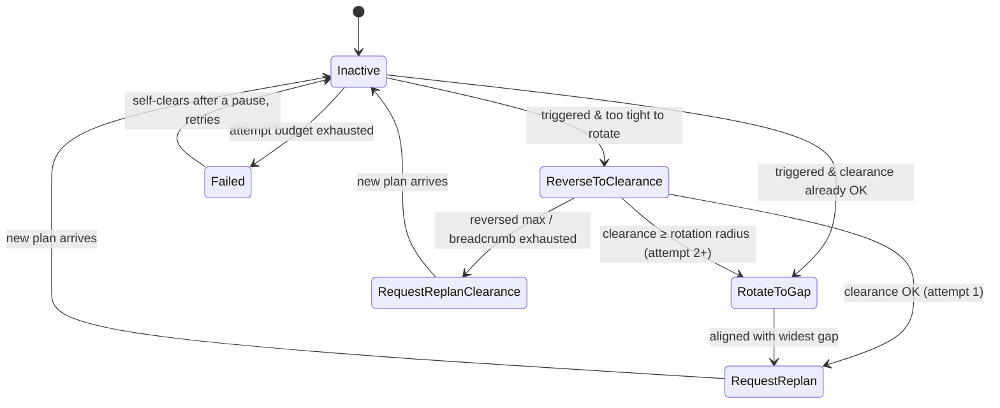
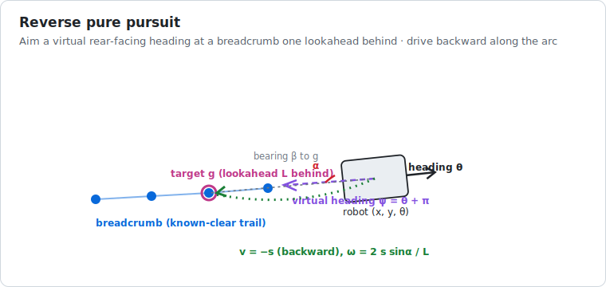

# 06 · When stuck — recovery and backtracking

> **Part of the [BARN navigation tutorial](./README.md).**
> **Before this:** [05 · The safety shield](./05-the-safety-shield.md) · **After this:** [07 · The system as a whole](./07-the-system-as-a-whole.md)

**What you'll learn**
- Why even a good planner + MPC + shield can get *stuck*, and why the obvious fix (spin in place) backfires.
- The **backtracking** idea: reverse along a known-clear trail to open space, then re-plan.
- The **breadcrumb** buffer and the recovery **state machine**.
- **Reverse pure pursuit** — steering a robot backward along a path.
- The safety interlocks that keep recovery from making things worse (clearance gating, blocked-bail, attempt budget).

**Prerequisites:** [Chapter 02](./02-mapping-occupancy-and-distance-fields.md) (distance fields / clearance), [Chapter 04](./04-local-planning-and-mpc.md) (the MPC that can fail), [Chapter 05](./05-the-safety-shield.md) (the shield that can veto).

---

## 1. Getting stuck — and why spinning doesn't help

### Intuition

Sometimes everything upstream does its job and the robot *still* wedges itself: it noses into a pocket that's just too tight, the MPC can't find a feasible command, the shield vetoes every twitch, and forward progress stops. On a 100 s clock, a robot frozen for even 5 seconds is bleeding score. It needs a plan for *being stuck*.

The tempting fix — **rotate in place to find a new heading** — is exactly what fails. Here's why, and it's a lesson worth internalizing:

> **⚠️ The trap:** A rectangular robot rotating in place sweeps its **corners** outward. In a tight pinch, those corners sweep straight into the walls — so the [safety shield](./05-the-safety-shield.md) vetoes the rotation to a dead stop. The recovery *commands* a spin, the shield zeroes it, and the robot sits there twitching at 0 m/s. We caught exactly this in a real trace: `RotateOpposite` commanded for 5 seconds, `swept 0°, moved 0.00 m`, shield reporting `emergency_veto` the whole time.

So the robot can't turn its way out. What *can* it do?

### The insight

The path the robot **just drove in on is guaranteed clear** — it physically occupied every point of it seconds ago. So the safe way out of a dead-end is to **back out the way you came** until you reach somewhere wide enough to turn, *then* re-plan. This is **backtracking recovery** (sometimes "breadcrumb" or "path-rewind" recovery), and it's how tight-aisle warehouse robots unstick themselves.

```
   Pinch (can't rotate: corners hit walls)      Backtracking recovery
   ##############                               ##############
   ####    ┌──┐                                 ####    ┌──┐
   ####    │▮▮│ ← wedged, MPC fails             ####    │  │
   ####  ##└──┘##                               ####  ##│  │##   1. reverse along
        ##      ##                                   ## │▮▮│ ##     the breadcrumb
   #####    open    #####                       #####  ▲ open  #####
                                                       │ 2. now clearance
                                                       ▮   permits rotate/replan
```

> **💡 How this differs from Nav2.** The de-facto standard stack, Nav2 [Macenski 2020], escalates through *simple primitives*: clear the costmap → spin → back up a fixed short distance → wait. Its back-up is blind and it will happily *try* to spin in a pinch. Our recovery is smarter in one specific way: it **reasons about whether rotation is even possible** (using clearance) and **reverses along the actual trail it recorded**, which is provably safe — rather than backing a fixed distance into the unknown.

---

## 2. The breadcrumb: a trail of known-clear poses

To back out "the way we came", we have to *remember* the way we came. As the robot drives normally, the node drops a **breadcrumb** — the current pose — every time it has moved a small spacing, keeping a bounded trail of recent, known-clear poses.

```
 oldest ●──●──●──●──●──●──●──● newest ≈ current pose
        (dropped every ~0.10 m of forward travel, capped length)
```

> ### 🔍 In the code
> `classical_mpc_node.cpp` records the trail only while navigating normally (never while reversing, which would corrupt it), spacing samples by `breadcrumb_spacing_m` (0.10 m) and capping at `breadcrumb_max_points` (160 ≈ 16 m). It is cleared on every new goal. You can *watch* it in RViz — it's published as the blue `breadcrumb` line marker.

---

## 3. The recovery state machine

Recovery is a small, explicit state machine (`ros2_ws/src/barn_classical/src/recovery.cpp`). The states map directly onto the plan "back out → turn if you now can → re-plan":



The **decision at trigger time** is the heart of it — and it's what the naive spinner got wrong:

> ### 📐 The math
> Let $d$ be the robot's clearance (distance-field value at its centre, from [Chapter 02](./02-mapping-occupancy-and-distance-fields.md)) and $\rho$ the **rotation radius** — the clearance needed to spin without a corner clipping anything, i.e. the footprint's half-diagonal plus a margin:
> $$\rho \approx \sqrt{h_x^2 + h_y^2} + \text{margin} = \sqrt{0.254^2 + 0.216^2} + \text{margin} \approx 0.40\ \text{m}.$$
> The rule:
> $$\text{if } d < \rho:\ \textbf{reverse first (can't turn here)} \qquad \text{else}:\ \textbf{turn / re-plan}.$$
> Rotation is only ever *commanded where it is geometrically possible*, so it can never again be vetoed into a freeze.

> ### 🔍 In the code
> `Recovery::begin_episode` (`recovery.cpp`) branches on `ctx.clearance < ctx.rotation_radius`. The threshold is the `rotation_clearance_m` parameter (0.40 m). Escalation is by attempt count: attempt 1 reverses then re-plans; attempt 2+ also rotates toward the widest gap; attempt 3+ re-plans with a boosted clearance weight so A\* routes wider next time.

---

## 4. Reverse pure pursuit: steering backward along the trail

### Intuition

Reversing along the breadcrumb is a *path-following* problem, but backward. The classic forward technique is **pure pursuit** [Coulter 1992]: pick a point on the path a fixed "lookahead" distance ahead, and steer toward it along a circular arc; repeat, and you smoothly track the path.

The trick for going backward is beautifully simple: **pretend the robot's rear is its front.** A robot reversing is geometrically identical to an imaginary robot *facing backward* driving forward. So we run ordinary pure pursuit for that imaginary robot — aiming at a breadcrumb point *behind* us — and the yaw-rate it produces is exactly the yaw-rate the real robot needs; we just drive with negative speed.



> ### 📐 The math
> Let the robot be at $(x, y, \theta)$. Define the **virtual heading** $\psi = \theta + \pi$ (pointing backward). Find the breadcrumb target $\mathbf{g}$ one lookahead $L$ behind along the trail, and its bearing $\beta = \operatorname{atan2}(g_y - y,\ g_x - x)$. The **look-ahead angle** is
> $$\alpha = \operatorname{wrap}(\beta - \psi).$$
> Pure pursuit's steering curvature gives the yaw rate for a speed $s$:
> $$\omega = \frac{2\,s\,\sin\alpha}{L}, \qquad v = -s \ \ (\text{drive backward}).$$
> The yaw rate of the "virtual forward" robot equals the real robot's yaw rate, so this is exactly right — only the linear velocity flips sign.

> ### 🔍 In the code
> `Recovery::reverse_command` (`recovery.cpp`) computes exactly this: the nearest breadcrumb index, a walk back by `reverse_lookahead` (0.5 m) to the target, `virtual_heading = wrap(pose.yaw + M_PI)`, and `w = 2 * reverse_speed * sin(alpha) / lookahead`, returning `{-reverse_speed, w}`. If there is no usable breadcrumb, it backs straight out (`{-reverse_speed, 0}`) and lets the shield guard the motion.

---

## 5. Interlocks: recovery that can't dig a deeper hole

A recovery that thrashes is worse than none. Four interlocks keep it disciplined — each one was added in response to a *specific* failure we observed in traces:

- **Clearance gating (§3):** never spin where the body can't spin. Kills the freeze-while-spinning trap at the source.
- **Blocked-bail:** if the safety shield is *fully* (emergency) vetoing the escape command for longer than `blocked_timeout` (0.7 s), the maneuver is achieving nothing — abandon it and re-plan immediately, rather than grinding out a multi-second timeout frozen in place.
- **Veto-escape exit:** when recovery was triggered *by* a shield veto, the instant the shield clears (after a minimal maneuver) the escape has succeeded — re-plan from the fresh pose instead of running on.
- **Attempt budget with self-clearing failure:** after `max_recovery_attempts` (5) failed episodes *in a row*, recovery latches `Failed`, pauses briefly, then **self-clears and retries** — a robot that permanently gives up scores zero, so "give up forever" is never the right answer on a live clock. Crucially, real forward progress **refunds** the budget, so the cap counts *consecutive* failures, not lifetime ones.

> **💡 Design lesson:** Every one of these interlocks exists because a plausible-looking recovery did something dumb in a real run — freeze while spinning, thrash against the shield, or permanently give up. The way we *found* them is itself part of the method: record a time-aligned trace of every recovery episode and analyze it offline.

> ### 🔍 In the code & tooling
> The interlocks are `Recovery::step` in `recovery.cpp`. To debug recovery live, `tools/record_recovery_trace.py` samples the internal topics (recovery state, commands, veto, pose, clearance) into a JSONL file, and `tools/analyze_recovery_trace.py` reconstructs every episode and flags failure modes (over-rotation, veto-escape overrun, flapping, lockout). This record-and-analyze loop is how the four interlocks above were discovered.

---

## Recap

- Planning, control, and safety can still leave the robot **stuck**; it needs an explicit escape behavior.
- **Rotating in place fails** in a pinch — the corners sweep into walls and the shield vetoes it. Reason about clearance *before* commanding a spin.
- **Backtracking** reverses along the **breadcrumb** — a recorded, known-clear trail — to reach space wide enough to turn, then re-plans.
- Backward path following is **reverse pure pursuit**: run forward pure pursuit for a virtual rear-facing robot; flip the sign of the speed.
- Interlocks (clearance gating, blocked-bail, veto-escape exit, self-clearing attempt budget) keep recovery from making things worse — each one earned by a real failure in a trace.

## Try it yourself

- Watch the blue **breadcrumb** marker grow in RViz as the robot drives. When it enters a pinch, watch it reverse *along that trail*.
- Record a run: `python3 tools/record_recovery_trace.py -o results/run.jsonl`, then `python3 tools/analyze_recovery_trace.py results/run.jsonl --episodes`. Read the per-episode report — it tells you exactly what recovery did and why.
- **Thought experiment:** why does progress *refund* the attempt budget instead of the cap being a simple lifetime total? (Hint: a 100 s run through a dense field may legitimately need to recover several times.)

## References

- [Coulter 1992] — pure pursuit path tracking (we use a reverse variant).
- [Macenski 2020] — Nav2's recovery-behavior primitives, the baseline we improve on.

See [`references.md`](./references.md) for full entries.

---
◀ [05 · The safety shield](./05-the-safety-shield.md) · [tutorial index](./README.md) · [07 · The system as a whole](./07-the-system-as-a-whole.md) ▶
