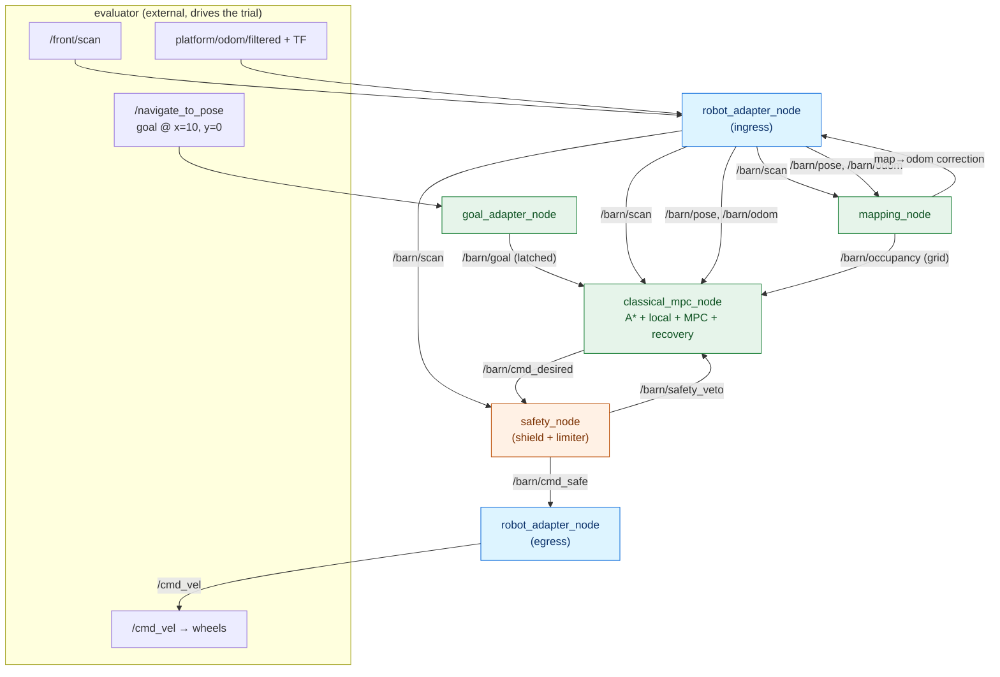
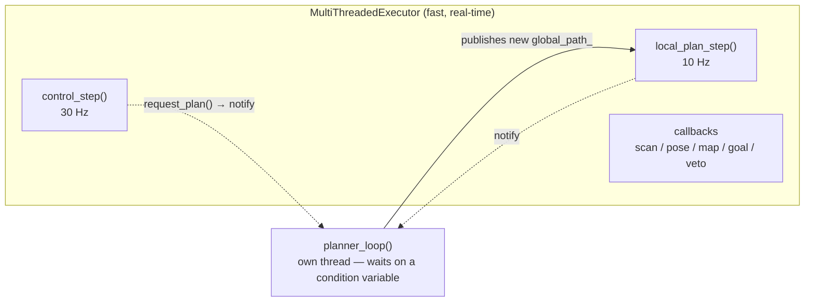

# 07 · The system as a whole

> **Part of the [BARN navigation tutorial](./README.md).**
> **Before this:** [06 · Recovery and backtracking](./06-recovery-and-backtracking.md) · **After this:** [08 · Measuring success](./08-measuring-success.md)

**What you'll learn**
- How the pieces from Chapters 01–06 connect into one running system — the **node graph** and the topics between them.
- Why the stack is split into **separate processes**, and what each is responsible for.
- The **rates** everything runs at, and why they differ.
- The **threading** inside the classical node: how a slow planner and a fast controller share data without blocking or racing.

**Prerequisites:** the earlier chapters — this one assembles them. A little ROS 2 vocabulary (node, topic, publish/subscribe) helps; if it's new, read the intuition and skip the topic names.

---

## 1. From parts to a pipeline

You've now met every part: the [robot adapter](./01-the-robot-and-its-senses.md), the [map and distance field](./02-mapping-occupancy-and-distance-fields.md), the [A\* planner](./03-global-planning-with-a-star.md), the [MPC controller](./04-local-planning-and-mpc.md), the [safety shield](./05-the-safety-shield.md), and [recovery](./06-recovery-and-backtracking.md). This chapter shows them **wired together**.

### Intuition

Think of an assembly line. Raw material (LiDAR + odometry) enters one end; a finished product (a wheel command) leaves the other. Each station does one job and hands its output to the next via a labeled conveyor belt. In ROS 2, the stations are **nodes** (separate programs) and the conveyor belts are **topics** (named message streams). A node doesn't call another node directly — it just *publishes* to a topic, and whoever cares *subscribes*.

> **💡 Why separate processes at all?** Three reasons, all of which matter for BARN: **isolation** (if the planner crashes, the safety node keeps clamping commands to a stop), **independence** (the shield deliberately shares *no state* with the planner — see [Chapter 05](./05-the-safety-shield.md)), and **clarity** (each node has one testable job). It's the same reason you don't write a whole program in one function.

---

## 2. The node graph

Here is the whole Track-A stack. Green is the navigation "brain", orange is safety, blue are the adapters at the robot boundary, and the dashed box is the external evaluator that drives the whole thing.

Read it as a river flowing top to bottom: the evaluator sets a **goal** and streams **sensors**; the adapter normalizes them onto internal `/barn/*` topics; mapping turns scans into a **grid**; the classical node turns grid + goal + pose into a **desired command**; the shield turns that into a **safe command**; the adapter turns that into `/cmd_vel` for the wheels. Two feedback arrows matter: mapping's **drift correction** back to the adapter (keeping frames aligned, [Chapter 02](./02-mapping-occupancy-and-distance-fields.md)) and the shield's **veto** back to the planner (triggering [recovery](./06-recovery-and-backtracking.md)).

> **💡 The command relay.** Notice the command changes name as it flows: `/barn/cmd_desired` (what the planner *wants*) → `/barn/cmd_safe` (what the shield *allows*) → `/cmd_vel` (what the wheels *get*). Three names, one command, each stage a checkpoint. This is the single most important safety property of the design: **nothing reaches the wheels without passing the shield.**

---

## 3. Everything runs at a different rate

Not every job needs to run at the same speed, and forcing them to would waste computation or starve the fast loops. Each part runs as fast as it *usefully* can and no faster.

| Loop | Rate | Why this rate |
|------|-----:|---------------|
| **MPC control** | ~30 Hz | The wheels need a fresh command constantly; this closes the loop tight. |
| **Local planner** | ~10 Hz | The reference trajectory changes slowly; re-deriving it 30×/s is wasteful. |
| **Global A\*** | on-demand + ~2 Hz check | Full re-planning is expensive; do it when the path is blocked or missing, not every tick. |
| **Mapping** | ~15 Hz | Matches the LiDAR; fast enough to see obstacles appear, slow enough to stay cheap. |
| **Safety shield** | per command | Runs on *every* `/barn/cmd_desired` message — it must never lag the thing it guards. |

> **💡 Key idea:** a control system is a set of nested loops running at different speeds — a fast inner loop (control) wrapped by slower outer loops (local planning, then global planning). The fast loop reacts; the slow loops think. This "hierarchy of timescales" is how almost all real robots are built.

> ### 🔍 In the code
> Inside `classical_mpc_node.cpp` the timers are created explicitly: a 33 ms `control_timer_` (MPC), a 100 ms `local_timer_` (local planner), and a 500 ms `replan_timer_` that requests a global re-plan only if the path is empty. The global planner itself runs on its **own thread** — see §4.

---

## 4. Threading: a fast controller and a slow planner, sharing safely

### The problem

The MPC must produce a command every 33 ms, no excuses. But a global A\* search can take tens or hundreds of milliseconds. If the controller had to *wait* for the planner, it would miss its deadline every time the planner ran — the robot would stutter. So the planner **cannot** run on the control thread.

### The solution

Run the global planner on a **dedicated background thread** that sleeps until asked. The fast loops (control, local) run on ROS timers via a multi-threaded executor. When a re-plan is needed, a loop just sets a flag and *notifies* the planner thread; the planner wakes, computes a new path at its own pace, and swaps it in when ready. The controller never blocks.

That shared data — the map, the pose, the current global path — is touched by several threads at once, which is a recipe for **data races** unless access is disciplined. The node uses two mutexes with a strict ordering:

- `mutex_` guards the shared *data* (pose, grid, distance field, `global_path_`, flags).
- `control_mutex_` serializes the *control decision* (so the timer callback and the veto callback can't both drive recovery at the same instant).

> **⚠️ Gotcha — lock ordering.** Whenever both locks are needed, the code **always** takes `control_mutex_` before `mutex_`. Taking two locks in inconsistent orders across threads is the classic recipe for **deadlock** (thread A holds lock 1 waiting for lock 2 while thread B holds lock 2 waiting for lock 1). A fixed global order makes deadlock impossible.

> ### 🔍 In the code
> The planner thread is `planner_loop()`, waiting on `planner_cv_` (a `std::condition_variable`) until `plan_requested_` is set; `request_plan()` sets the flag and calls `planner_cv_.notify_one()`. `main()` runs the node under a `MultiThreadedExecutor` so the timers and callbacks can run concurrently. Snapshots of shared data are copied out under `mutex_` at the top of each `control_step()` so the heavy work happens on a *local copy*, holding the lock only briefly.

---

## 5. A command's journey, end to end

Let's follow one control tick, start to finish, to see the chapters connect:

1. **Sense** — LiDAR and odometry arrive; the [adapter](./01-the-robot-and-its-senses.md) relays them to `/barn/scan`, `/barn/pose`.
2. **Map** — [mapping](./02-mapping-occupancy-and-distance-fields.md) folds the scan into the occupancy grid and re-derives the distance field; it also nudges the `map→odom` correction to fight drift.
3. **Route** (as needed) — if the path is missing or blocked, the background thread runs [A\*](./03-global-planning-with-a-star.md) to a fresh global route.
4. **Shape** — the [local planner](./04-local-planning-and-mpc.md#2-the-local-planner-an-elastic-band-with-a-speed-profile) relaxes the route into a smooth, speed-profiled reference.
5. **Control** — the [MPC](./04-local-planning-and-mpc.md) solves its QP and emits `/barn/cmd_desired`. If it *can't* (stuck), [recovery](./06-recovery-and-backtracking.md) takes over.
6. **Guard** — the [safety shield](./05-the-safety-shield.md) scales or vetoes it into `/barn/cmd_safe`, and reports any veto back to step 5.
7. **Drive** — the adapter converts `/barn/cmd_safe` into `/cmd_vel`; the wheels turn.

Thirty times a second. That loop, repeated, is autonomous navigation.

---

## Recap

- The stack is a **pipeline of independent nodes** connected by **topics** — isolation, safety independence, and clarity all follow from the split.
- The command flows `cmd_desired → cmd_safe → cmd_vel`: three names, three checkpoints, and **nothing reaches the wheels without the shield**.
- Loops run at **different rates** — a fast control loop nested inside slower planning loops (a hierarchy of timescales).
- A **background planner thread** keeps slow global search off the real-time control path; **two ordered mutexes** let threads share data without races or deadlock.

## Try it yourself

- In the distrobox, with the stack running: `ros2 node list`, then `ros2 topic list`. Find `/barn/cmd_desired`, `/barn/cmd_safe`, and `/cmd_vel`. `ros2 topic hz /barn/cmd_desired` shows the control rate; compare it to `/barn/occupancy`.
- `ros2 topic echo /barn/safety_veto` while the robot squeezes through a gap — watch the shield speak to the planner.
- **Thought experiment:** the safety node subscribes to `/barn/scan` *directly*, not to anything the planner produces. Why is that independence essential to it being a trustworthy last line of defense?

## References

- [Macenski 2020] — Nav2, a full ROS 2 navigation system for comparison of architecture.

See [`references.md`](./references.md) for full entries.

---
◀ [06 · Recovery and backtracking](./06-recovery-and-backtracking.md) · [tutorial index](./README.md) · [08 · Measuring success](./08-measuring-success.md) ▶
