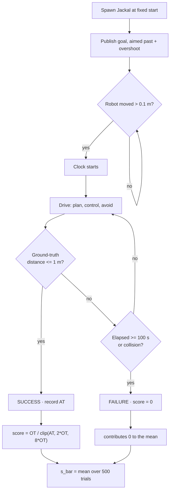

# 08 · Measuring success — the benchmark and its metric

> **Part of the [BARN navigation tutorial](./README.md).**
> **Before this:** [07 · The system as a whole](./07-the-system-as-a-whole.md) · **After this:** *this is the final chapter* — back to the [index](./README.md)

**What you'll learn**
- Why a fair navigation score must reward *both* reaching the goal *and* getting there
  quickly — without paying out for reckless speed or punishing honest caution.
- Exactly how the BARN per-trial score is built: success, the delayed clock, Optimal
  Time, Actual Time, and the clip that tames both extremes.
- A real, published-vs-upstream discrepancy in the metric — and why this repo reports
  **two** numbers and never blends them.
- How 500 trials become one number, and one runner bug the repo's suite quietly fixes.
- The "aim past the goal" trick in `goal_adapter_node`, and why it exists *because* the
  evaluator judges success on ground truth.

**Prerequisites:** You should have a feel for the whole stack from
[Chapter 07](./07-the-system-as-a-whole.md) — sensors in, `/cmd_vel` out — and know that
BARN drops a Jackal into a cluttered field and asks it to reach a goal. You do **not**
need any of the control math from earlier chapters here.

---

## 1. What does it even mean to "win"?

Imagine you are judging a driving test in a crowded car park. Two learners take the same
route to the same parking bay.

- One drives smoothly, parks cleanly, takes 40 seconds.
- The other flings the car across the lot, clips a trolley, and screeches into the bay
  in 12 seconds.

Who passes? Obviously the first — the second *crashed*. Speed only counts **after** you
finish cleanly. And you would not fail the careful driver just for being careful; you'd
only start docking marks if they crawled so slowly they held up the whole car park.

That is the entire philosophy of the BARN score in one paragraph:

> **💡 Key idea:** Finishing cleanly is the price of admission. *Only then* does speed
> matter — and even then, being implausibly fast earns you nothing extra, and being slow
> is penalized gently, not infinitely.

Everything below is just that idea made precise. The benchmark itself is defined by
[Perille 2020] and exercised at scale by the BARN Challenge [Xiao 2022]; the exact
formula, the clip, and the two-report policy this repo follows live in
[`docs/benchmark/metric_notes.md`](../benchmark/metric_notes.md) and
[`docs/benchmark/barn_2026_contract.md`](../benchmark/barn_2026_contract.md).

---

## 2. The pieces of one trial

Before we can write a score, we need to agree on *what a trial measures*. A **trial** is
one run: spawn the Jackal at a fixed start, hand it a goal, and let it drive until one of
three things happens — it reaches the goal, it hits something, or the clock runs out.

Four quantities come out of a trial. Meet them one at a time.

### 2.1 Success — judged on the *real* position, not the robot's opinion

The robot succeeds when it gets **within 1.0 m of the goal, with no collision, before the
100-second timeout**. That's it.

The subtle, crucial word is *real*. The evaluator does not ask your navigation stack "are
you there yet?" It ignores your `NavigateToPose` action result entirely and looks at the
robot's **ground-truth position in the simulator**.

> **⚠️ Gotcha:** Your stack can be *convinced* it has arrived — action server returns
> `SUCCEEDED`, feedback says `distance_remaining = 0` — and still **fail**, because its
> internal frame has drifted and the *physical* robot is parked 1.2 m from the goal. The
> map in the robot's head is not the map being graded. Hold onto this; §6 is built
> entirely around it.

The contract states this bluntly (`docs/benchmark/barn_2026_contract.md:64`): the runner
continues while `distance_to_goal > 1.0 m AND not collided AND elapsed < timeout`, and
success is the instant `distance_to_goal <= 1.0 m` on the simulator's own measurement.

### 2.2 The clock starts late — the 0.1 m rule

Here is a small piece of fairness that is easy to miss. The 100-second timer does **not**
start when the trial spawns. It starts only after the robot has physically moved **more
than 0.1 m** from where it began.

Why? Because startup is noisy. Your planner needs a moment to receive the goal, build its
first occupancy grid, and plan. If the clock ran during that housekeeping, a stack that
happened to launch slowly would look *slower at navigating* than one that launched fast —
even if they drove identically. The 0.1 m rule says: *we start timing you when you start
driving, not when the lights come on.*

### 2.3 Optimal Time (OT) — the yardstick

To judge "quick," you need something to be quick *relative to*. That yardstick is
**Optimal Time**: how long the fastest legal robot would take to walk the reference path.

The BARN Jackal tops out at 2 m/s. So if the reference path through a world is, say, 20 m
long, the best conceivable traversal time is `20 / 2 = 10 s`. That's OT.

**📐 The math**

```math
OT_i = \frac{\text{reference path length}_i}{v_{\max}}, \qquad v_{\max} = 2\ \text{m/s}
```

$OT_i$ is the **Optimal Time** for world $i$ — a per-world constant, not something your
robot influences. The reference path is a Dijkstra shortest path through the world; note
it is used **only** to set this yardstick, never as something your controller is allowed
to drive along (`barn_2026_contract.md:126`).

> ### 🔍 In the code
> `evaluation/metrics/_common.py:71`
> ```python
> V_MAX = 2.0  # m/s, BARN maximum robot speed (used to derive OT from path length)
>
> def optimal_time(path_length):
>     """Optimal traversal time = reference path length / maximum speed."""
>     return path_length / V_MAX
> ```

### 2.4 Actual Time (AT) — what you really took

**Actual Time** is the measured traversal time for the trial: from the moment the clock
started (§2.2) to the moment the robot entered the 1 m circle. A successful, efficient run
has AT close to OT. A cautious run has a larger AT. A failed run has no meaningful AT at
all — as you'll see next, failure zeroes the score regardless of time.

Here are the four pieces side by side:

| Symbol | Name | Where it comes from | Beginner's gloss |
|---|---|---|---|
| $\text{success}_i$ | Success flag | Ground-truth: within 1 m, no collision, before 100 s | "Did you actually finish cleanly?" |
| $OT_i$ | Optimal Time | `path_length / 2.0` | "Fastest anyone could do this route" |
| $AT_i$ | Actual Time | Measured, clock starts after 0.1 m of motion | "How long you really took" |
| (timeout) | — | 100 s cap per trial | "Time's up" |

---

## 3. Building the score

Now we assemble the pieces. Intuitively we want a ratio: *how close was your time to the
ideal time?* That's `OT / AT`. Drive the route perfectly and `OT/AT ≈ 1`; dawdle and it
sinks toward 0. Multiply by the success flag so that failing scores exactly 0.

But a raw ratio has two nasty edges, and this is where the analogy pays off:

- **The reckless edge.** Suppose a physics glitch (or a run that briefly exceeds the 2 m/s
  model) gives `AT < OT`. Then `OT/AT > 1` — a *single* trial could score above 1 and
  dominate the whole average. We don't want to reward implausible speed.
- **The crawler edge.** A robot that succeeds but takes forever gives `OT/AT ≈ 0`. That's
  almost the same score as an outright *failure* — which feels wrong. A slow success is
  still a success; it deserves a small floor, not near-zero.

The fix for both is one operation: **clip AT into a band** before dividing.

### 3.1 A picture of the score

```
  s = OT / clip(AT, 2*OT, 8*OT)          (for a SUCCESS; a failure is a flat 0)

 score
 0.5 |______                                   <- FLAT TOP: AT <= 2*OT all give 0.5
     |      \                                      (can't score higher by being faster)
     |       \.
     |         \..                                 1/AT decay: 2*OT < AT < 8*OT
     |            \....
 0.125|                \.........________________  <- FLOOR: AT >= 8*OT all give 0.125
     |                                             (slowness stops being punished)
     +----+------+----------+---------------------> AT
         2*OT   4*OT       8*OT
          ^                  ^
    can't beat 0.5     can't fall below 0.125
```

Read it left to right. Anywhere left of `2·OT`, AT is *clipped up* to `2·OT`, so the score
sits flat at `OT/(2·OT) = 0.5` — the ceiling. Between `2·OT` and `8·OT` the real AT is used
and the score decays like `1/AT`. Past `8·OT`, AT is *clipped down* to `8·OT`, so the score
flattens at `OT/(8·OT) = 0.125` — the floor. Fail the trial and none of this applies: you
score 0, which is *below* the 0.125 floor. That gap is deliberate — a slow success must
always beat a failure.

### 3.2 The formula

**📐 The math**

The per-trial score is

```math
s_i = \text{success}_i \cdot \frac{OT_i}{\text{clip}\!\big(AT_i,\ 2\,OT_i,\ 8\,OT_i\big)}
```

where

```math
\text{clip}(x, \text{lo}, \text{hi}) = \max\big(\text{lo},\ \min(\text{hi},\ x)\big).
```

| Symbol | Meaning |
|---|---|
| $s_i$ | Score for trial $i$, in $[0,\,0.5]$ |
| $\text{success}_i$ | $1$ if goal reached (≤ 1 m) without collision before timeout, else $0$ |
| $OT_i$ | Optimal Time (§2.3) |
| $AT_i$ | Actual Time (§2.4) |
| $2\,OT_i$ | Clip **lower** bound — caps the reward for implausible speed |
| $8\,OT_i$ | Clip **upper** bound — floors the penalty for crawling |

The two bounds do exactly what the two "edges" above demanded:
$AT < 2\,OT \Rightarrow s = OT/(2\,OT) = 0.5$ (the flat top), and
$AT > 8\,OT \Rightarrow s = OT/(8\,OT) = 0.125$ (the floor).

> ### 🔍 In the code
> `evaluation/metrics/_common.py:81`
> ```python
> def trial_score(success, actual_time, opt_time, lower_mult, upper_mult):
>     """s = success * OT / clip(AT, lower_mult*OT, upper_mult*OT)."""
>     if not success or opt_time <= 0.0:
>         return 0.0
>     at = clip(actual_time, lower_mult * opt_time, upper_mult * opt_time)
>     return opt_time / at
> ```
> Notice the bounds are passed **in** as `lower_mult` / `upper_mult` rather than hard-coded.
> That single design choice is what §4 is about.

> **💡 Key idea:** The lower clip is not there to be *nice* to fast robots — it's there to
> stop one lucky/glitchy trial from blowing up the mean. The upper clip is not there to be
> nice to slow robots either — it's there so slow successes don't drag the mean down so far
> they may as well have been failures. Both bounds protect the **average**, not any one run.

---

## 4. A cautionary tale: 2·OT vs 4·OT

Here is a lesson every benchmark-reader eventually learns the hard way: **the rule as
published and the rule as *coded* can disagree.** BARN 2026 is a live example, and this
repo treats it as a teaching moment rather than sweeping it under the rug.

- The **published** BARN 2026 rule clips the lower bound at **`2·OT`**.
- The **upstream** ROS 2 evaluator's own `report_test.py` clips at **`4·OT`** —
  `np.clip(actual_time, optimal_time * 4, optimal_time * 8)`. Worse, that file's inline
  comment describes one bound while its code applies the other. *The code is what ran, so
  the code is what scored.*

Same physical run. Two different numbers. So which do you report?

### 4.1 Why the divergence only hits *fast* runs

Look back at the score curve. The two rules differ **only** in where the left-hand flat
region begins — `2·OT` for published, `4·OT` for upstream. Everything at or right of `4·OT`
is identical between them.

```
  published: flat-top starts here
             v
   ----------+========================================  clip[2*OT, 8*OT]
             2*OT      4*OT                    8*OT

  upstream:           flat-top starts here
                      v
   -------------------+=============================     clip[4*OT, 8*OT]
             2*OT      4*OT                    8*OT

   DIVERGE  |<------->|  AGREE ---------------------->
            AT in (0, 4*OT)     AT >= 4*OT
```

- `AT ≥ 4·OT` (slow successes): both clip identically (or not at all) → **same score**.
- `AT < 4·OT` (fast successes): the published rule has already left its flat top but
  upstream is still clipping up to `4·OT` → **different score**.

So the disagreement is *entirely* a fast-runs phenomenon. The better your robot, the more
the two reports diverge — which is precisely the worst place to have an ambiguity.

### 4.2 The worked example (the maximum-divergence case)

Take a fast success: `OT = 5 s`, `AT = 6 s`, `success = 1`. Here `AT = 6` sits below
*both* lower bounds, so each rule clips it up to its own bound:

| Report | Lower bound | Clipped AT | $s = OT / \text{clipped AT}$ |
|---|---|---|---|
| **Published** (`L = 2`) | `2·OT = 10 s` | `clip(6, 10, 40) = 10` | `5 / 10 = ` **`0.500`** |
| **Upstream** (`L = 4`) | `4·OT = 20 s` | `clip(6, 20, 40) = 20` | `5 / 20 = ` **`0.250`** |

The published rule caps this trial at `0.5`; the upstream variant caps it at `0.25`. One
run, two legitimate-looking scores — a **2× gap** on the same robot doing the same thing.
These exact values are asserted by both scripts' `--selftest` checks, so you can prove the
scripts apply the bound they claim before trusting a campaign:

> ### 🔍 In the code
> `evaluation/metrics/upstream_compat_metric.py:58`
> ```python
> fast_upstream  = C.trial_score(True, 6.0, 5.0, LOWER_MULT, UPPER_MULT)  # 4*OT -> 0.25
> fast_published = C.trial_score(True, 6.0, 5.0, 2, UPPER_MULT)           # 2*OT -> 0.50
> assert abs(fast_upstream - 0.25) < 1e-9, fast_upstream
> assert abs(fast_published - 0.5) < 1e-9, fast_published
> assert fast_upstream < fast_published, 'reports must diverge on a fast success'
> ```

For contrast, a *slow* success (`AT = 15`, `OT = 5`) lands above `2·OT` but below `4·OT`,
so it still diverges — `5/15 ≈ 0.333` published vs `5/20 = 0.25` upstream — while a genuinely
slow run (`AT ≥ 4·OT`) scores identically under both. (Both worked examples are in
`metric_notes.md:134`.)

### 4.3 The two-report policy

This repo's response is disciplined: **always emit both numbers, always labeled, never
mixed into one figure.**

```
              raw evaluator output (results/)   <- single source of truth
                          |
             +------------+------------+
             v                         v
   barn2026_metric.py        upstream_compat_metric.py
   clip[2*OT, 8*OT]           clip[4*OT, 8*OT]
   "PUBLISHED"                "UPSTREAM-COMPAT"
   research numbers           debugging only
             |                         |
             v                         v
     report labeled            report labeled
     "published rule"         "upstream compat"     (never merged)
```

| Script | Clip | Use for |
|---|---|---|
| `evaluation/metrics/barn2026_metric.py` | `[2·OT, 8·OT]` | **Research numbers** — the rule we report against |
| `evaluation/metrics/upstream_compat_metric.py` | `[4·OT, 8·OT]` | **Evaluator-compat debugging only** |

> **⚠️ Gotcha:** Never average or combine the two. A results table without a label saying
> *which* metric produced it is, per the repo's rules, **invalid**. Research conclusions
> cite the published (`2·OT`) number; the upstream one exists only to reproduce what the
> upstream evaluator would have printed. The `upstream_compat` script even prints both
> side by side with their delta so the discrepancy is never silent
> (`upstream_compat_metric.py:38`).

---

## 5. From 500 trials to one number

One trial is noise. Spawn positions wobble, the planner's first grid differs run to run,
and a single unlucky pinch can zero a score that "should" have been 0.4. So the benchmark
averages over **many** trials.

The scored campaign is **50 worlds × 10 trials = 500 trials**. The 50 worlds are evenly
spaced across the 300 public worlds — indices `0, 6, 12, …, 294` — chosen as a stand-in
for the 50 *hidden* worlds you'll actually be graded on at competition time. The final
number is just the mean.

**📐 The math**

```math
\bar s = \frac{1}{N}\sum_{i=1}^{N} s_i, \qquad N = 500.
```

Because every failed trial contributes $s_i = 0$, the mean folds success rate and speed
into one figure: you raise $\bar s$ either by failing less often or by finishing more
efficiently, and there is no way to raise it by being reckless (recklessness collides,
which zeroes the trial).

> ### 🔍 In the code
> `evaluation/metrics/_common.py:94`
> ```python
> return {
>     'trials': n,
>     'score': sum(scores) / n,          # <- the mean s_bar
>     'success_rate': successes / n,
>     'collision_rate': collisions / n,
>     'timeout_rate': timeouts / n,
> }
> ```

### 5.1 The world-selection bug this repo fixes

Averaging is only fair if you actually run *all* 50 worlds. The upstream `test.sh` has a
quiet bug: its loop is `for i in {7..49}`, which — because it maps `i` to a world offset —
**starts at world 42 and silently skips worlds 0, 6, 12, 18, 24, 30, 36**, even though its
own comment claims it runs the full evenly spaced set.

```
  intended:  0  6  12  18  24  30  36  42  48 ... 294   (50 worlds)
  actual:    x  x   x   x   x   x   x  42  48 ... 294   (43 worlds; first 7 dropped)
             ^^^^^^^^^^^^^^^^^^^^^^^^^  lost by {7..49}
```

Benchmarking only 43 of 50 worlds — and dropping the *first* seven, which tend to be the
open, easy ones — quietly inflates difficulty and makes numbers non-comparable. This repo
replaces it with `evaluation/scripts/run_barn2026_public_suite.sh`, which iterates
correctly:

> ### 🔍 In the code
> `evaluation/scripts/run_barn2026_public_suite.sh:28`
> ```bash
> for i in $(seq 0 49); do
>   world_idx=$((i * 6))          # -> 0, 6, 12, ..., 294  (all 50)
>   for trial in $(seq 1 "$TRIALS"); do   # 10 trials each -> 500 total
> ```
> The suite then runs *both* metric reports over the raw `results/` output and captures a
> reproducibility manifest — the raw file under `results/` is always the source of truth.

---

## 6. The frame-drift trick: aim *past* the goal

We end where §2.1 began: **success is judged on ground truth, and the robot's frame
drifts.** This one fact forces a genuinely clever trick in `goal_adapter_node`, and it's a
lovely capstone because it ties the whole chapter together.

### 6.1 The problem, drawn

The robot believes it is at the goal. But odometry drift means its internal frame has
slid, so the *real* robot is somewhere slightly else. If your stack stops **exactly** on
the believed goal, the true robot can end up parked just *outside* the real 1 m circle —
a believed-success that the evaluator scores as a **failure**.

```
        believed goal (where the robot THINKS the goal is)
              *
             /|
            / |  <- drift offset between belief and reality
           /  |
   real  o----+ . . . . .( real 1 m circle, centered on the TRUE goal )
   robot      \_________/
              ^ stops here, believing it arrived, but sits OUTSIDE the real circle -> FAIL
```

### 6.2 Fix one — overshoot: drive *through* the finish, not *to* it

If parking exactly on the believed goal risks stranding you just short, then don't aim at
the believed goal — aim **past** it. `goal_adapter_node` pushes the internal goal a fixed
distance *beyond* the real goal, along the start→goal direction. The robot then drives
*through* the true finish circle instead of tiptoeing up to its edge. Default overshoot:
**0.75 m**.

> ### 🔍 In the code
> `ros2_ws/src/barn_goal_adapter/src/goal_adapter_node.cpp:137`
> ```cpp
> // Push the internal goal past the evaluator's finish circle... stopping exactly
> // on the believed goal can strand the robot just outside the real circle.
> if (goal_overshoot_m_ > 0.0) {
>   goal_pose.pose.position.x += goal_overshoot_m_ * ux;
>   goal_pose.pose.position.y += goal_overshoot_m_ * uy;
> }
> ```
> `ux, uy` is the unit vector from the robot's pose at goal-receipt toward the goal.

### 6.3 Fix two — the finish sweep: search across the line

Overshoot handles drift *along* the path. But drift can also push the robot *sideways*, so
even driving through the believed goal might slide the true track past one side of the real
circle. So the adapter has a fallback: **if the process is still alive after believed
success, sweep laterally across the finish line.**

Why does "still alive" mean anything? Because the evaluator kills this process the instant
the *true* robot enters the circle. So if `goal_adapter_node` reaches its post-success code
at all, that is proof the believed goal *missed* — the real robot is off to one side. The
adapter then republishes goals stepping `±1 m, ±2 m` perpendicular to the approach
direction, dragging the true track back and forth across the finish until the real circle
is crossed (or the trial is torn down mid-sweep, which is the happy outcome).

> ### 🔍 In the code
> `ros2_ws/src/barn_goal_adapter/src/goal_adapter_node.cpp:213`
> ```cpp
> const double px = -uy;   // perpendicular to the approach direction
> const double py = ux;
> for (double mag = finish_sweep_step_m_; mag <= finish_sweep_max_m_ + 1e-9;
>      mag += finish_sweep_step_m_) {
>   for (const double off : {mag, -mag}) {   // +mag then -mag: straddle the line
>     sweep.pose.position.x += off * px;
>     sweep.pose.position.y += off * py;
>     goal_pub_->publish(sweep);
> ```

| Parameter | Default | Meaning |
|---|---|---|
| `success_distance` | 1.0 m | Believed-arrival radius the *adapter* uses internally |
| `goal_overshoot_m` | 0.75 m | How far past the goal to aim |
| `finish_sweep_step_m` | 1.0 m | Lateral step between sweep legs |
| `finish_sweep_max_m` | 2.0 m | Furthest lateral offset before giving up |
| `finish_sweep_leg_timeout_s` | 15.0 s | Time budget per sweep leg |
| `finish_sweep_reached_m` | 0.5 m | Believed-arrival radius for a sweep leg |

> **💡 Key idea:** Neither trick "cheats." They read no ground truth — the adapter uses only
> the robot's own (drifting) pose, exactly as the [contract](../benchmark/barn_2026_contract.md)
> allows. They are honest engineering responses to the fact that *the map in the robot's head
> is not the map being graded.* That single sentence is the whole benchmark.

### 6.4 The trial lifecycle, end to end



Every decision diamond that says "ground-truth" or "collision" is the evaluator looking at
the simulator, not at your stack. That is why §6 exists.

---

## Recap

- **Finish first, be quick second.** A collision, timeout, or parking short scores a flat
  **0** — no amount of speed buys it back.
- The score is $s_i = \text{success}_i \cdot OT_i / \text{clip}(AT_i, 2\,OT_i, 8\,OT_i)$.
  The **lower** clip (`2·OT`) caps the per-trial score at 0.5 so implausible speed can't
  dominate; the **upper** clip (`8·OT`) floors it at 0.125 so slow successes still beat
  failures.
- **Ground truth decides everything** — success, collision, timeout, AT — never your
  stack's belief or action result. The clock starts only after 0.1 m of real motion.
- The **published** rule clips at `2·OT`; the **upstream** evaluator code clips at `4·OT`.
  They diverge for *fast* successes (AT < 4·OT) — e.g. `AT=6, OT=5` scores 0.5 vs 0.25 —
  so this repo reports **both**, labeled, never mixed.
- The campaign is **500 trials** (50 evenly spaced worlds × 10), averaged; the repo's
  suite fixes the upstream `test.sh` bug that skipped the first 7 worlds.
- Because the robot's frame drifts, `goal_adapter_node` **aims past** the goal and, if
  still alive after believed success, **sweeps** across the finish — honest tricks that
  exist purely because success is judged on ground truth.

## Try it yourself

1. **Prove the scripts do what they claim.** In the distrobox:
   ```bash
   python3 evaluation/metrics/barn2026_metric.py --selftest
   python3 evaluation/metrics/upstream_compat_metric.py --selftest
   ```
   Watch the `fast success (AT=6, OT=5)` assertions print `0.5` (published) and `0.25`
   (upstream). You've just reproduced §4.2 by hand.
2. **Feel the clip.** On paper, compute $s$ for `OT=5` at `AT = 4, 10, 20, 30, 60` under
   the published rule. Confirm the flat top at 0.5 (AT ≤ 10) and the floor at 0.125
   (AT ≥ 40), and sketch the curve from §3.1.
3. **Thought experiment.** A robot finishes in `AT = 0.9·OT` because of a sim glitch. What
   would its *unclipped* score be, and how much would that one trial move a 500-trial mean
   if the lower clip weren't there? Now you know why the clip protects the average.

## References
- [Perille 2020] — Perille, Truong, Xiao, Stone. *Benchmarking Metric Ground Navigation.*
  See [`references.md`](./references.md).
- [Xiao 2022] — Xiao, Xu, Warnell, Stone, et al. *BARN Challenge report / methods survey.*
  See [`references.md`](./references.md).

---
◀ [07 · The system as a whole](./07-the-system-as-a-whole.md) · [tutorial index](./README.md) · *final chapter* ▶
