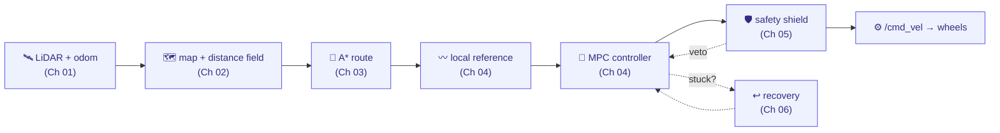

# 🧭 The BARN Navigation Tutorial

### A hands-on course in how a real robot plans and drives — built from the `barn_classical` stack in this repository

*From "what is a LiDAR?" to a sequentially-linearized MPC solving a QP thirty times a second.*

---

## Who this is for

You're new to **robotics**, **path planning**, or **control**, and you want to understand not just the *ideas* but a **real, working system** that uses them. Every concept here is grounded in code you can read, run, and change — the classical navigation stack that drives a Clearpath Jackal through the [ICRA BARN Challenge](./00-the-barn-problem.md).

No graduate background is assumed. Each idea is taught in **three layers**:

> 🟢 **Intuition** — plain language and a picture. Read only this and you'll still understand *what* and *why*.
> 📐 **The math** — the formal version, for when you want rigor. Skippable; you lose nothing essential.
> 🔍 **In the code** — the exact file and lines where the idea lives, so theory meets practice.

Beginners can ride the green layer end to end. Keen students can dig into every equation and line reference.

> **▶ Prefer to play before you read?** The [**interactive visual companion**](https://rudra-roy.github.io/BARN/) has live, draggable demos of the whole pipeline — LiDAR, distance fields, A\* search, the elastic band, the MPC rollout, the safety shield, and backtracking recovery.

---

## 📚 The learning path

Read in order — each chapter builds on the last — or jump to what you need.

| # | Chapter | You'll understand… |
|:-:|---------|--------------------|
| **00** | [The BARN problem](./00-the-barn-problem.md) | Why "drive through a dense obstacle field you've never seen" is hard, and the rules of the game. |
| **01** | [The robot and its senses](./01-the-robot-and-its-senses.md) | The Jackal, its LiDAR, coordinate frames, and the adapter that hides the wiring. |
| **02** | [Mapping: occupancy & distance fields](./02-mapping-occupancy-and-distance-fields.md) | Turning laser points into a map, and a map into a *clearance field* with gradients. |
| **03** | [Global planning with A\*](./03-global-planning-with-a-star.md) | Searching a lattice for a whole route — Dijkstra, A\*, heuristics, and clearance costs. |
| **04** | [Local planning & **MPC**](./04-local-planning-and-mpc.md) ⭐ | The flagship: how optimization becomes a controller. Receding horizon, linearization, QP, OSQP. |
| **05** | [The safety shield](./05-the-safety-shield.md) | An independent last line of defense that can only ever say "slower" or "stop". |
| **06** | [Recovery & backtracking](./06-recovery-and-backtracking.md) | Getting unstuck by reversing along a known-clear trail — and why spinning fails. |
| **07** | [The system as a whole](./07-the-system-as-a-whole.md) | How the pieces wire into one pipeline: nodes, topics, rates, and threads. |
| **08** | [Measuring success](./08-measuring-success.md) | The benchmark metric, and how to read a benchmark critically. |

📖 [**References & further reading**](./references.md) — the canonical papers and textbooks behind every idea.

---

## 🗺️ The whole stack on one page

Everything the tutorial covers, as a single flow. Sensors in, wheel commands out.

---

## 🧪 Using this as course material

- **A reading course:** Chapters 00 → 08 in order is a self-contained unit on classical mobile-robot navigation. Roughly one chapter per session.
- **A lab:** every chapter ends with a **Try it yourself** — a concrete experiment in the [distrobox](../setup/barn_2026_jazzy_distrobox.md) (change a parameter, watch the behavior in RViz) or a thought exercise.
- **A code map:** the 🔍 *In the code* boxes are a guided tour of `ros2_ws/src/`. Follow them to see textbook algorithms as real C++.
- **Diagram conventions:** flow/architecture diagrams are [Mermaid](https://mermaid.js.org/) (they render on GitHub); geometric illustrations are hand-drawn [SVGs](./figures/) or ASCII. Math renders via GitHub's LaTeX support.

> **A note on honesty.** This tutorial teaches a stack that *works* but is not the last word — every chapter is candid about trade-offs and the failures that shaped the design. Learning *why* a design is the way it is (and what it got wrong first) is the real lesson.

---

## Where to go next

- Run it: the [setup walkthrough](../setup/barn_2026_jazzy_distrobox.md) gets the stack building and driving in your distrobox.
- Go deeper on the benchmark: the [metric notes](../benchmark/metric_notes.md) and [failure taxonomy](../benchmark/failure_taxonomy.md).
- The road ahead: the project [roadmap](../roadmap.md).

**Start here → [00 · The BARN problem](./00-the-barn-problem.md)**

